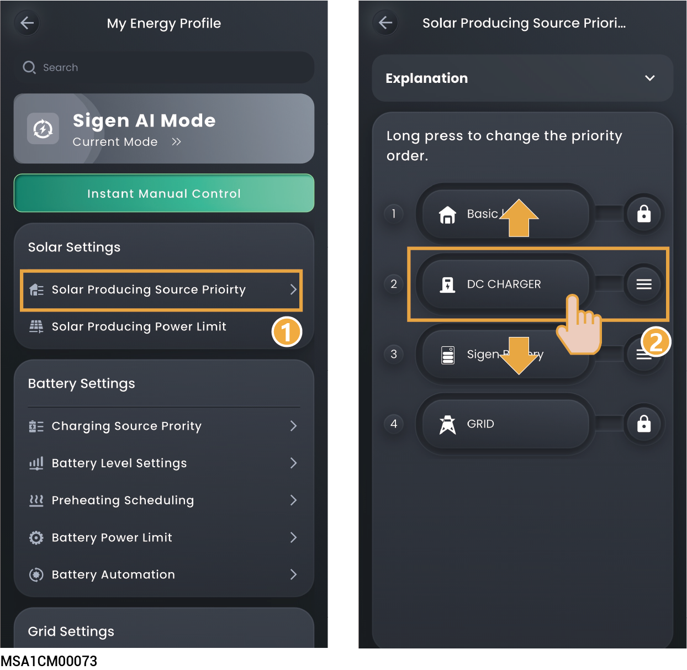
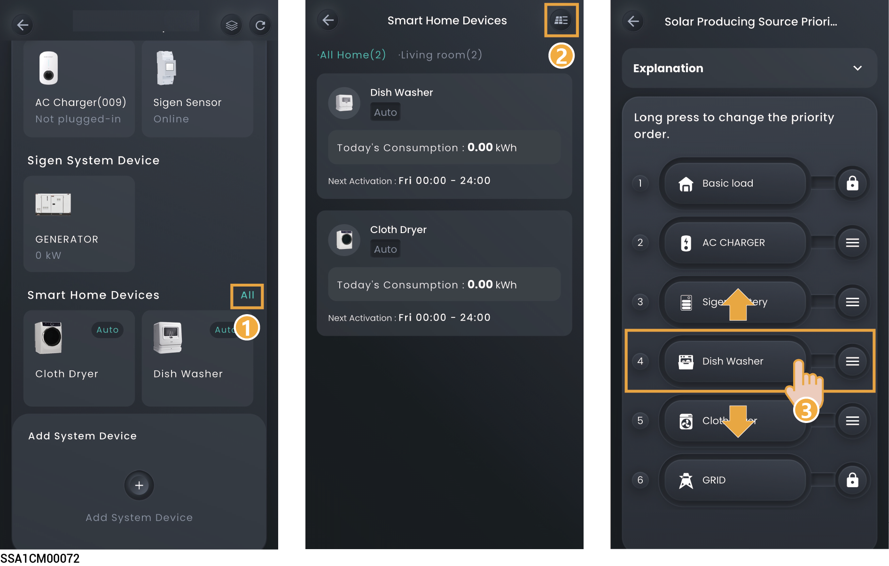
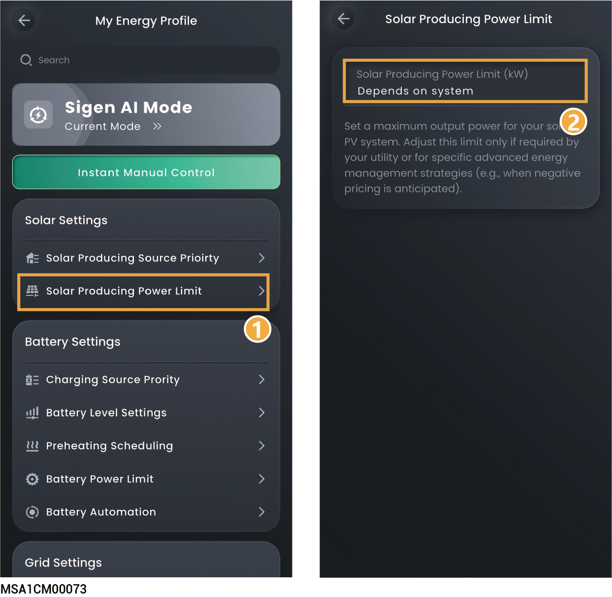

# Solar Settings

Setting PV-related parameters can optimize power generation efficiency, ensure safe operation, and achieve intelligent energy management.

## Solar Producing Prority



* <mark style="color:blue;">The displayed parameters may vary in different working modes. Please refer to the actual interface.</mark>
* <mark style="color:blue;">PV distributes the direction of the electrical energy according to the set order.</mark>

### Method 1:

<figure><figcaption></figcaption></figure>

### Method 2:



<mark style="color:blue;">If a smart load is configured in the power station, the Solar Producing Priority can be set through this method.</mark>

<figure><figcaption></figcaption></figure>

## Solar Producing Power Limit



<mark style="color:blue;">It is recommended to set this parameter in the negative electricity price scenario.</mark>

<figure><figcaption></figcaption></figure>
