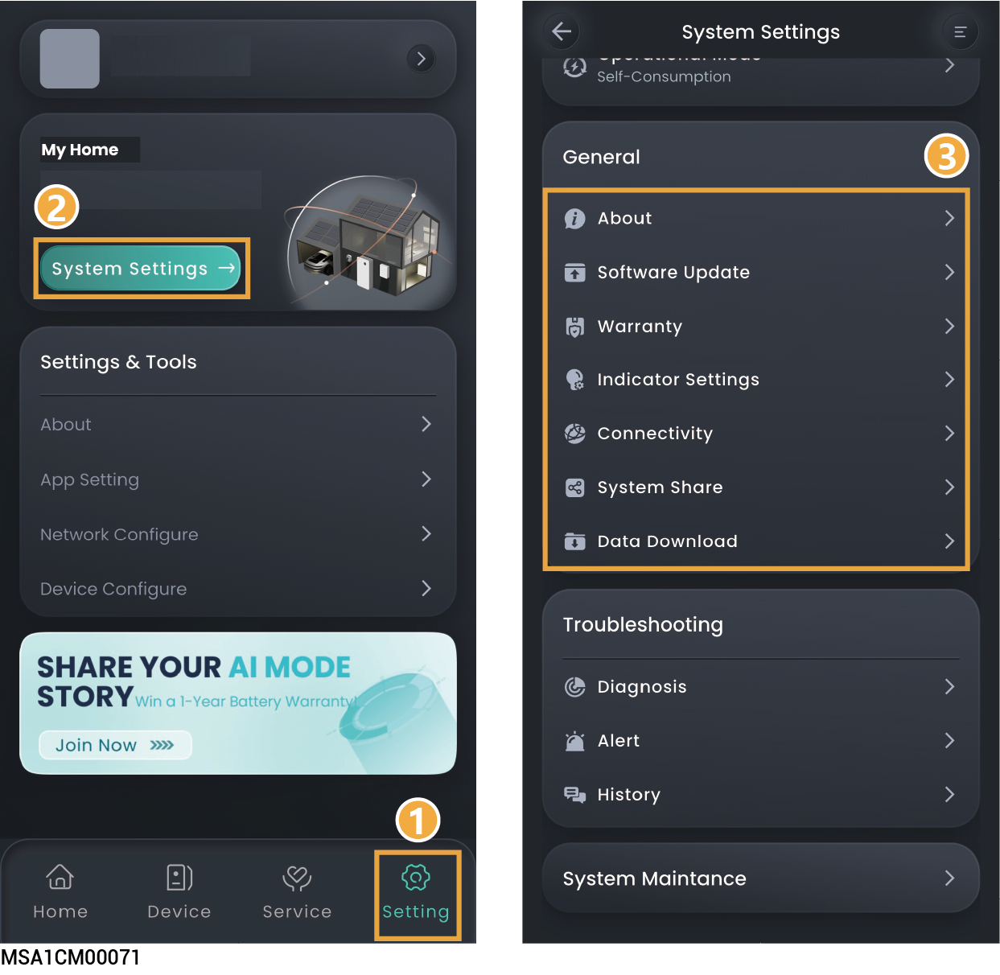

# General setting

<figure><figcaption></figcaption></figure>

<table><thead><tr><th width="84.6666259765625" align="center" valign="middle">No.</th><th width="148" valign="middle">Parameter Name</th><th valign="top">Description</th></tr></thead><tbody><tr><td align="center" valign="middle">1</td><td valign="middle">About</td><td valign="top">Click to modify the power station type, name, and address.</td></tr><tr><td align="center" valign="middle">2</td><td valign="middle">Software upgrade</td><td valign="top">Click to upgrade the power station software. You can use this function to check whether the system software is updated to the latest version and upgrade the device to the latest version when necessary.</td></tr><tr><td align="center" valign="middle">3</td><td valign="middle">Warranty</td><td valign="top">Click to view the warranty status.</td></tr><tr><td align="center" valign="middle">4</td><td valign="middle">Indicator Settings</td><td valign="top">Click to set the LED indicator effects. When set to，You can set the LED lighting effect according to your preference. When "LED Strips" is set to "Power Flow," the flowing water lighting effect from the top down indicates that the battery pack and charger are charging and the flowing water lighting effect from the bottom up indicates that the battery pack and charger are discharging. The steady-on lighting effect indicates that the battery pack and charger are not charging or discharging.</td></tr><tr><td align="center" valign="middle">5</td><td valign="middle">Connectivity</td><td valign="top">
It is recommended to use Fast Ethernet and WLAN for communication with inverters. When free 4G traffic of CommMod runs out, users must top up their accounts or replace an SIM card. <strong>Ethernet</strong> Displays the connection status of Fast Ethernet. Do not disconnect the network cable when the Internet connection is stable. <strong>WLAN</strong>

Displays the connection status of WLAN. Here you can configure the WLAN for all devices in the power station.
<ul><li>Before configuring the WLAN, please make sure that antennas are installed on devices.</li><li>Non-encrypted WLAN is not recommended as it may lead to Internet access failure.</li><li>When WLAN is the only connection path for the devices to access the internet, switching WLAN to any other wireless router will be prohibited.</li></ul>
<strong>Cellular</strong>
<ul><li>Displays whether the 4G network is connected to the Internet.</li><li>When 4G is used for communication users can view the monthly traffic usage and set a traffic usage threshold for each month.</li></ul></td></tr><tr><td align="center" valign="middle">6</td><td valign="middle">System Share</td><td valign="top">Click to share power station information.</td></tr><tr><td align="center" valign="middle">7</td><td valign="middle">Data Download</td><td valign="top">Click to download power station information.</td></tr></tbody></table>
