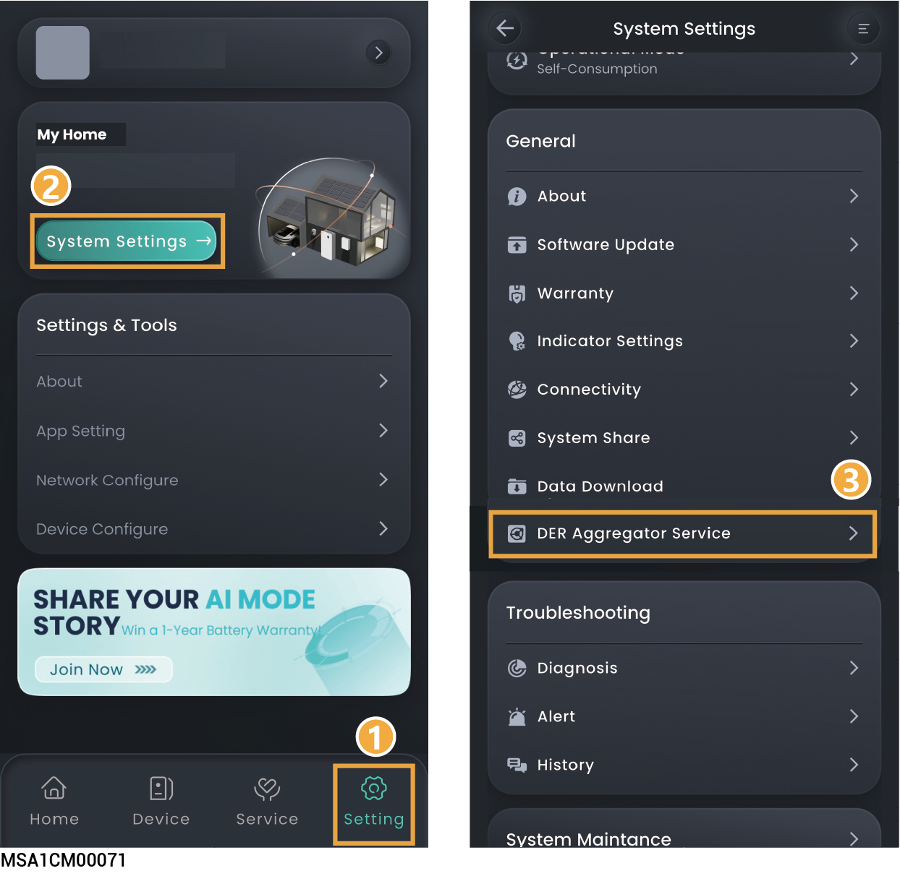

# (Optional) DER Aggregator Service



* <mark style="color:blue;">This parameter is only available in select countries (e.g., the United States). Actual availability is subject to the interface.</mark>
* <mark style="color:blue;">After clicking, you will complete the signing or registration process with a third-party virtual power plant (VPP) operator. Your energy storage system will be connected to the VPP smart dispatch network, and the VPP Schedule mode will be automatically selected in the App's energy storage working mode interface.</mark>

<figure><figcaption></figcaption></figure>
