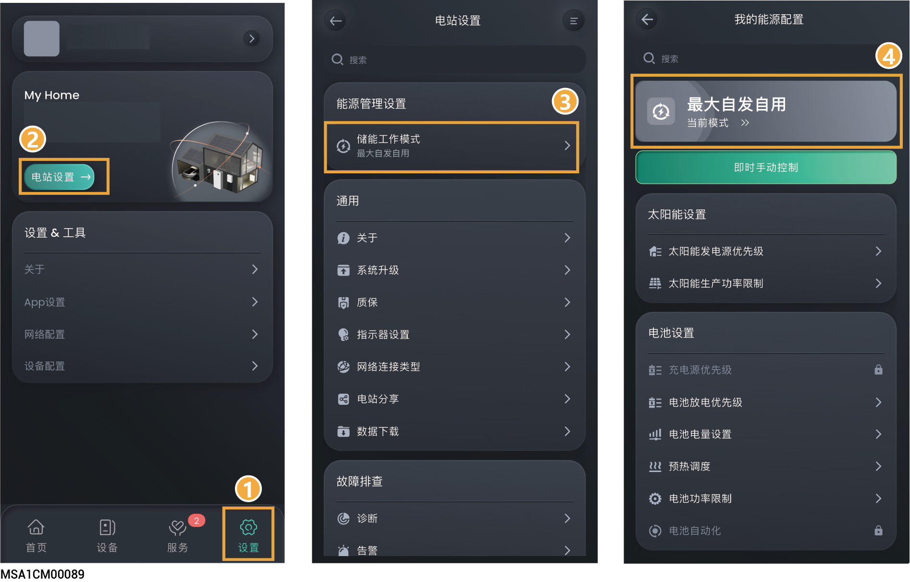
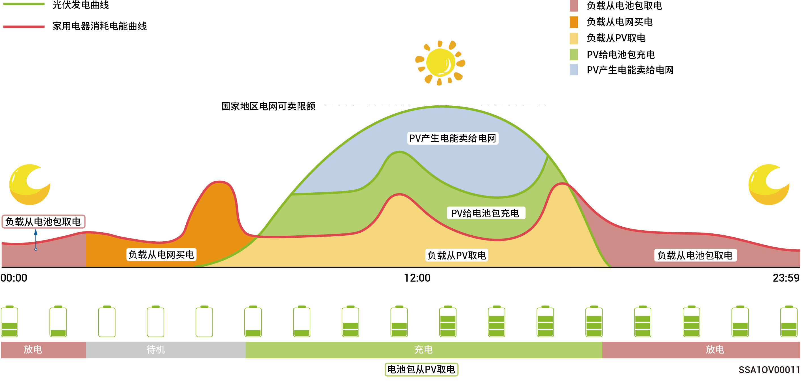
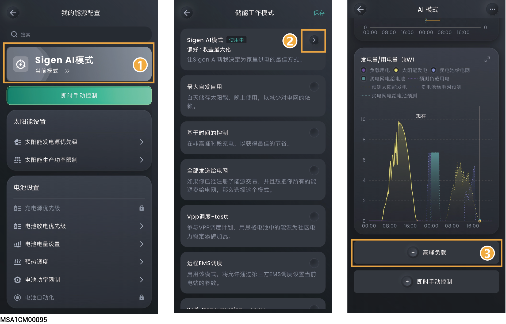
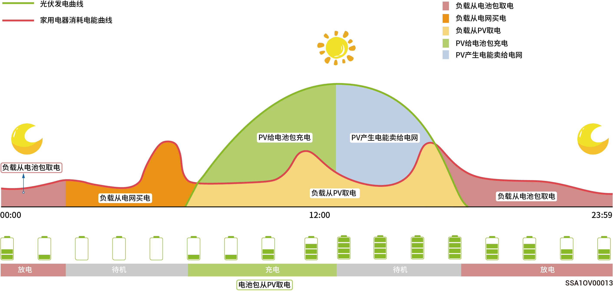
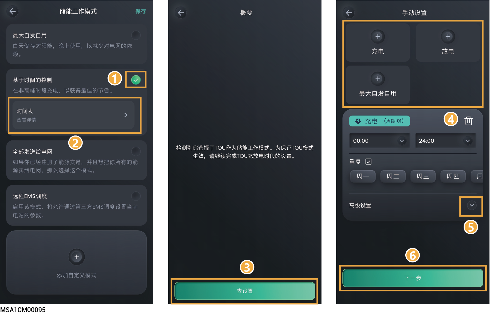
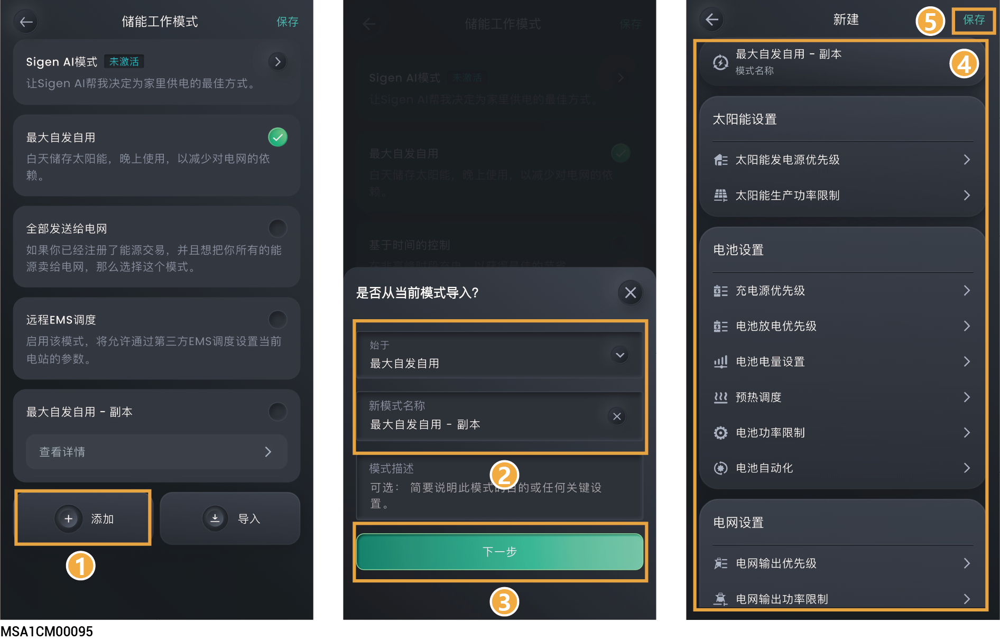
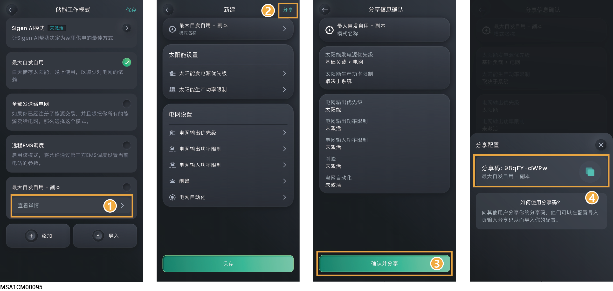
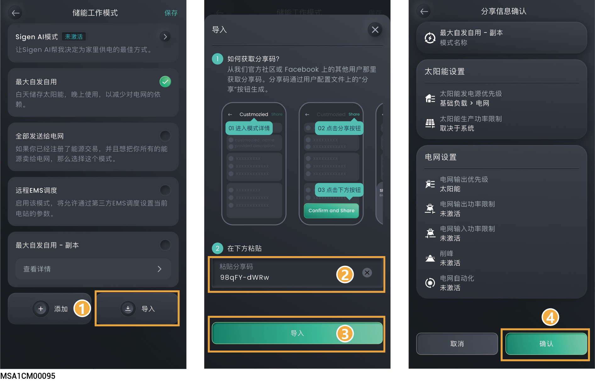

# 储能工作模式



* <mark style="color:blue;">储能系统支持多种工作模式，部分国家支持减载模式和虚拟电厂调度模式，以App界面显示为准。</mark>
* <mark style="color:blue;">支持工作模式下的参数根据模式保存。</mark>

<figure><figcaption></figcaption></figure>

## **Sigen AI模式**

通过获取当地波峰波谷电价、天气数据，结合用户用电习惯，SigenAI模式可定制智能用电解决方案，最大程度为客户节约用电成本。

<figure><figcaption></figcaption></figure>

<figure><figcaption></figcaption></figure>

### **添加高峰负载**

高峰值负载指瞬时突增的电力需求。

<figure><figcaption></figcaption></figure>

## **最大自发自用模式**

* 当太阳能充足时，光伏系统产生的电能将优先供给负载，剩余电能存储在电池中，再余电能卖给电网。当太阳能不足时，电池会释放电能供给负载。提高光伏系统的自发自用率和家庭能源自给自足率，可节省电费支出。
* 该模式适用于电价较高或有零功率并网限制的区域。

<figure><figcaption></figcaption></figure>

## **基于时间的控制模式**

* 需要手动设置充电时段、放电时段和自发自用时段。在电价较高时光伏发电的剩余电力和电池电力可以卖给电网，在电网低电价时段给电池充电，可节省电费支出。
* 未设置时间段储能待机不放电，光伏优先供给负载，余电供给储能充电\*。
* 最多可以设置24个充放电或自发自用时间段。
* 适用于峰谷电价且价差较大的区域。

\*进入该时段时，会记录电池电量，当光伏功率大于负载时，剩余光伏功率给电池充电，当光伏功率小于负载时，电池可以放电给负载，但是电池电量下降并且接近进入该时段时的电池电量值时，电池会结束放电。

<figure><figcaption></figcaption></figure>

<figure><figcaption></figcaption></figure>

<table><thead><tr><th width="55" align="center">序号</th><th width="74.800048828125">参数名称</th><th width="188">参数名称</th><th>说明</th></tr></thead><tbody><tr><td align="center">1</td><td>充电</td><td>PACK充电最大功率</td><td><ul><li>在此时间段，系统中所有电池包充电功率之和不能大于“PACK充电最大功率”。</li><li>系统默认为无穷大。</li></ul></td></tr><tr><td align="center">2</td><td>充电</td><td>电网充电截止SOC</td><td><ul><li>设置在此时间段，电池包利用电网充电的截止充电电量值。</li></ul><ul><li>系统默认为100%。</li></ul></td></tr><tr><td align="center">3</td><td>充电</td><td>并网点买电最大功率</td><td><ul><li>在此时间段，允许从电网侧买入的最大功率值。</li></ul><ul><li>系统默认值：按照“电站设置 → 能源管理设置→ 我的能源配置” 设置的参数生效。</li></ul></td></tr><tr><td align="center">4</td><td>充电</td><td>电网给储能充电最大功率</td><td><ul><li>在此时间段，电网给电池包充电的最大功率。</li></ul><ul><li>系统默认值为无穷大。</li></ul></td></tr><tr><td align="center">5</td><td>放电</td><td>PACK 放电最大功率</td><td><ul><li>在此时间段，系统中所有电池包放电功率之和不能大于“PACK放电最大功率”</li></ul><ul><li>系统默认为无穷大。</li></ul></td></tr><tr><td align="center">6</td><td>放电</td><td>并网点卖电最大功率</td><td><ul><li>在此时间段，系统允许向电网侧卖出的最大功率值。</li></ul><ul><li>系统默认值：按照“电站设置 → 能源管理设置→ 我的能源配置” 设置的参数生效。</li></ul></td></tr><tr><td align="center">7</td><td>放电</td><td>储能给电网放电最大功率</td><td><ul><li>在此时间段，电池包放电给电网的最大功率。</li></ul><ul><li>系统默认值为无穷大。</li></ul></td></tr><tr><td align="center">8</td><td>放电</td><td>储能向电网卖电截止 SOC</td><td><ul><li>设置在此时间段，电池包放电给电网的截止放电电量值。</li></ul><ul><li>系统默认为100%。</li></ul></td></tr><tr><td align="center">9</td><td>最大自发自用</td><td>并网点买电最大功率</td><td><ul><li>在此时间段，允许从电网侧买入的最大功率值。</li></ul><ul><li>系统默认值：按照“电站设置 → 能源管理设置→ 我的能源配置” 设置的参数生效。</li></ul></td></tr><tr><td align="center">10</td><td>最大自发自用</td><td>并网点卖电最大功率</td><td><ul><li>在此时间段，系统允许向电网侧卖出的最大功率值。</li></ul><ul><li>系统默认值：按照“电站设置 → 能源管理设置→ 我的能源配置” 设置的参数生效。</li></ul></td></tr></tbody></table>



<mark style="color:blue;">未手动设置的时间段，当PV侧有电，优先供给家庭负载，剩余功率给电池包充电；电池包不进行放电。</mark>

## **全部发送给电网模式**

* 可使光伏发电最大化卖给电网。
* 白天光伏发电功率＞逆变器的最大输出能力时，逆变器保持最大输出，同时将多余电量存储在电池中；当光伏发电功率＜逆变器最大输出能力或夜间无光伏发电时，电池放电，确保逆变器能够最大化输出。

## **远程EMS调度模式**

设置为本模式后，将允许第三方EMS调度公司设置电站及产品的相关参数。未经安装商确认，请勿进入或退出此模式。

## **减载模式**

对于经常停电的地区，您可使用本模式添加地区与计划时间表，系统将根据时间表提前将电池电量充满，确保停电时，您可使用电池电量为负载供电。(目前只支持南非地区)

## **虚拟电厂调度模式**

业主和第三方虚拟电厂运营商（VPP）完成签约或注册流程后，您的储能系统将接入虚拟电厂(VPP)智能调度网络，App界面显示该模式并自动选中。

## **自定义工作模式**

### **创建自定义工作模式**

可根据业主需求，创建定制化的工作模式。

<figure><figcaption></figcaption></figure>

### **分享自定义工作模式**

复制分享码，将自定义工作模式分享给他人。

<figure><figcaption></figcaption></figure>

### **添加自定义工作模式**

粘贴分享码，获取他人自定义工作模式。

<figure><figcaption></figcaption></figure>
