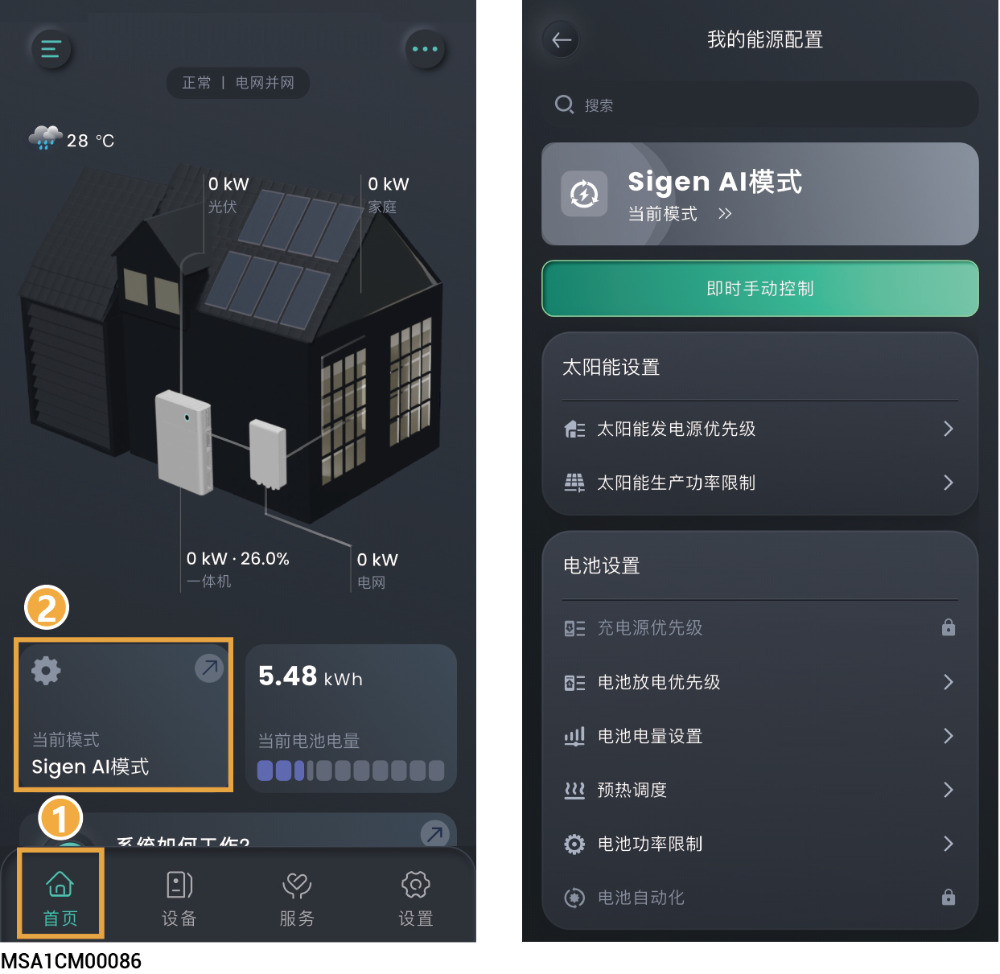

# 电站能源配置



* <mark style="color:blue;">不同的电站，显示参数会有所不同，请以实际界面为准。</mark>
* <mark style="color:blue;">不同工作模式下，显示参数会有所不同，请以实际界面为准。</mark>
* <mark style="color:blue;">若参数灰色带</mark>![](data:image/png;base64,/9j/4AAQSkZJRgABAQEAYABgAAD/2wBDAAoHBwkHBgoJCAkLCwoMDxkQDw4ODx4WFxIZJCAmJSMgIyIoLTkwKCo2KyIjMkQyNjs9QEBAJjBGS0U+Sjk/QD3/2wBDAQsLCw8NDx0QEB09KSMpPT09PT09PT09PT09PT09PT09PT09PT09PT09PT09PT09PT09PT09PT09PT09PT09PT3/wAARCAAhACQDASIAAhEBAxEB/8QAHwAAAQUBAQEBAQEAAAAAAAAAAAECAwQFBgcICQoL/8QAtRAAAgEDAwIEAwUFBAQAAAF9AQIDAAQRBRIhMUEGE1FhByJxFDKBkaEII0KxwRVS0fAkM2JyggkKFhcYGRolJicoKSo0NTY3ODk6Q0RFRkdISUpTVFVWV1hZWmNkZWZnaGlqc3R1dnd4eXqDhIWGh4iJipKTlJWWl5iZmqKjpKWmp6ipqrKztLW2t7i5usLDxMXGx8jJytLT1NXW19jZ2uHi4+Tl5ufo6erx8vP09fb3+Pn6/8QAHwEAAwEBAQEBAQEBAQAAAAAAAAECAwQFBgcICQoL/8QAtREAAgECBAQDBAcFBAQAAQJ3AAECAxEEBSExBhJBUQdhcRMiMoEIFEKRobHBCSMzUvAVYnLRChYkNOEl8RcYGRomJygpKjU2Nzg5OkNERUZHSElKU1RVVldYWVpjZGVmZ2hpanN0dXZ3eHl6goOEhYaHiImKkpOUlZaXmJmaoqOkpaanqKmqsrO0tba3uLm6wsPExcbHyMnK0tPU1dbX2Nna4uPk5ebn6Onq8vP09fb3+Pn6/9oADAMBAAIRAxEAPwDiKKKVVZ2CopZj0AGSa0JEpa2V01BPHaNZSkMo3XHOQxGfpgdKx5I3icpIpVh1BGDTAbRRRSAKv6F/yGrb/eP8jVCnRyPFIskbFXU5DDqKYHds139vQKsf2TYdzE/Nurl/En/IZk/3F/lVb+19Q/5/JvzqtLNJPIZJnZ3PVmPNDYrDM0UlFIYtJRRQAtJRRQAUUUUAf//Z)<mark style="color:blue;">，则不可设</mark><mark style="color:blue;">置。</mark>

<figure><figcaption></figcaption></figure>
