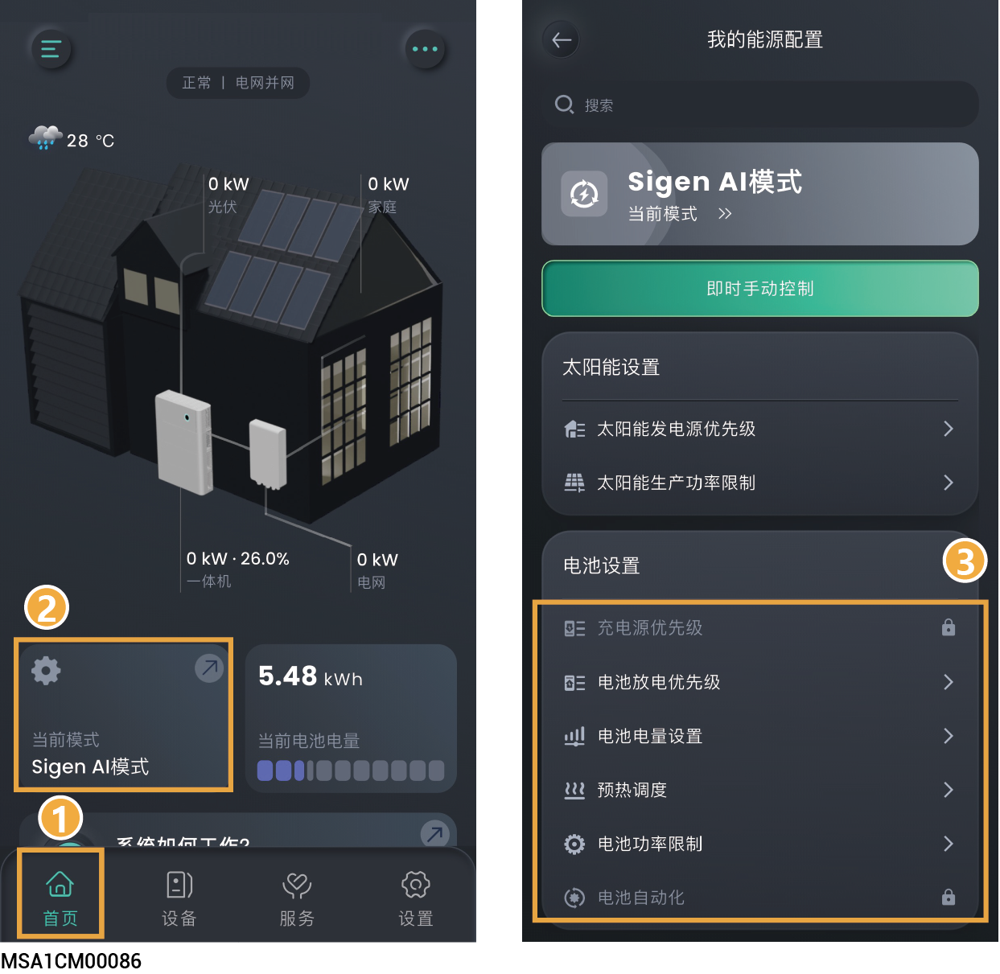

# 电池设置

设置电池相关参数可优化电池性能、延长寿命并实现智能充放电策略。

<figure><figcaption></figcaption></figure>

## 充电源优先级



* <mark style="color:blue;">电池根据设置顺序获取电能。</mark>
* <mark style="color:blue;">默认优先级：光伏＞电网，优先使用光伏给电池充电，剩余由电网补充。</mark>
* <mark style="color:blue;">负电价情景下，可调整优先级为：电网＞光伏。</mark>

## 电池放电优先级



<mark style="color:blue;">电池根据设置顺序释放电能，可根据实际情况设置电池放电优先级。</mark>

## 电池电量设置

<table><thead><tr><th width="61" align="center" valign="middle">序号</th><th width="140" valign="middle">参数名称</th><th valign="top">说明</th></tr></thead><tbody><tr><td align="center" valign="middle">1</td><td valign="middle">充电截止SOC</td><td valign="top">设置电池包停止充电的容量。</td></tr><tr><td align="center" valign="middle">2</td><td valign="middle">放电截止SOC</td><td valign="top">
设置电池包停止放电的容量。
<ul><li>此参数建议设置为0％，避免电池包未及时充电造成不可逆的衰减。</li><li>在备电组网时，优先执行“备电SOC”；非备电组网时，执行此参数。</li></ul></td></tr><tr><td align="center" valign="middle">3</td><td valign="middle">削峰</td><td valign="top">设置电池峰值削峰截止点。</td></tr><tr><td align="center" valign="middle">4</td><td valign="middle">备电截止 SOC</td><td valign="top"><ul><li>电站中含有思格能源备电柜时，可设置此参数。</li><li>并网场景时，电池包放电至备电量值时不再放电；离网场景时，电池包给用电设备供电，放电至设置的放电截止SOC时，停止放电。</li><li>用户根据地区断电频率和离家时间手动设置。不建议设置为0，避免电池包电量为0，在离网时无法为负载供能。</li></ul></td></tr></tbody></table>

## 电池预热调度



<mark style="color:blue;">在低温环境下预先调节电池温度至最佳工作范围，防止低温导致电池性能衰减与安全隐患。</mark>

### 户用储能电站

<table><thead><tr><th width="71" align="center" valign="top">序号</th><th width="194" valign="top">参数名称</th><th valign="top">说明</th></tr></thead><tbody><tr><td align="center" valign="top">1</td><td valign="top">电池预热计划</td><td valign="top">设置为时，可设置电池预热时段。</td></tr></tbody></table>

### 工商业储能电站

电池预热计划设置为后，需选择预加热的模式。

#### 手动设置

手动模式下，需要手动设置电池加热膜预约加热时段及预期的充电及放电功率。

<table><thead><tr><th width="91" align="center" valign="top">序号</th><th width="172" valign="top">参数名称</th><th valign="top">说明</th></tr></thead><tbody><tr><td align="center" valign="top">1</td><td valign="top">电池预热计划</td><td valign="top">设置为时，使能电池加热膜预约加热功能。</td></tr><tr><td align="center" valign="top">2</td><td valign="top">加热</td><td valign="top">点击添加电池加热膜预约加热时段。</td></tr><tr><td align="center" valign="top">3</td><td valign="top">目标充电功率</td><td valign="top">由于低温导致电池充电功率受限，启动加热后，当充电能力大于该值时，停止加热膜工作。</td></tr><tr><td align="center" valign="top">4</td><td valign="top">目标放电功率</td><td valign="top">由于低温导致电池放电功率受限，启动加热后，当放电能力大于该值时，停止加热膜工作。</td></tr></tbody></table>

#### 取决于系统（自动模式）

仅在电站处于TOU调度模式下支持自动模式。

## 电池功率限制



<mark style="color:blue;">若需设置更详细的充放电数据，可设置此参数。</mark>

<table><thead><tr><th width="66" align="center" valign="top">序号</th><th width="206" valign="top">参数名称</th><th valign="top">说明</th></tr></thead><tbody><tr><td align="center" valign="top">1</td><td valign="top">电池最大充电功率</td><td valign="top">设置电站中所有电池的允许总最大充电功率。</td></tr><tr><td align="center" valign="top">2</td><td valign="top">电池最大放电功率</td><td valign="top">设置电站中所有电池的允许总最大放电功率。</td></tr></tbody></table>

## 电池自动化



<mark style="color:blue;">若设置此参数，电池优先执行电池自动化设置的参数。</mark>

<table><thead><tr><th width="60" align="center" valign="middle">序号</th><th width="150" valign="middle">参数名称</th><th valign="top">说明</th></tr></thead><tbody><tr><td align="center" valign="middle">1</td><td valign="middle">添加时间段</td><td valign="top">点击添加时间段。</td></tr><tr><td align="center" valign="middle">2</td><td valign="middle">添加你的操作</td><td valign="top">
点击添加电池运行状态。

<strong>电池充电</strong>
<ul><li>最大充电功率：设置电站中所有电池允许的总最大充电功率，在该时间窗口下生效。</li><li>电网到电池的最大充电功率：设置电网向电池的最大充电输入功率。</li><li>电池从电网充电的 SOC 截止值：当电池SOC达到此阈值时，强制停止电网给电池充电。</li><li>电池充电来源优先级：调整电池电能来源优先级。</li></ul>
<strong>电池放电</strong>
<ul><li>最大放电功率：设置电站中所有电池允许的总最大放电功率，在该时间窗口下生效。</li><li>从电池到电网的最大放电功率：设置电池向电网最大放电输出功率。</li><li>电池到电网放电切断 SOC：当电池SOC达到此阈值时，强制停止电池给电网输电。</li></ul>
<strong>电池保留：电池不充电也不放电。</strong>

<strong>电池自耗：电池的电能优先供给负载，剩余电能卖给电网。</strong>
<ul><li>最大充电功率：设置电站中所有电池的允许总最大充电功率，在该时间窗口下生效。</li><li>最大放电功率：设置电站中所有电池的允许总最大放电功率，在该时间窗口下生效。</li></ul></td></tr></tbody></table>
