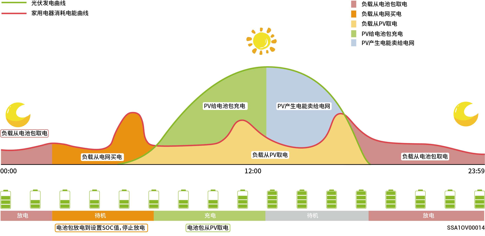
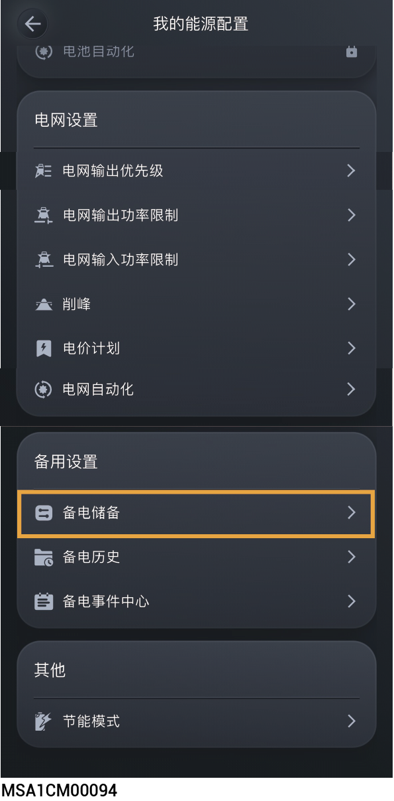

# 备电设置

## **备电储备**



* <mark style="color:blue;">若未配思格能源备电柜请忽略此章节。</mark>
* <mark style="color:blue;">根据地区断电频率和离家时间手动设置。</mark>

组网中含有思格能源备电柜时，可思格云App中手动设置“备电储备”值。在电网并网时，电池放电至设置的备电SOC时停止放电；在电网掉电时，可以使用备电的电池电量。

示例： 最大自发自用下设置了备电SOC。

<figure><figcaption></figcaption></figure>

<figure><figcaption></figcaption></figure>

## **备电历史**



<mark style="color:blue;">系统中安装</mark>思格能源备电柜<mark style="color:blue;">后，当出现并离网事件时，系统将进行记录。您可通过以下方式查看并离网切换的时间与原因。</mark>
