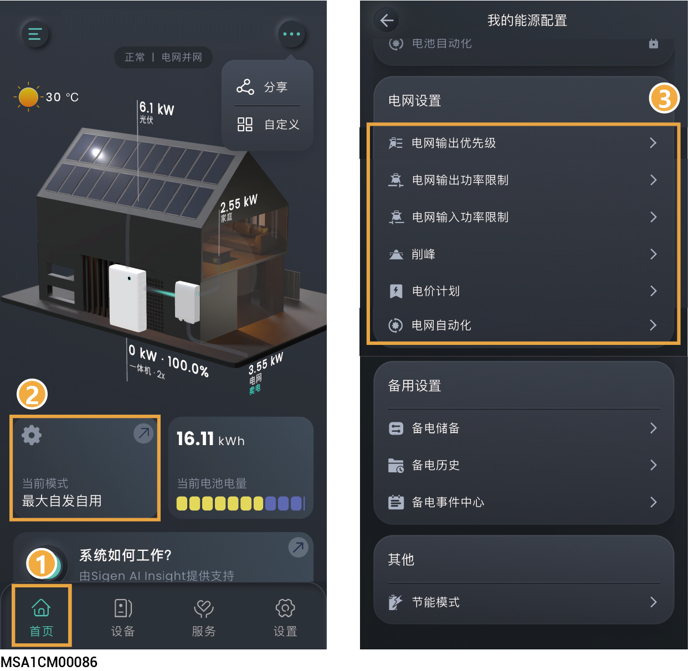
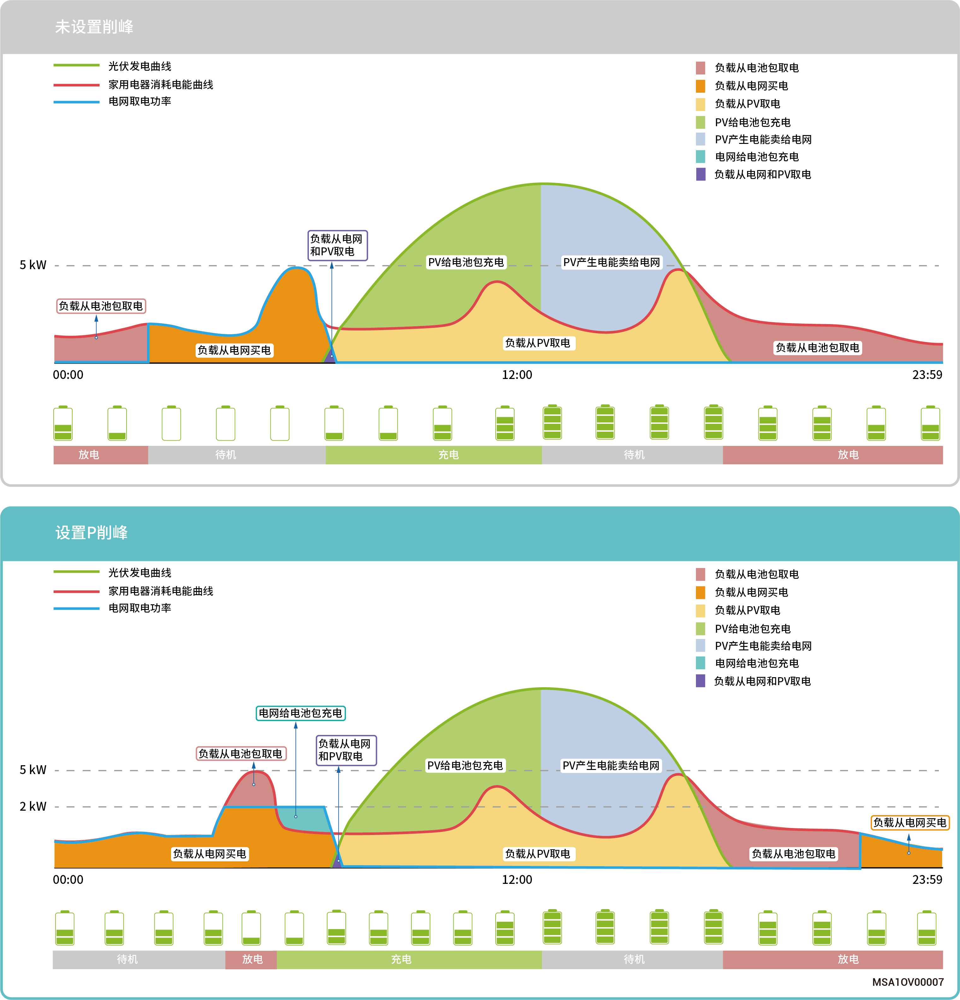
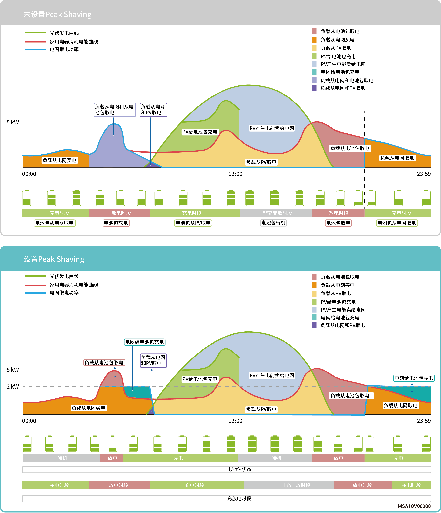

# 电网设置

设置电网相关参数可确保安全并网、合规售电和收益最大化。

<figure><figcaption></figcaption></figure>

## 电网输出优先级



* <mark style="color:blue;">默认优先级：光伏＞电池，光伏功率优先向电网卖售电，电池补充向电网售电。</mark>
* <mark style="color:blue;">负电价情景下，优先级可以调整为： 电池＞光伏。尽量放出电池电量，负电价时从电网买电给电池充电。</mark>
* <mark style="color:blue;">设备根据设置顺序向电网售电。</mark>

## 电网功率

<table><thead><tr><th width="81.55555725097656" align="center" valign="top">序号</th><th width="181.11111450195312" valign="top">参数名称</th><th valign="top">说明</th></tr></thead><tbody><tr><td align="center" valign="top">1</td><td valign="top">电网输出功率限制</td><td valign="top">设置系统向电网卖电的最大功率。</td></tr><tr><td align="center" valign="top">2</td><td valign="top">电网输入功率限制</td><td valign="top">设置系统从电网买电的最大功率。</td></tr></tbody></table>

## 削峰



* <mark style="color:blue;">某些地区的电费计算方式为：总电费 = 峰值功率费用 + 用电电量费用 + 其它费用。其中，峰值功率指的是从电网取电的最大功率值。该模式适用于有峰谷电价且价差较大的区域。</mark>
* <mark style="color:blue;">削峰功能可以配合所有工作模式使用，通过配置从电网取电最大峰值功率，降低高峰期电网取电最大峰值功率，降低用电费用。</mark>

#### **有功功率控制**

<table><thead><tr><th width="62" align="center" valign="middle">序号</th><th width="162" valign="middle">参数名称</th><th valign="top">说明</th></tr></thead><tbody><tr><td align="center" valign="middle">1</td><td valign="middle">削峰SOC</td><td valign="top">本参数的设置值将影响削峰的能力，在用电低谷期，系统给电池充电到设置的SOC值。本参数设置值越大，削峰的能力越强。</td></tr><tr><td align="center" valign="middle">2</td><td valign="middle">时间表</td><td valign="top">最多可以添加24个时间表。</td></tr><tr><td align="center" valign="middle">3</td><td valign="middle">最大峰值功率</td><td valign="top">设置从电网取电用于家庭负载和电池包充电的最大峰值功率。</td></tr></tbody></table>

### **案例一：最大自发自用设置削峰**

假设削峰设置的削峰SOC为50%，最大峰值功率为2 kW。

因为总电费 = 峰值功率费用 + 用电电量费用 + 其它费用。其中，峰值功率指的是从电网取电的最大功率值。最大自发自用设置削峰后，电网购电功率从5 kW下降到2 kW，所以总电费降低了。

<figure><figcaption></figcaption></figure>

### **案例二：基于时间的控制设削峰**

假设削峰设置的削峰SOC为50%，最大峰值功率为2 kW。

因为总电费 = 峰值功率费用 + 用电电量费用 + 其它费用。其中，峰值功率指的是从电网取电的最大功率值。基于时间的控制设置削峰后，电网购电功率从5 kW下降到2 kW，所以总电费降低了。

<figure><figcaption></figcaption></figure>

## **电价设置**

### **费率电价计划**

<table><thead><tr><th width="84" align="center" valign="top">序号</th><th width="157.66668701171875" valign="top">参数名称</th><th valign="top">说明</th></tr></thead><tbody><tr><td align="center" valign="top">1</td><td valign="top">电力公司</td><td valign="top">选择电力公司。</td></tr><tr><td align="center" valign="top">2</td><td valign="top">电价计划名称</td><td valign="top">选择电价方案。</td></tr><tr><td align="center" valign="top">3</td><td valign="top">货币单位</td><td valign="top">默认使用辅币单位进行设置。</td></tr><tr><td align="center" valign="top">4</td><td valign="top">费率电价</td><td valign="top">自动匹配附加费用。</td></tr><tr><td align="center" valign="top">5</td><td valign="top">定制电价</td><td valign="top">点击切换到定制电价计划。</td></tr></tbody></table>

### **定制电价计划**

<table><thead><tr><th width="80" align="center" valign="middle">序号</th><th width="158.00003051757812" valign="middle">参数名称</th><th valign="top">说明</th></tr></thead><tbody><tr><td align="center" valign="middle">1</td><td valign="middle">电力公司</td><td valign="top">填写电力公司名称。</td></tr><tr><td align="center" valign="middle">2</td><td valign="middle">电价计划名称</td><td valign="top">填写电价方案名称。</td></tr><tr><td align="center" valign="middle">3</td><td valign="middle">货币单位</td><td valign="top">默认使用辅币单位进行设置。</td></tr><tr><td align="center" valign="middle">4</td><td valign="middle">电价计划类型</td><td valign="top">
<strong>单一费率电价：所有时段采用单一价格。</strong>
<ul><li>费率电价：</li></ul>
<strong>分时电价：不同时段采用不同价格。</strong>
<ul><li>添加你的时间表：添加分时电价时段。</li><li>季节设置：在1年内最多可设置6个季节。</li><li>在 N 季节时间段：在季节内设置时间段。</li><li>价格设置：在时间段内设置价格。</li></ul></td></tr><tr><td align="center" valign="middle">5</td><td valign="middle">费率电价</td><td valign="top">点击切换到费率电价计划。</td></tr></tbody></table>

### **保存电价配置**



<mark style="color:blue;">可将电价配置保存到安装商个人账号，并将电价配置应用于其他电站。</mark>

## 电网自动化



<mark style="color:blue;">若设置此参数，电网优先执行电网自动化设置的参数。</mark>

<table><thead><tr><th width="60" align="center" valign="middle">序号</th><th width="149" valign="middle">参数名称</th><th valign="top">说明</th></tr></thead><tbody><tr><td align="center" valign="middle">1</td><td valign="middle">添加时间段</td><td valign="top">点击添加时间段。</td></tr><tr><td align="center" valign="middle">2</td><td valign="middle">添加你的操作</td><td valign="top">
点击添加电网运行状态。

<strong>电网自消耗：电池的电能优先供给负载，剩余电能卖给电网。</strong>
<ul><li>从电网输入的最大功率：设置从电网购买电力的最大输入功率。</li><li>向电网输出的最大功率：设置向电网卖电的最大输出功率。</li></ul>
<strong>电网输入：系统从电网买电模式。</strong>
<ul><li>从电网输入的最大功率：设置系统从电网买电的最大功率。</li></ul>
<strong>电网输出：系统向电网卖电模式。</strong>
<ul><li>向电网输出的最大功率：设置系统向电网卖电的最大输出功率。</li><li>电网输出源优先级：根据设置优先级向电网卖电。</li></ul></td></tr></tbody></table>
