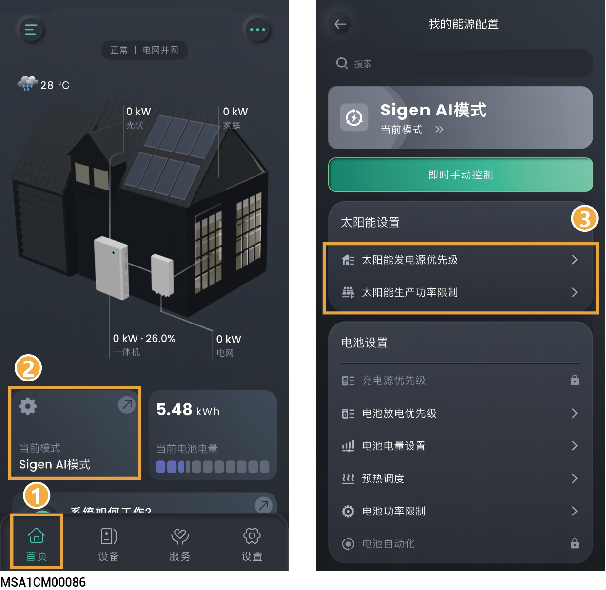

# 太阳能设置

设置光伏相关参数可优化发电效率、保障安全运行并实现智能化能源管理。

<figure><figcaption></figcaption></figure>

## 太阳能发电源优先级



* <mark style="color:blue;">不同工作模式下，显示参数会有所不同，请以实际界面为准。</mark>
* <mark style="color:blue;">光伏根据设置的优先级分配光伏电能的去向。</mark>

## 太阳能生产功率限制



<mark style="color:blue;">限制光伏发电功率，建议在负电价情景下设置此参数。</mark>
