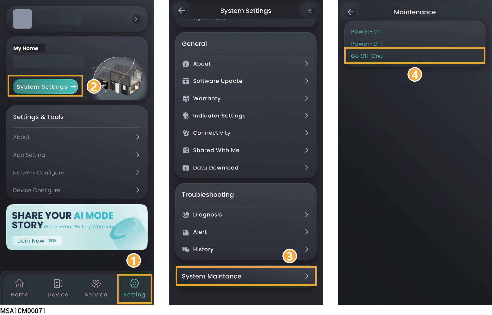
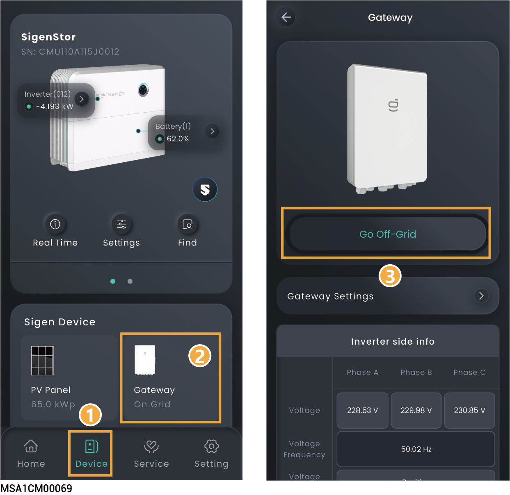

# System Maintance

## Sytem Device Power-on/Power-off

### Batch power on/off

<figure><figcaption></figcaption></figure>

### **Single-device power on/off**

<figure><figcaption></figcaption></figure>

## On-grid/Off-grid switchover



<mark style="color:blue;">Skip this section if no Gateway is configured.</mark>



* <mark style="color:red;">When set to "Go-Off-Grid," your inverter supports off-grid operation. During off-grid operation, the anti-islanding function of the inverter will be turned off.</mark>
* <mark style="color:red;">Before you perform any operation of the power distribution system (such as installation, wiring, or replacement), ensure that all power supplies and their corresponding circuit breakers are disconnected. This includes the power switches of the power grid side, inverter and diesel Generator to avoid operation with power on.</mark>

### Method 1:

<figure><figcaption></figcaption></figure>

### Method 2:

<figure><figcaption></figcaption></figure>
