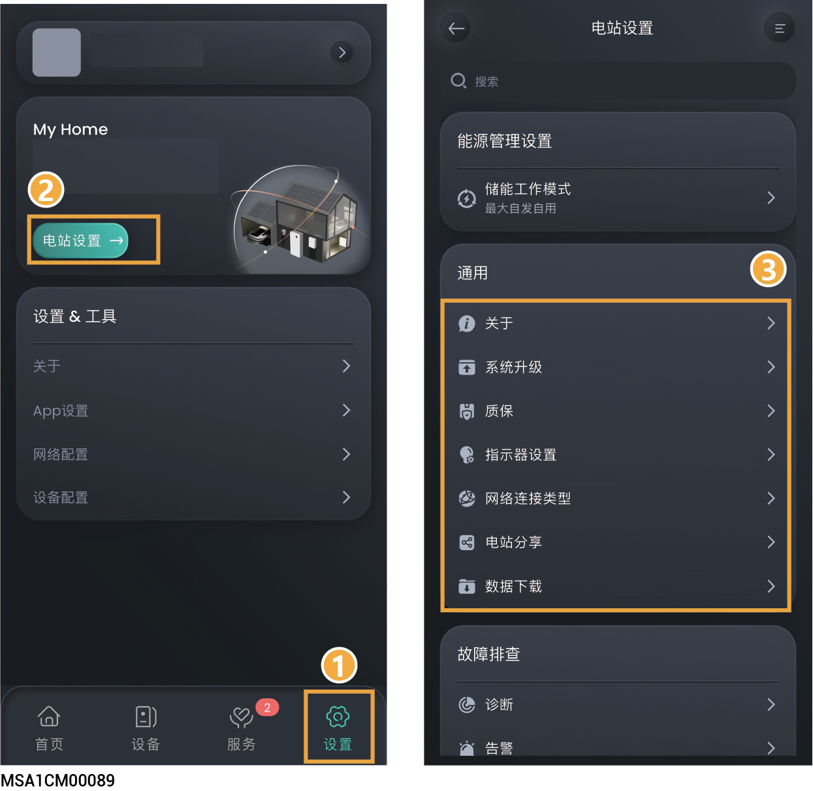

# 通用设置

<figure><figcaption></figcaption></figure>

<table><thead><tr><th width="70" align="center" valign="middle">序号</th><th width="124" valign="middle">参数名称</th><th valign="top">说明</th></tr></thead><tbody><tr><td align="center" valign="middle">1</td><td valign="middle">关于</td><td valign="top">点击可修改电站类型、名称与地址。</td></tr><tr><td align="center" valign="middle">2</td><td valign="middle">系统升级</td><td valign="top">点击可升级电站软件。 您可通过本功能知晓系统中设备软件是否为最新版本，并支持将设备升级为最新版本。</td></tr><tr><td align="center" valign="middle">3</td><td valign="middle">质保</td><td valign="top">点击查看质保状态。</td></tr><tr><td align="center" valign="middle">4</td><td valign="middle">指示器设置</td><td valign="top">点击设置指示灯灯效。 设置为后，您可根据喜好设置设备LED灯显示效果。其中，当“侧面灯带”设置为“能量流”时，从上往下流水灯效，表示电池包与充电桩充电中；从下往上流水灯效，表示电池包与充电桩放电中；常亮灯效表示电池包与充电桩非充非放状态。</td></tr><tr><td align="center" valign="middle">5</td><td valign="middle">网络连接类型</td><td valign="top">
通信方式推荐采用FE和WLAN。思格能源通信棒赠送4G流量用完后，需用户自行充值或更换SIM卡。 <strong>以太网</strong> 显示FE连接状态。在网络稳定情况下不建议拔插网线。 <strong>WLAN</strong> 显示WLAN连接状态。此处支持为电站所有的设备配置需要连接的WLAN。
<ul><li>配置WLAN通信前，请确认设备已安装天线。</li></ul><ul><li>连接非加密WLAN，可能导致网络不可用，不推荐使用。</li></ul><ul><li>当设备仅可用WLAN连接网络时，不可切换其他无线路由器WLAN</li></ul>
<strong>移动网</strong>
<ul><li>显示4G是否连接到网络。</li></ul><ul><li>当采用4G通信时，可查看当前每月使用的流量，同时可设置每月使用流量阈值。</li></ul></td></tr><tr><td align="center" valign="middle">6</td><td valign="middle">电站分享</td><td valign="top">点击可分享电站信息。</td></tr><tr><td align="center" valign="middle">7</td><td valign="middle">数据下载</td><td valign="top">点击可下载电站信息。</td></tr></tbody></table>
