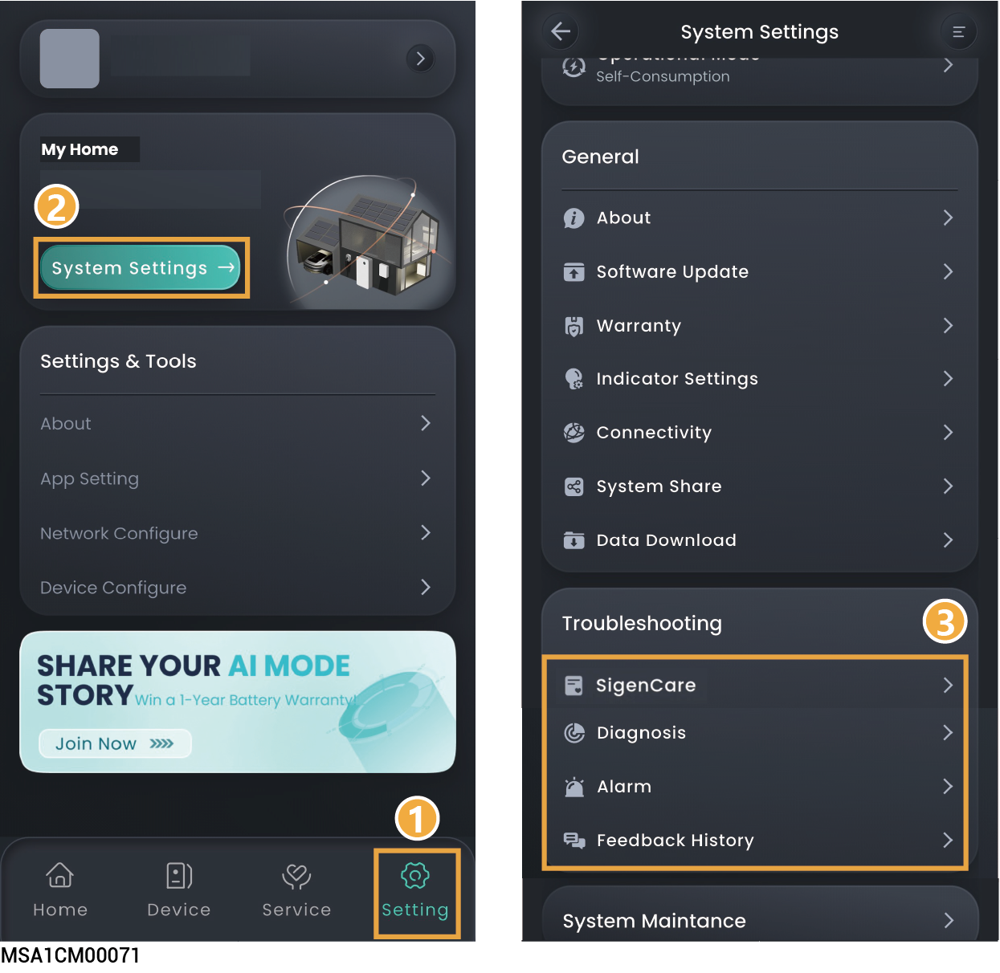

# Troubleshooting



<mark style="color:blue;">The parameters that can be configured vary depending on the country or power plant. Please refer to the actual interface for details.</mark>

<figure><figcaption></figcaption></figure>

<table><thead><tr><th width="82.888916015625">No.</th><th width="166.111083984375">Parameter name</th><th>Description</th></tr></thead><tbody><tr><td>1</td><td>(Optional) SigenCare</td><td>Click to perform a comprehensive analysis of six core dimensions of the power station, including environmental reliability, revenue performance, device reliability, network reliability, energy storage health, and system capacity configuration. Generate intuitive health scores and diagnostic reports to help users quickly understand the operating status of the power station, promptly identify potential issues, and ensure asset security and maximized revenue.</td></tr><tr><td>2</td><td>Diagnosis</td><td>You can use this feature to check the communication status of the station and connection status of devices in the station.</td></tr><tr><td>3</td><td>Alert</td><td>Click to view the alarm information of a single power station. When the system is operating off-grid, and the inverter shuts down due to a communication failure of the Gateway, and if the Gateway cannot automatically clear the alert upon power-on after communication is restored, you can click "Alert" → "Clear" to restart the inverter, and the Gateway will resume power supply, and the alert can be cleared.</td></tr><tr><td>4</td><td>Feedback History</td><td>Click to view historical work orders.</td></tr><tr><td>5</td><td>(Optional) Operation Log</td><td>Click to download the operation log of the power station.</td></tr></tbody></table>
