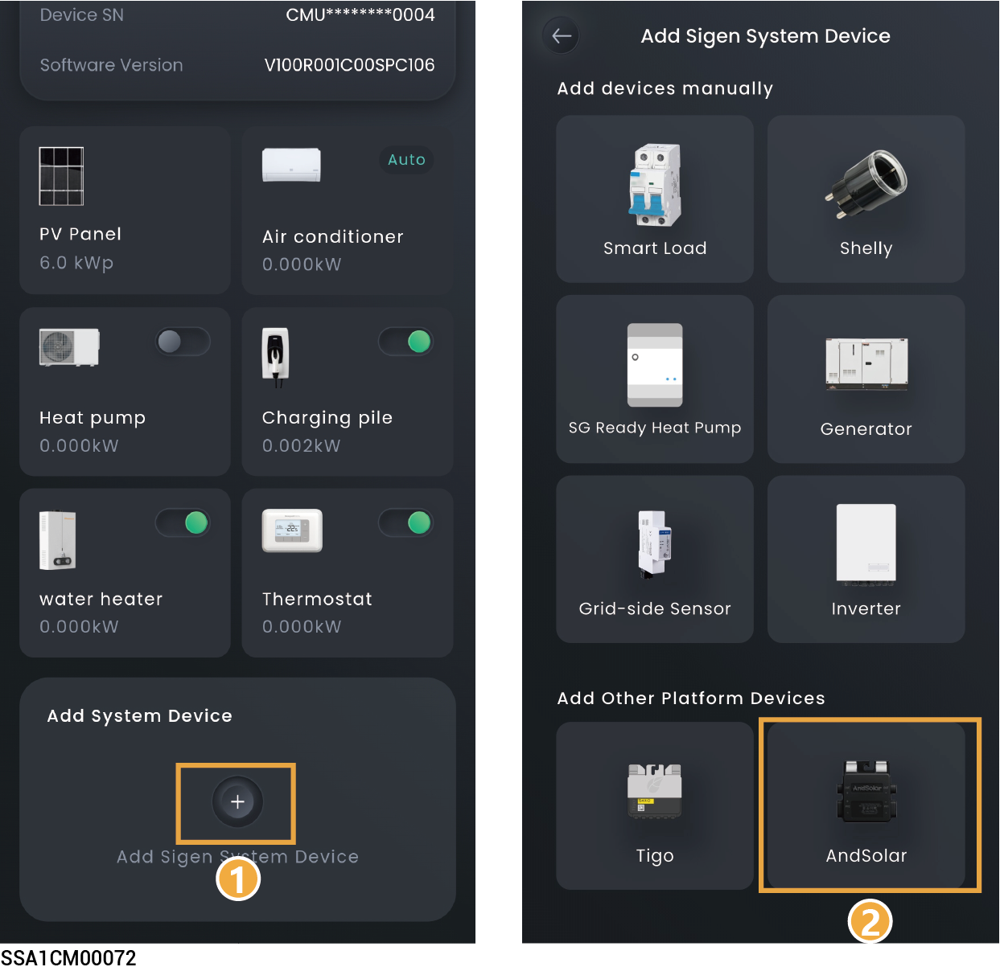

# AndSolar



* <mark style="color:blue;">Installing AndSolar can improve the conversion efficiency of photovoltaic systems.</mark>
* <mark style="color:blue;">After adding AndSolar via the App, you can view its location and relevant parameters.</mark>

<figure><figcaption></figcaption></figure>
