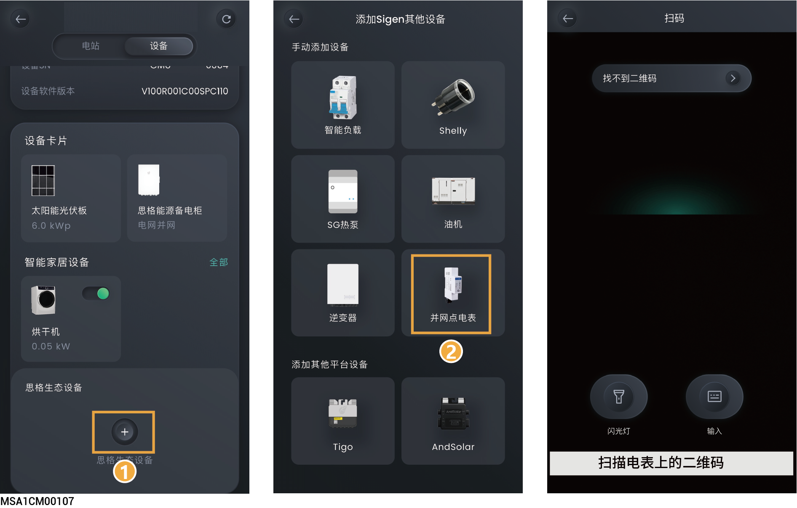

# 并网点电表

### **添加WLAN电表** 



* <mark style="color:blue;">在防逆流场景下，电站需要安装 WLAN 电表。</mark>
* <mark style="color:blue;">仅 SigenMicro 系列光伏微型逆变器的电站可添加 WLAN 电表。</mark>
* <mark style="color:blue;">WLAN电表连接的 WLAN 必须与电站连接的 WLAN 保持一致。</mark>

<figure><figcaption></figcaption></figure>

### **添加RGM电表** 



* <mark style="color:blue;">仅美国区域电站可添加RGM电表。</mark>
* <mark style="color:blue;">若通过逆变器的RS485接口或LoadHub的RS485接口添加RGM电表，需App操作，逆变器或LoadHub的信息，请查阅对应机型的《安装指南》。</mark>

