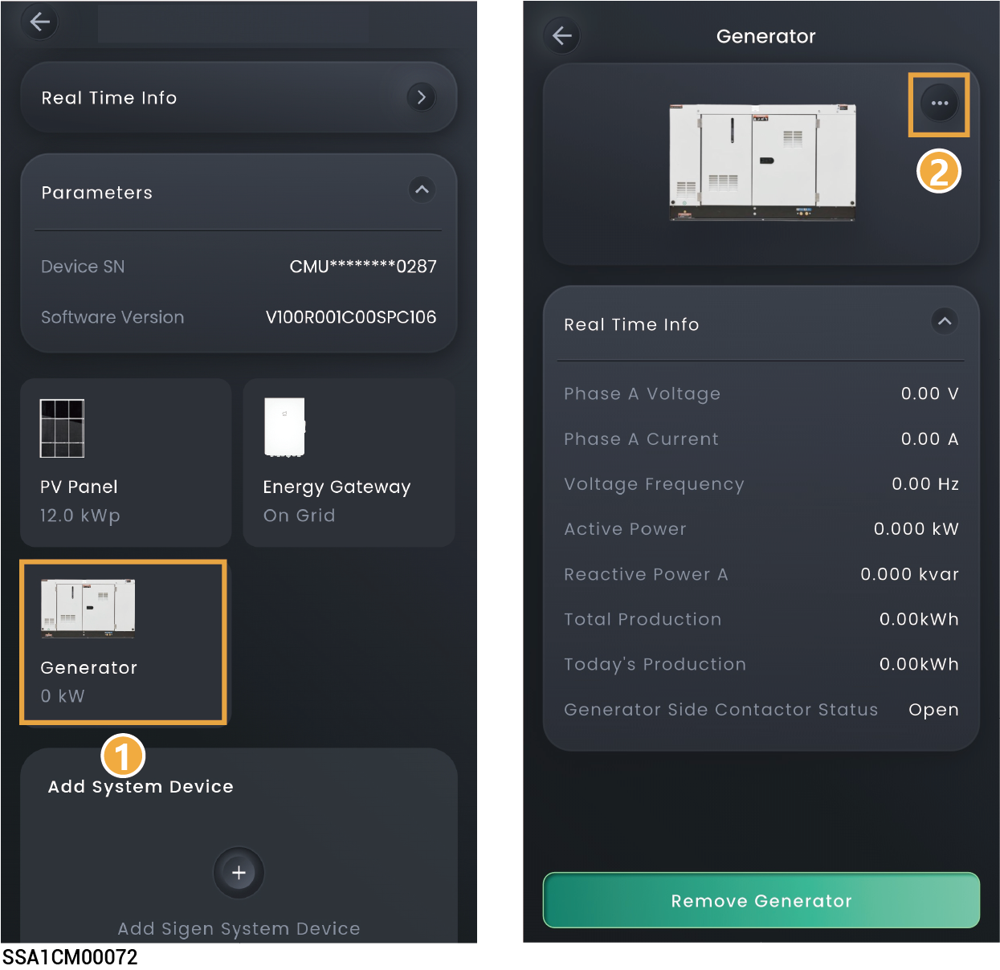

# Generator



* <mark style="color:blue;">Before connecting a diesel generator, please ensure that the Gateway that can be connected to the diesel generator has been configured in the networking and connected correctly. For details about the Gateway, please refer to the respective Installation Guide.</mark>
* <mark style="color:blue;">If the Gateway features a Smart Port interface, the generator card will be displayed in the App interface.</mark>
* <mark style="color:blue;">After connecting the generator to the Gateway, users must add the generator via the App to access and configure generator-specific parameters.</mark>

<figure><figcaption></figcaption></figure>

### **Manual start by operating the generator's switch**

In this mode, you must switch on and off the system on the generator side.

<table><thead><tr><th width="60" align="center">No.</th><th width="209">Parameter name</th><th>Description</th></tr></thead><tbody><tr><td align="center"><strong>1</strong></td><td>Rated Power</td><td>Sets the rated power of the diesel generator.</td></tr><tr><td align="center"><strong>2</strong></td><td>Maximum Power Duty</td><td>To guarantee the optimal functioning status of the system, you are advised to control the output power of the diesel generator not more than 80%.</td></tr><tr><td align="center"><strong>3</strong></td><td>Minimum Power Duty</td><td>To ensure that the diesel generator does not run at no-load, it is suggested to control the output power of the generator. The recommended default value is 0%.</td></tr><tr><td align="center"><strong>4</strong></td><td>Battery Charging Cut-off SOC for Generator</td><td>When the SOC of the battery pack is lower than the "Battery Charging Cut-off SOC for Generator" setting, the diesel generator will charge the battery pack to the set value.</td></tr></tbody></table>

### **two - wire – start**

In this mode, you can start and stop the diesel generator in the App, or the diesel generator can start or stop automatically.

<table><thead><tr><th width="60" align="center">No.</th><th width="148">Parameter name</th><th>Description</th></tr></thead><tbody><tr><td align="center"><strong>1</strong></td><td>Operating Mode</td><td><ul><li>Manual</li><li>Auto</li></ul></td></tr><tr><td align="center"><strong>2</strong></td><td>Generator Start</td><td>In "Manual" mode, when it is set to , you can start or stop the diesel generator using the icon in the App.</td></tr><tr><td align="center"><strong>3</strong></td><td>Rated Power</td><td>Sets the rated power of the diesel generator.</td></tr><tr><td align="center"><strong>4</strong></td><td>Maximum Power Duty</td><td>To guarantee the optimal functioning status of the system, you are advised to control the output power of the diesel generator not more than 80%.</td></tr><tr><td align="center">5</td><td>Minimum Power Duty</td><td>To ensure that the generator does not run at no-load, it is suggested to control the output power of the generator. The recommended default value is 0%.</td></tr><tr><td align="center">6</td><td>Battery Charging Cut-off SOC for Generator</td><td>When the SOC of the battery pack is lower than the "Battery Charging Cut-off SOC for Generator" setting, the diesel generator will charge the battery pack to the set value.</td></tr><tr><td align="center">7</td><td>Exercise</td><td>
<strong>In "Auto" mode, when it is set to</strong> <strong>, the startup mode can be set.</strong>
<ul><li>Duration: Set the runtime duration.</li><li>Interval: Set the scheduled start interval.</li><li>Day In Week: Set the scheduled start date.</li><li>Start Time: Set the scheduled start time.</li></ul></td></tr><tr><td align="center">8</td><td>Load Condition</td><td>
<strong>In "Auto" mode, when it is set to</strong> <strong>, you can set the Load Power Measurement Type.</strong>
<ul><li>
Total Load Power
<ul><li>Generator Start Tatal Load Power Threshold: Total load power threshold for Generator start. When the total load power is greater than the threshold, the Generator is started.</li><li>Generator Stop Tatal Load Power Threshold: Total load power threshold for Generator stop. When the total load power is less than the threshold, the Generator is stopped.</li></ul></li></ul><ul><li>
<strong>Maximum Power Per-phase</strong>
<ul><li>Generator Start Per-phase Load Power Threshold: The generator will start when the power per phase is greater than the set parameter.</li><li>Generator Stop Per-phase Load Power Threshold: The generator will shut down when the power per phase is less than the set parameter.</li></ul></li></ul></td></tr><tr><td align="center">9</td><td>Time of use</td><td>
<strong>In "Auto" mode, when it is set to</strong><strong>, you can set a schedule to start the Generator.</strong>
<ul><li>Auto Start SOC: When the battery SOC is greater than the threshold, the Generator is started.</li><li>Auto Stop SOC: When the battery SOC is less than the threshold, the Generator is stopped.</li><li>Maximum Power Duty: To guarantee the optimal functioning status of the system, you are advised to control the output power of the Generator not more than 80%.</li></ul></td></tr></tbody></table>
