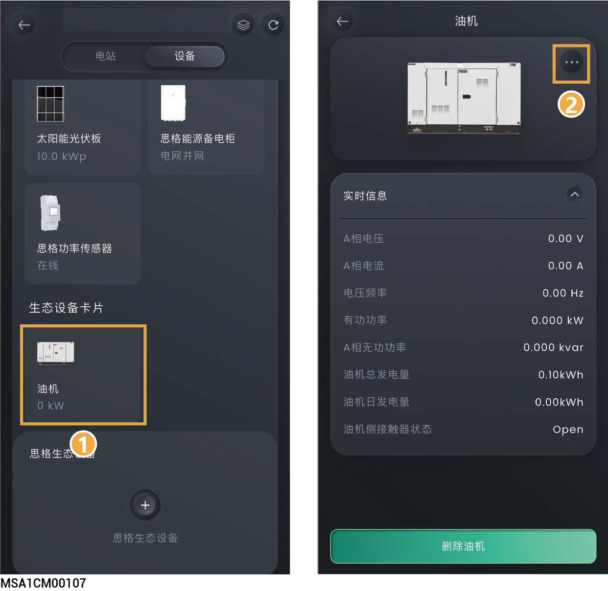

# 发电机



* 在接入发电机前，请确保组网中已配置支持连接发电机的思格能源备电柜，且已正确接线。思格能源备电柜的信息，请查阅对应机型的《安装指南》。
* 若思格能源备电柜有智能负载接口，App界面展示发电机卡片。
* 发电机接入思格能源备电柜后需通过App添加油机，才可查看与设置油机相关参数。

<figure><figcaption></figcaption></figure>

## **通过手动操作控制**

本模式下，您需要在柴油发电机侧进行开关机。

<table><thead><tr><th width="73" align="center">序号</th><th width="143">参数名称</th><th>说明</th></tr></thead><tbody><tr><td align="center">1</td><td>额定功率</td><td>设置柴油发电机的额定功率。</td></tr><tr><td align="center">2</td><td>最大负载率</td><td>为保证油机最佳使用状态，建议对柴油发电机输出功率进行控制，推荐设置值为≤80%。</td></tr><tr><td align="center">3</td><td>最小负载率</td><td>为保证油机不空载运行，建议对柴油发电机输出功率进行控制，推荐默认值为0%。</td></tr><tr><td align="center">4</td><td>【油机供电】电池备电SOC</td><td>当电池包的SOC＜“【油机供电】电池备电SOC”值时，柴油发电机将为电池包充电至设置值。</td></tr></tbody></table>

## **两线启动**

本模式下，您可通过App端进行柴油发电机开关机或柴油发电机可实现自动开关机。

<table><thead><tr><th width="78" align="center">序号</th><th width="146">参数名称</th><th>说明</th></tr></thead><tbody><tr><td align="center">1</td><td>运行模式</td><td><ul><li>手动</li><li>自动</li></ul></td></tr><tr><td align="center">2</td><td>油机启动</td><td>在“Manual”模式下，设置为 时，您可在App上，通过  ”对柴油发电机进行开关机。</td></tr><tr><td align="center">3</td><td>额定功率</td><td>设置柴油发电机的额定功率。</td></tr><tr><td align="center">4</td><td>最大负载率</td><td>为保证油机最佳使用状态，建议对柴油发电机输出功率进行控制，推荐设置值为≤80%。</td></tr><tr><td align="center">5</td><td>最小负载率</td><td>为保证油机不空载运行，建议对柴油发电机输出功率进行控制，推荐默认值为0%。</td></tr><tr><td align="center">6</td><td>油机供电】电池备电SOC</td><td>当电池包的SOC＜“油机供电】电池备电SOC”值时，柴油发电机将为电池包充电至设置值。</td></tr><tr><td align="center">7</td><td>定时启动</td><td>在“Auto”模式下，设置为 时，可设置启动方式。</td></tr><tr><td align="center">8</td><td>负载功率设置</td><td>
在“Auto”模式下，设置为 时，设置负载功率测量类型。

<strong>负载总功率</strong>
<ul><li>油机启动总负载功率阈值：当负载的总功率＞设置参数时，油机启动。</li><li>油机停止总负载功率阈值：当负载的总功率＜设置参数时，油机停止。</li></ul>
<strong>每相负载功率最大值</strong>
<ul><li>油机启动每相负载功率阈值：当每相负载功率＞设置参数时，油机启动。</li><li>油机停止每相负载功率阈值：当每相负载功率＜设置参数时，油机关闭。</li></ul></td></tr><tr><td align="center">9</td><td>使用时间</td><td>
在“自动”模式下，设置为 时，可以设置计划表启动油机。
<ul><li>自动开机SOC阈值：当电池SOC＞设置参数时，油机启动。</li><li>自动关机SOC阈值：当电池SOC＜设置参数时，油机关闭。</li><li>最大负载率：为保证油机最佳使用状态，建议对发电机输出功率进行控制，推荐设置值为≤80%。</li></ul></td></tr></tbody></table>
