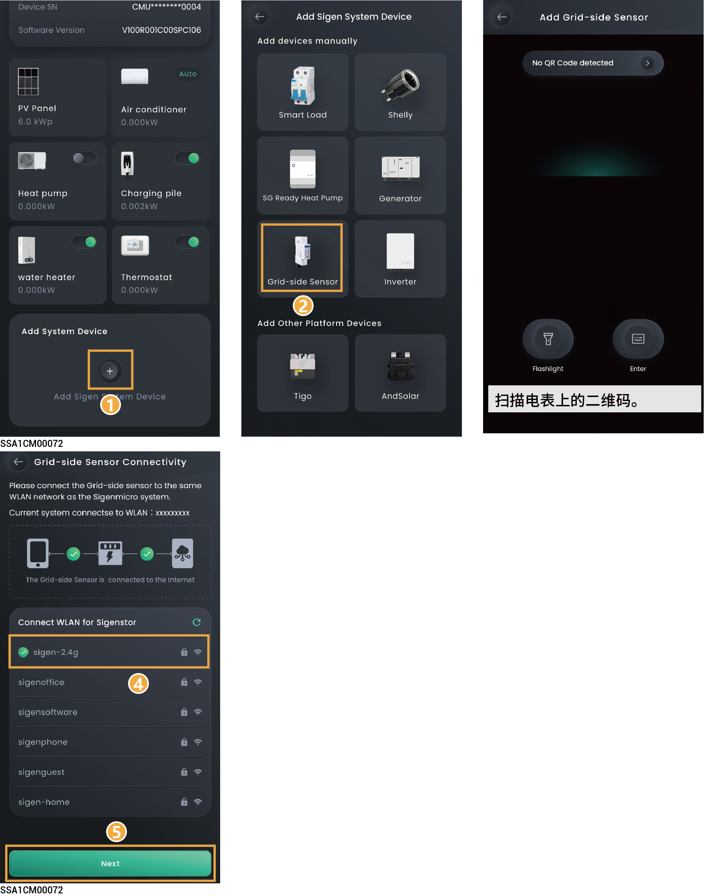

# Grid-side Sensor

## Add WLAN Meter



* <mark style="color:blue;">In anti-backflow scenarios, power stations require the installation of a grid-connection point electricity meter.</mark>
* <mark style="color:blue;">Only power stations with SigenMicro series products can add grid-connection point electricity meters.</mark>
* <mark style="color:blue;">The WLAN connected to the electricity meter must be consistent with the WLAN connected to the power station.</mark>

<figure><figcaption></figcaption></figure>
