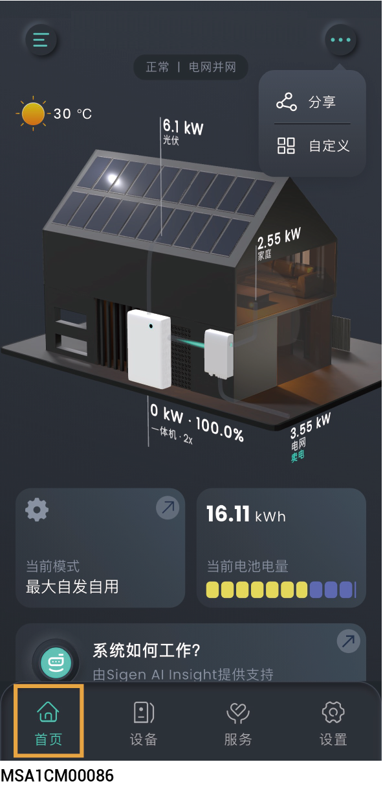
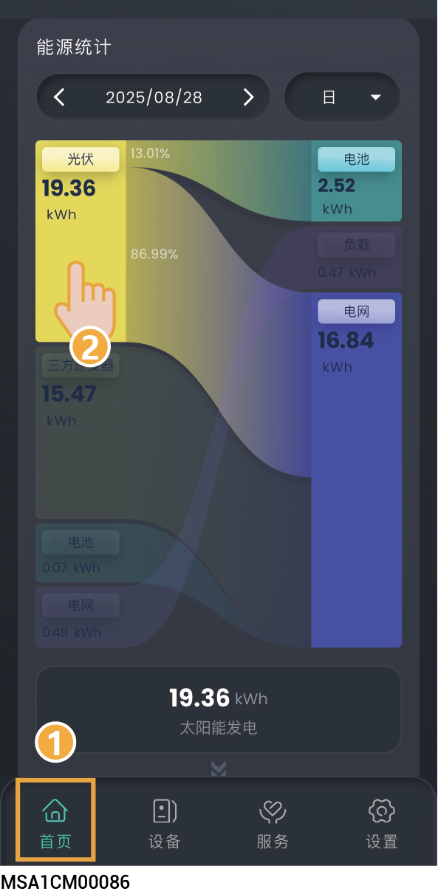
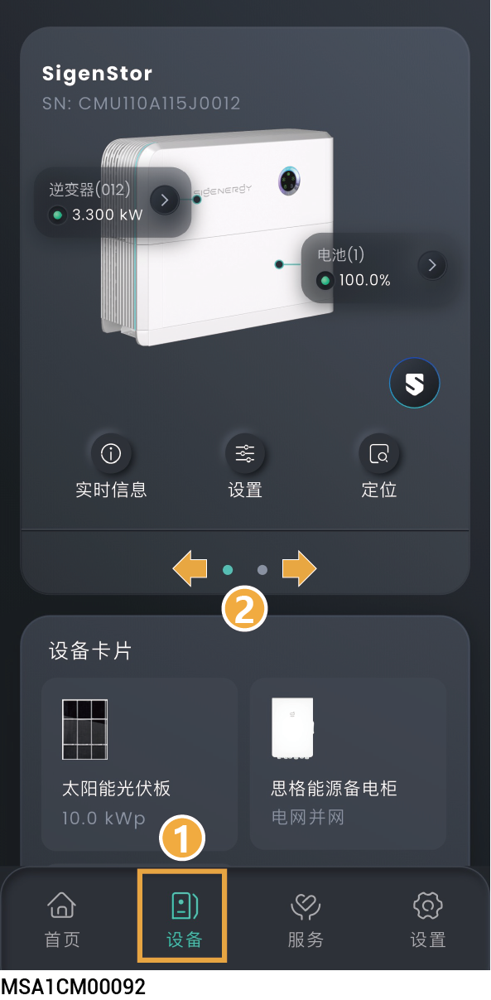
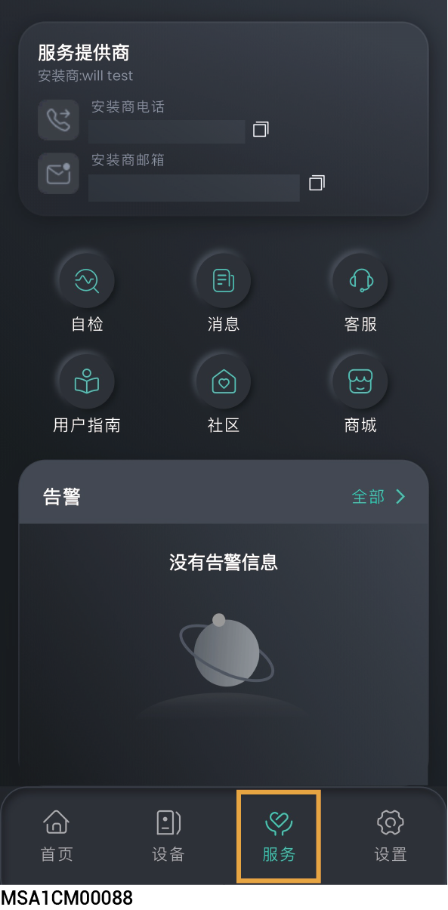
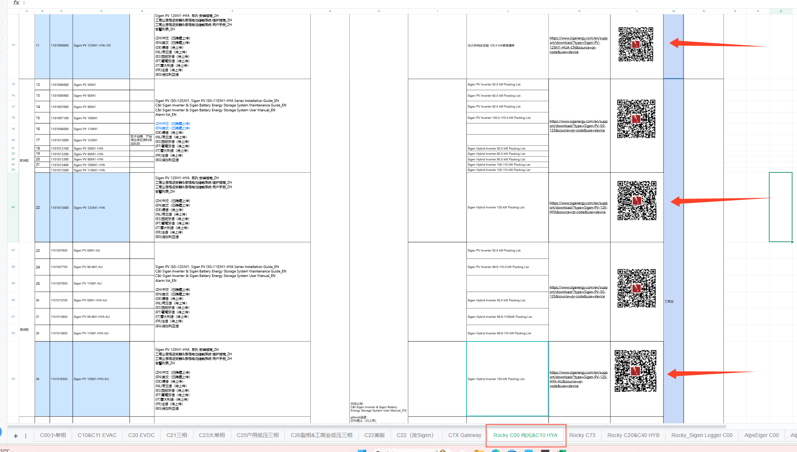

# 电站信息

## **电站运行信息**

<figure><figcaption></figcaption></figure>

### **分享电站**

首页界面可查看电站运行信息，点击→，您可将首页界面的信息分享给他人。

### **首页自定义设置**

* 点击→，您可根据需求，创建定制化的首页布局。
* 点击“恢复默认”可恢复默认设置。

## **能源分析**

点击能源框，可查看能量流向。

<figure><figcaption></figcaption></figure>

## **单设备信息**



* <mark style="color:blue;">多台思格逆变器/电池接入同一电站，左右或上下滑动，可查看每一台思格逆变器/电池。</mark>
* <mark style="color:blue;">App显示SN号和思格逆变器/电池标签的SN号一致，可通过SN号找到您需要查看的思格逆变器/电池。</mark>

<figure><figcaption></figcaption></figure>

## **服务页信息**

<figure><figcaption></figcaption></figure>

<table><thead><tr><th width="70" align="center" valign="middle">序号</th><th width="92.6162109375" valign="middle">参数名称</th><th valign="top">说明</th></tr></thead><tbody><tr><td align="center" valign="middle">1</td><td valign="middle">自检</td><td valign="top">若您想检查电站通信状态及电站内设备连接状态，可使用本功能<mark style="color:blue;">。</mark> 点击可进行电站诊断。</td></tr><tr><td align="center" valign="middle">2</td><td valign="middle">消息</td><td valign="top">点击查看电站消息。</td></tr><tr><td align="center" valign="middle">3</td><td valign="middle">客服</td><td valign="top"><ul><li>若您在使用设备过程中有疑问，可通过App告知我们。</li><li>若您想查看历史疑问，可点击“客服”界面右上角的“历史”获取。</li></ul></td></tr><tr><td align="center" valign="middle">4</td><td valign="middle">用户指南</td><td valign="top">点击获取用户指南。</td></tr><tr><td align="center" valign="middle">5</td><td valign="middle">社区</td><td valign="top">点击访问论坛界面。 点击“论坛”→“视频指南”，查看产品安装视频。</td></tr><tr><td align="center" valign="middle">6</td><td valign="middle">商城</td><td valign="top">点击购买产品，点击右上角“”查看历史订单</td></tr></tbody></table>

