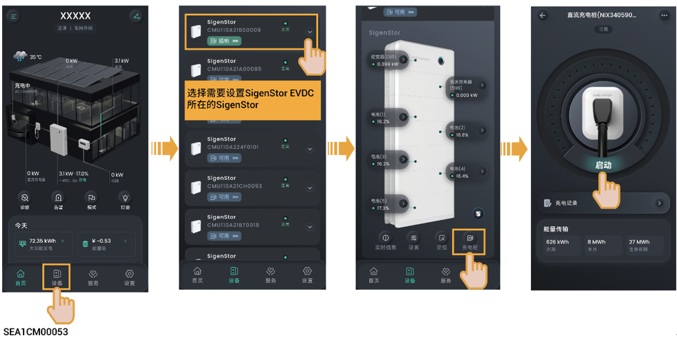

# App鉴权或RFID刷卡片鉴权充电（推荐）

1. 将充电枪安装到位。
2. 设备侧启动充电。

* #### 方式一：App鉴权充电

*   #### 方式二：RFID刷卡片鉴权充电

    刷RFID刷卡片卡。



* <mark style="color:blue;">**当您在App上操作或RFID刷卡片刷卡启动设备充电后，设备即刻进行自检测，并与车辆建立连接，约30s\~40s后，对车辆进行充电。在此期间，请耐心等待，请勿对设备操作，包含但不限于在App上操作或重复刷卡。**</mark>
* <mark style="color:blue;">**若出现车辆无法充电情况，可尝试重新拔插充电枪，确保充电枪与车辆连接到位后，重新启动充电。**</mark>
