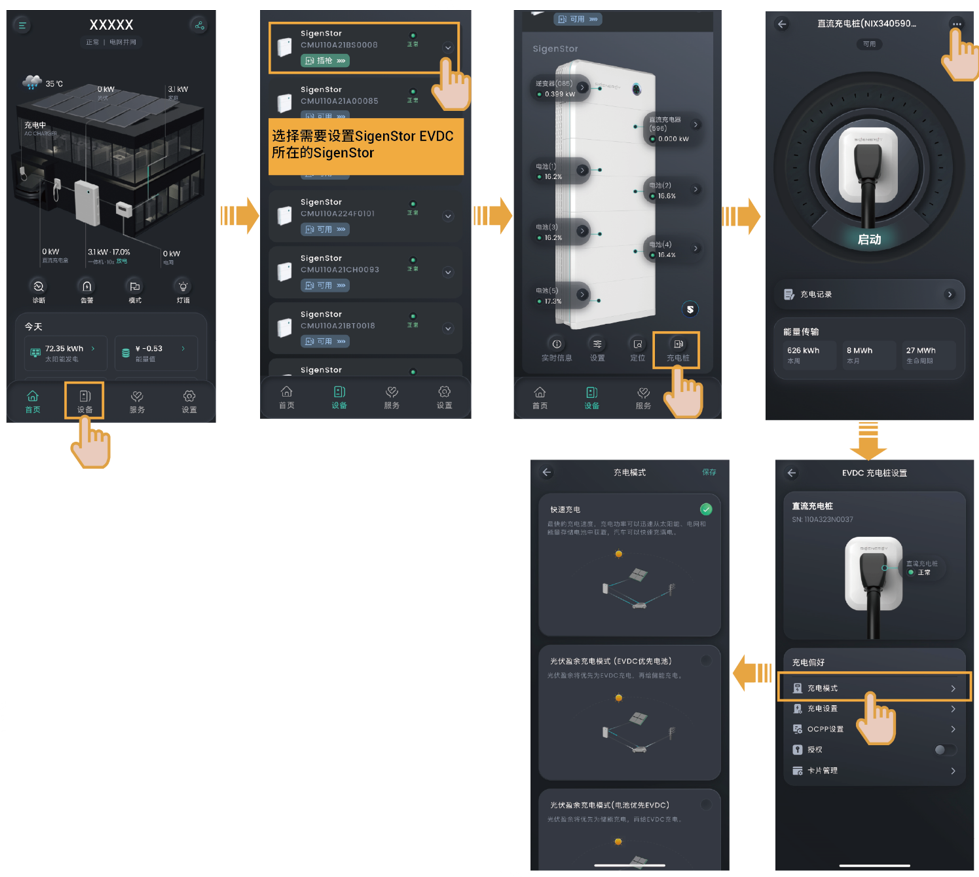

# 充电模式设置

### **快速充电**

光伏发电满足负载用电后，光伏剩余功率+电池包放电功率+电网买电功率一同用于SigenStor EVDC充电。

* 光伏剩余功率≥“EVDC允许充电功率”设置值时，SigenStor EVDC按照设置值充电，光伏剩余功率用于电池包充电。
* 光伏剩余功率+电池包总功率≥“EVDC允许充电功率”设置值时，SigenStor EVDC按照设置值充电。
* 光伏剩余功率+电池包总功率+电网买电功率≥“EVDC允许充电功率”设置值时，SigenStor EVDC按照设置值充电。
* 光伏剩余功率+电池包总功率+电网买电功率＜“EVDC允许充电功率”设置值时，SigenStor EVDC按照光伏剩余功率+电池包总功率+电网买电功率充电。
* 光伏剩余功率+电池包总功率+电网买电功率＜1kW时，系统会向您的车辆发送提示。

### **光伏盈余充电(EVDC优先电池)**

光伏发电满足负载用电后，光伏剩余功率用于SigenStor EVDC充电，再剩余功率用于电池包充电。

* 光伏剩余功率≥“EVDC允许充电功率”设置值时，SigenStor EVDC按照设置值充电，再剩余功率用于电池包充电。
* 光伏剩余功率＜“EVDC允许充电功率”设置值时，SigenStor EVDC按照光伏剩余功率+电池包放电功率充电。
* 光伏剩余功率为0或负值时，系统会向您的车辆发送提示。

### **光伏盈余充电(电池优先EVDC)**

光伏发电满足负载用电后，光伏剩余功率先电池包充电，再剩余功率用于SigenStor EVDC充电。

* 光伏剩余功率满足电池包从电后，再有剩余功率≥“EVDC允许充电功率”设置值时，SigenStor EVDC按照设置值充电。
* 光伏剩余功率满足电池包从电后，再剩余功率＜“EVDC允许充电功率”设置值时，SigenStor EVDC按照再剩余功率充电。
* 光伏剩余功率为0或负值时，系统会向您的车辆发送提示。
