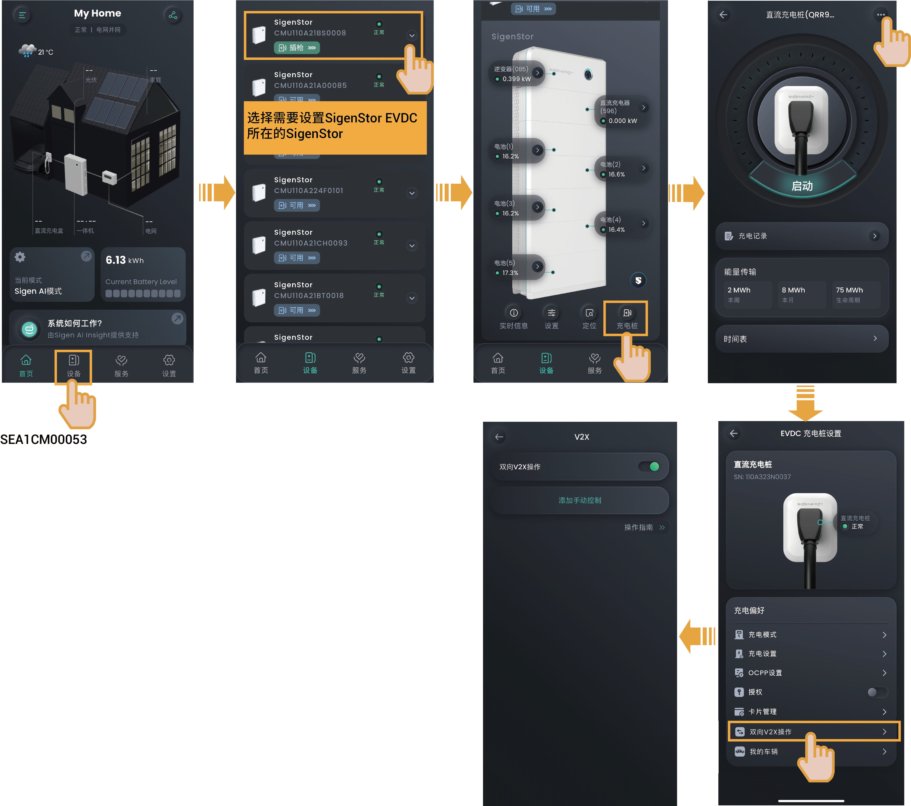

# （可选）V2X功能设置



* 开通V2X功能后，可将SigenStor EVDC作为额外 “储能” 参与电站调度，在离网时与电池包一同为用电设备供电。
* 当设备软件版本为SPC110及以上时，可支持V2X功能。

<figure><figcaption></figcaption></figure>

* 首次开通V2X功能时，点击“双向V2X操作”，签署风险告知协议、填写车型基础信息等后方可成功开通。
* 若您有多辆电动车，您可通过“我的车辆”添加车辆信息，并设置其中一台车为首选车辆。
* 若您希望在指定的时段内SigenStor EVDC以设置的功率放电，可通过“添加手动控制”进行设置。
* 在SigenStor EVDC执行V2X功能时，若您想停止SigenStor EVDC放电，可将“双向V2X操作”设置为。
