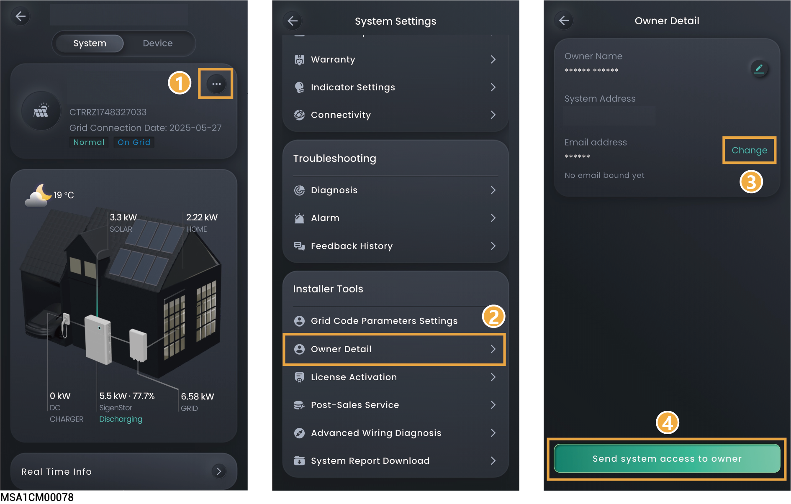
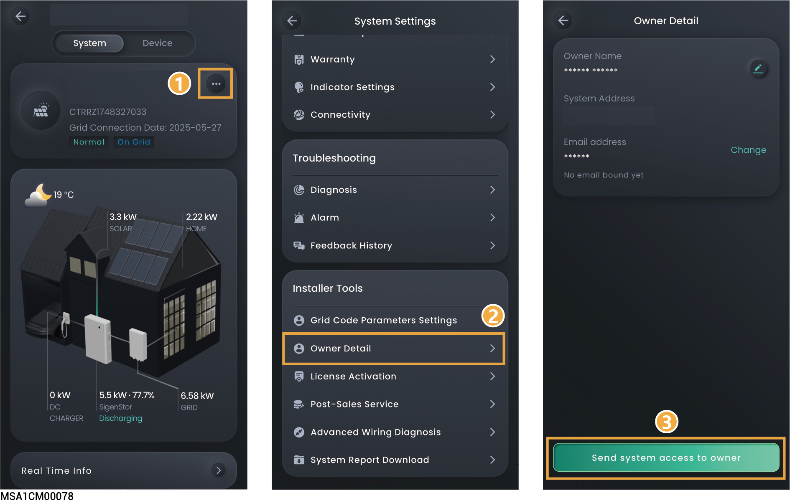
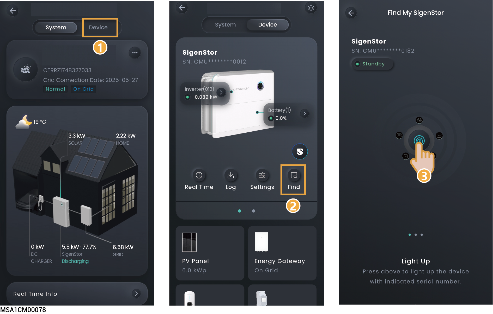

# FAQs

## What should you do if the owner has not received the account activation email?

* Check whether the email from the "sigencloud" account was received in the Spam folder.
* If not, check whether the email address of the owner is correct. If the email address is incorrect, please set the email address and push the notification again.

<figure><figcaption></figcaption></figure>

## What should you do if the owner account activation times out and cannot be operated?

Please push the account activation notification again and ask the owner to activate the account within 24 hours.

<figure><figcaption></figcaption></figure>

## What should you do if you have a problem with creating new systems or other actions? 

* Click "Service" → "Support" to get the contact information of your region.
* Please visit [https://www.sigenergy.com](https://www.sigenergy.com/) and go to "Contact Us" →"Local Contacts" to get the contact information.

## What should you do if you have not received emails (verification code or logs) from the system? 

* Check whether the email from the "sigencloud" account was received in the Spam folder.
* Push the notification again.

## What should you do if you want to disconnect WLAN when the communication mode changes from WLAN to FE?

1. Insert the network cable into the device.
2. On the "Home" screen, click the station name you want to set.
3. Click  next to the station name and click "System Settings" → "Connectivity.”
4. Wait until "Ethernet" is connected, click "WLAN,” and then select any WLAN and enter an invalid password.

## How do I connect a power sensor if the RS485\_2 port of the inverter is faulty? 

You can connect a power sensor to the RS485\_1 port of the inverter. You must manually add a power sensor after the cable is properly connected.



<mark style="color:blue;">When the RS485\_1 port is connected to a power sensor, do not connect other devices simultaneously. Otherwise, the power control may be affected.</mark>

<figure><figcaption></figcaption></figure>

## In grid connection scenarios, how can I quickly identify where SigenStor is installed?

You can light up the LED of SigenStor in the App and locate the SigenStor.

<figure><figcaption></figcaption></figure>

## How do I reconnect the network when the device network connection is lost?

You can re-configure the network settings using a device hotspot in "Setting" → "Network Configure" or "Device Configure."



<mark style="color:blue;">If you still cannot connect to the device hotspot, disconnect the AC circuit breaker and DC switch of the device, wait for the device indicator to go out, then turn on the AC circuit breaker and DC switch again, wait for 30 seconds, and then rescan the device QR code and configure the network according to the above steps.</mark>

## How do I check whether the device is connected in parallel with other ones?

You can check this in "Setting" → "System Affiliation Lookup."

## How to recharge the Sigen CommMod data when it is used up?

### Method 1:

Click "Service" → "Mall" → "Data Plan" to purchase.

### Method 2:

Click "Settings" → "System Settings" → "Connectivity" in General → "Cellular" → "4G Data Recharge"

## **How to Purchase a License?**



* <mark style="color:blue;">If Sigen Sigen Hybrid SP, Sigen Hybrid SP AU, Sigen Hybrid TP, Sigen Hybrid TP AU, Sigen Hybrid TPLV Series inverters are expected to be applied in PV storage systems, users must purchase and activate the license.</mark>
* <mark style="color:blue;">When upgrading the Sigen EV DC Charging Module (e.g., from 12.5kW to 25kW), it is necessary to purchase and activate a License.</mark>
* <mark style="color:blue;">During purchase, the product information must match the device information.</mark>

## **How to Activate a License?**

### Method 1:

Click "Service" → "Mall" → →Select the order to be activated → Click "Activate Now" → Copy the "License Key" → Select power station → Enter the "License Key"

### Method 2:

1. On the "Home" interface, click the name of the power station you want to configure.
2. Click  next to the station name and click "License Activation" in General → Enter the "License Key".

## **How to Buy Extended Warranty Service?**



<mark style="color:blue;">During purchase, the product information must match the device information.</mark>

Click "Service" → "Mall" → "Extended Warranty" to purchase.

## **How to Activate Extended Warranty Service?**

Click "Service" → "Mall" → →Select the order to be activated → Click "Activate Now" → Copy the "Extended Warranty Key" → Select power station → Enter the "Extended Warranty Key"

## How to revoke Sigen View's authorization for accessing power station information?

Click on "Service" → "Community" → "Profile icon" in the upper right corner → "Setting" → "Authorize station info" → "Revoke" → "Unbind" in the upper right corner.

## Does the Sigen EV AC Charger (pure charging station) support PV surplus charging with third-party inverters?

Yes, it does. However, the Sigen EV AC Charger pure charging station must be configured with a Sigen power sensor.

## How to Return a Completed ticket for Resubmission?



<mark style="color:blue;">Tickets completed within 7 days can be returned for resubmission.</mark>

Click "Service" → "Support" → "History" → Select the ticket → Click "Problem unsolved? Restart ticket"

## How to View Power Station Earnings and Income Calendar in Sigen AI Mode?

If the power station has activated Sigen AI mode, click the  next to the station name → Click "Operational Mode" → Click "Current Mode" → Select "Sigen AI mode" to view the earnings and income calendar for Sigen AI mode.

## How to View VPP Dispatch Records in VPP Scheduling Mode?

Click on the power station, scroll down to find the Power Metrics Chart, and click "Grid Service".

