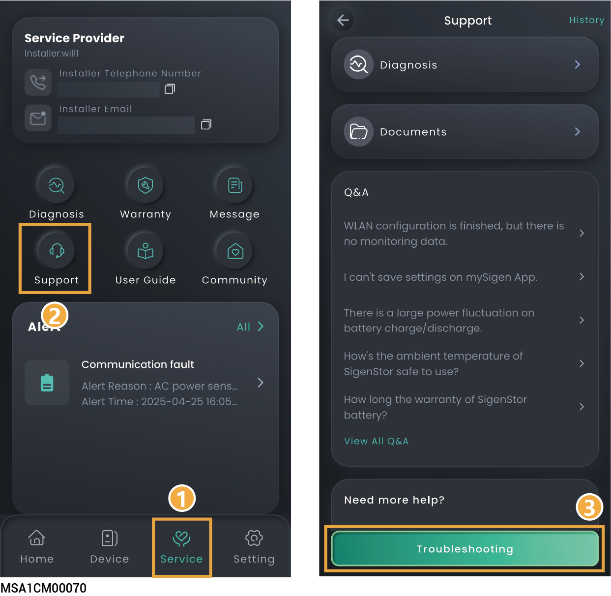
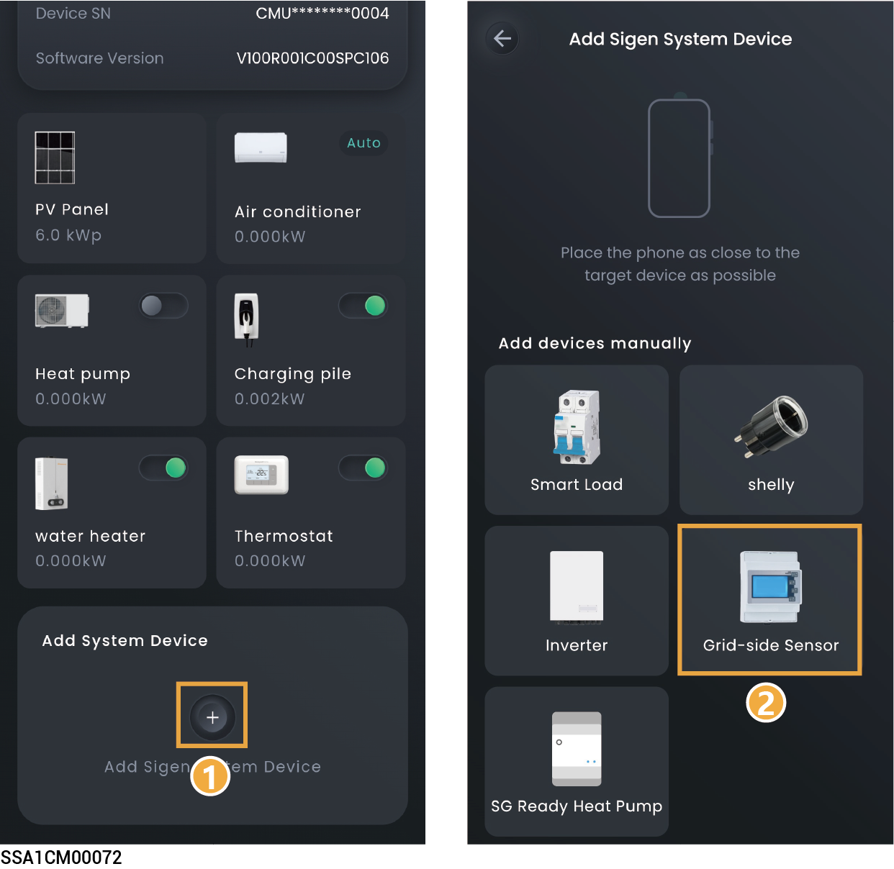
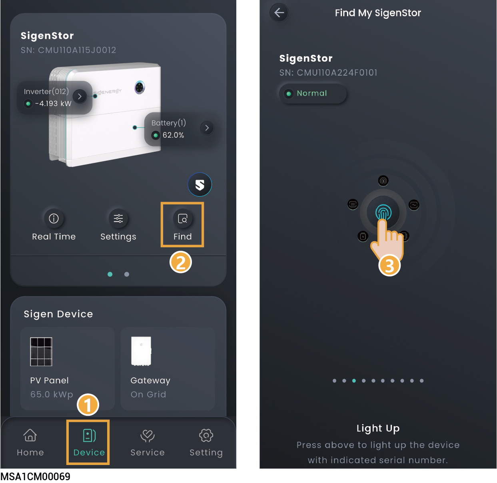
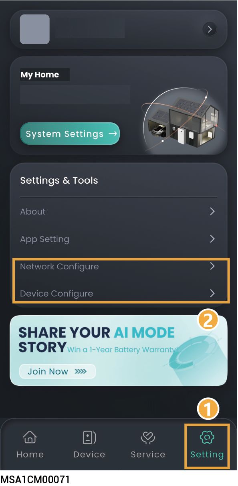
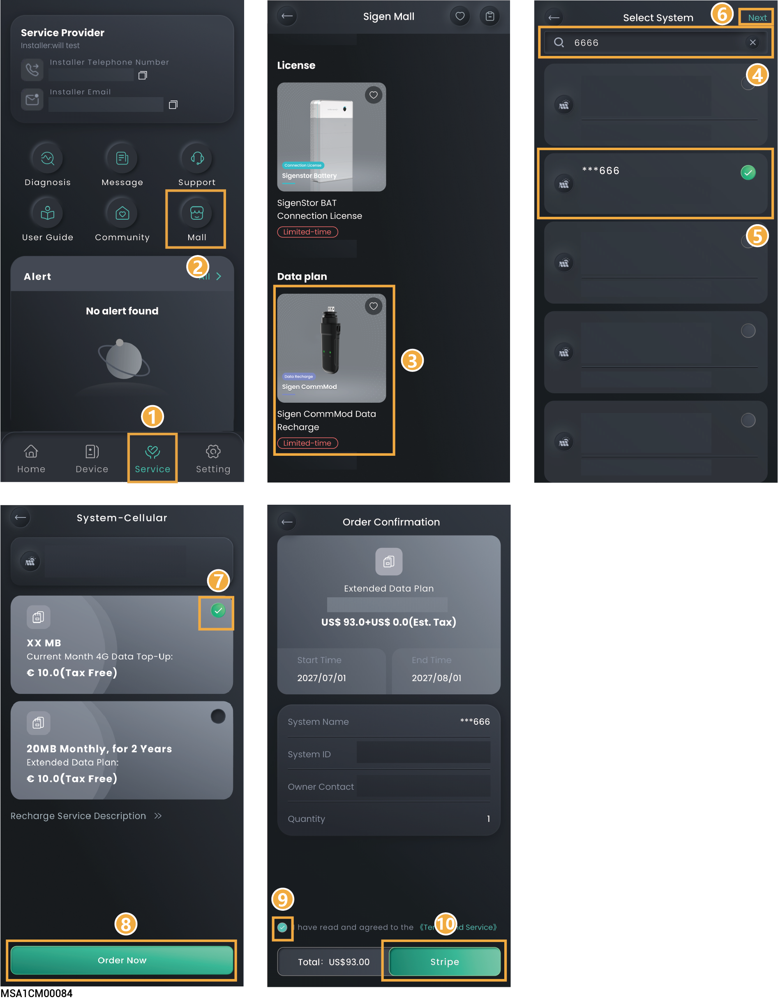
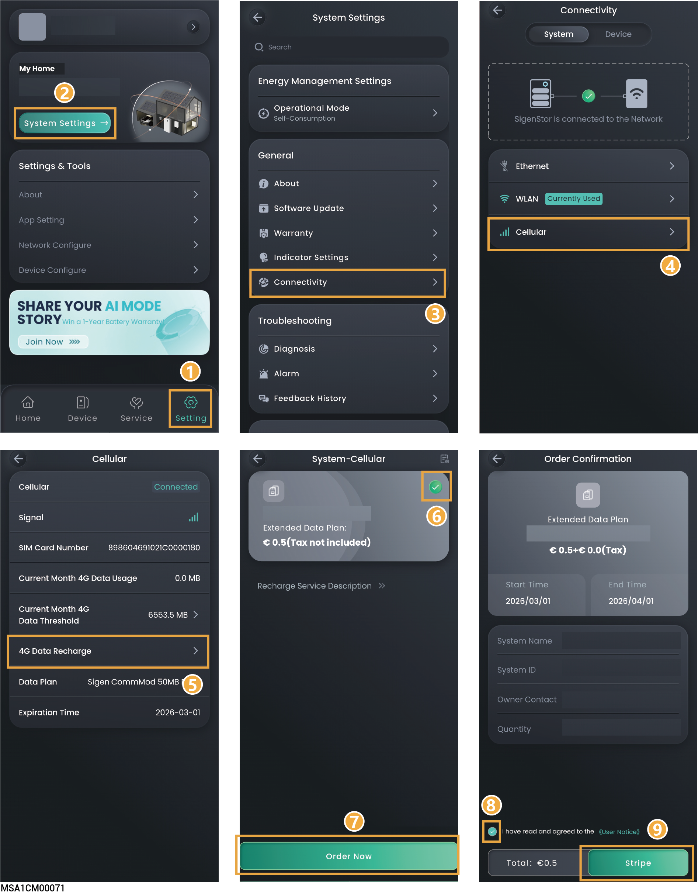
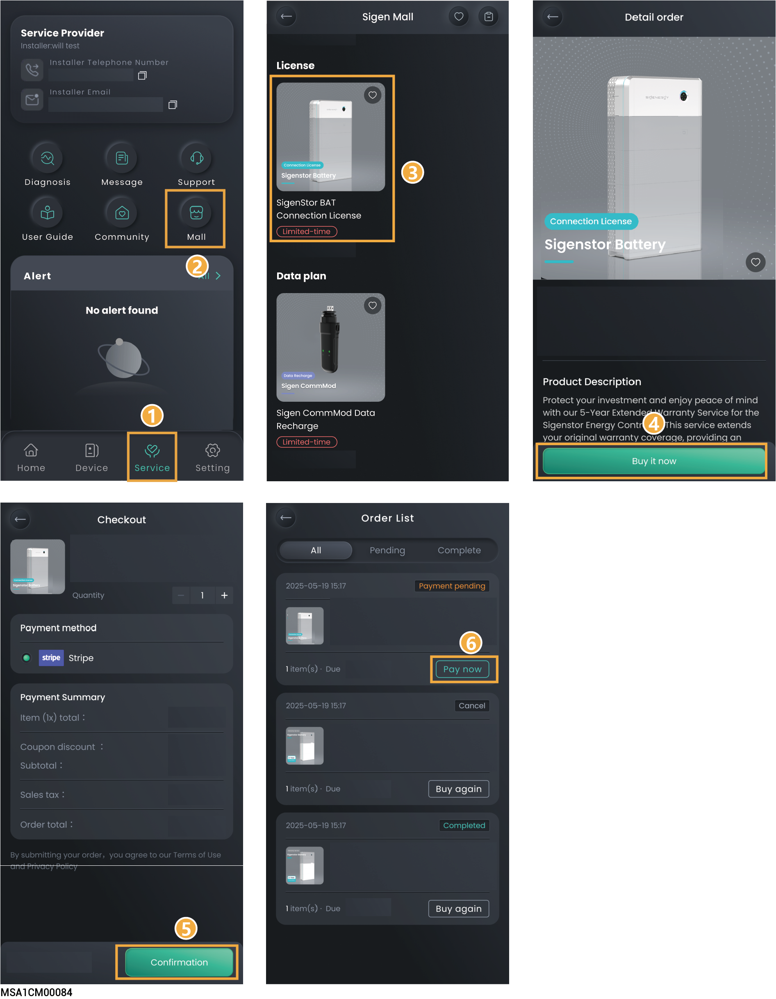
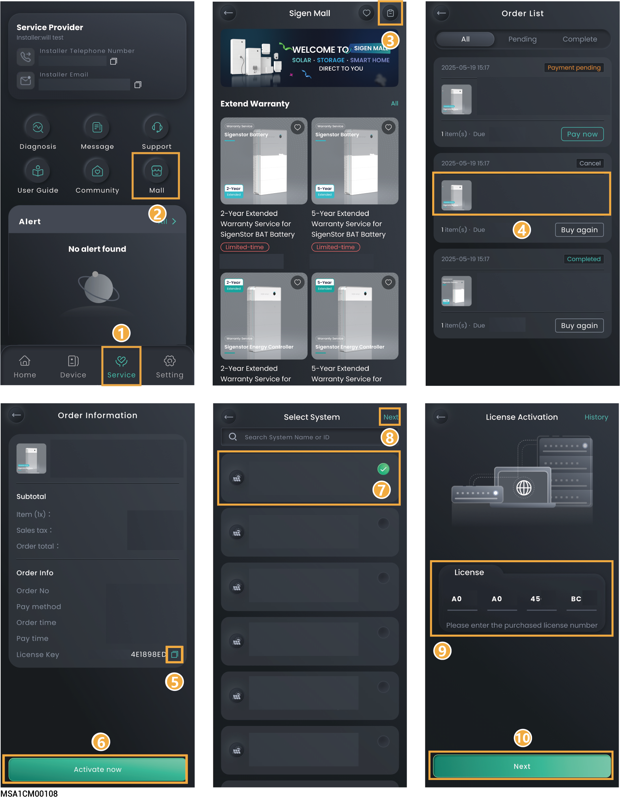
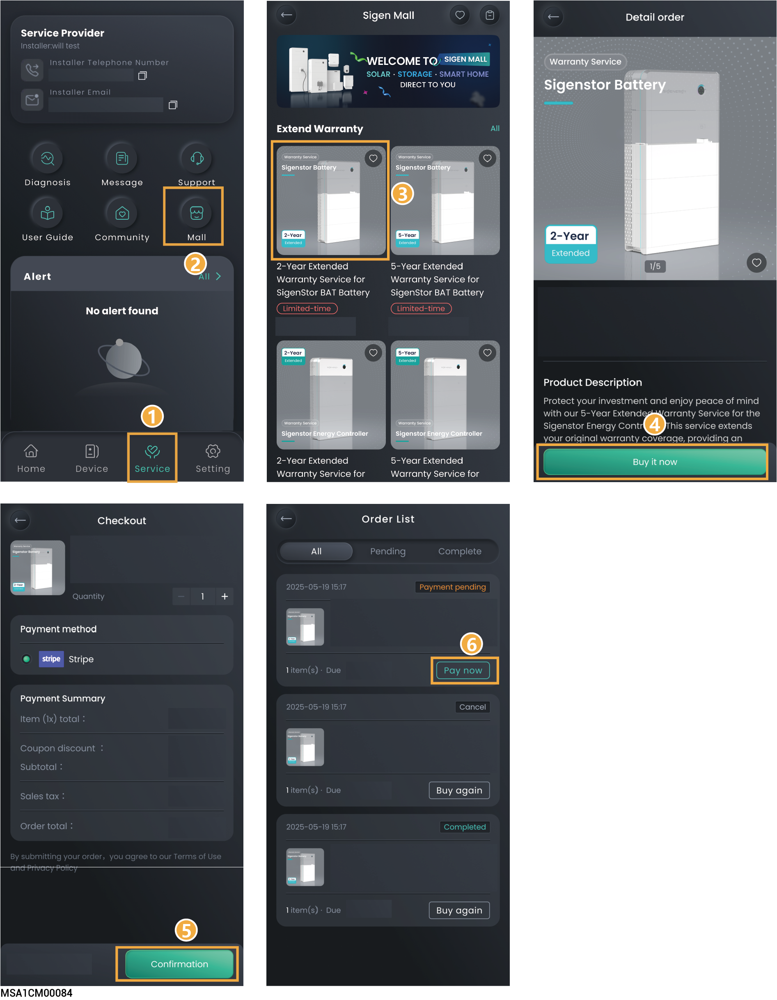
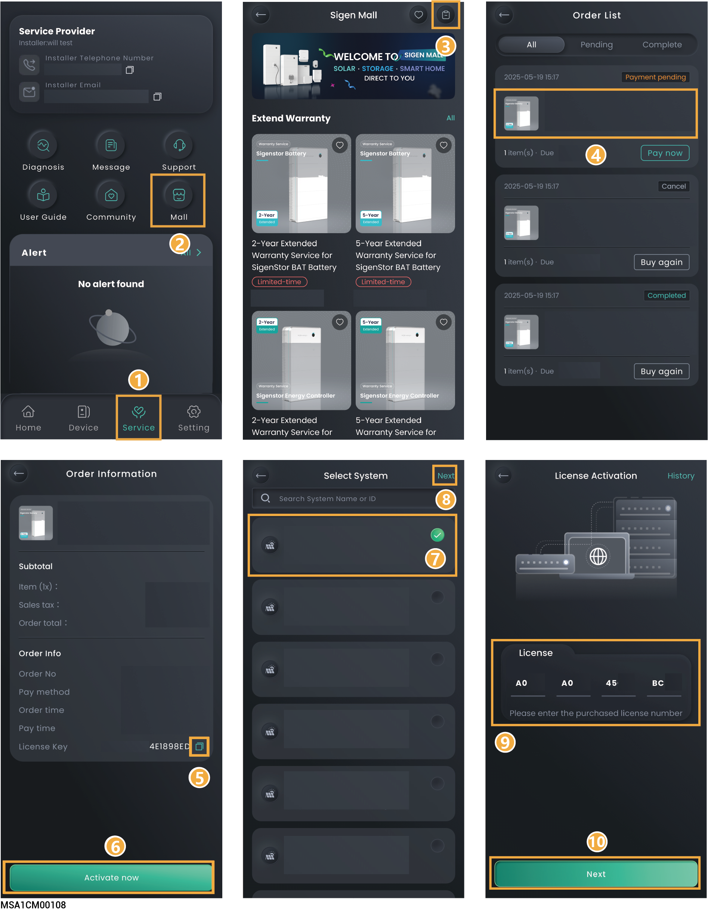

# FAQs

## Support

Please feel free to reach out to us in the App if you have any questions about the use of the product.



<mark style="color:blue;">To check the question history, click "History" in the upper right corner of the "Support" page.</mark>

<figure><figcaption></figcaption></figure>

## What should I do if I do not receive the email (link, password change) sent by the system? 

* Check whether the email from the "sigencloud" account was received in the Spam folder.
* Push the notification again.

## What should you do if you want to disconnect WLAN when the communication mode changes from WLAN to FE? 

1. Insert the network cable into the device.
2. On the "Home" screen, click the station name you want to set.
3. Click ![](data:image/png;base64,R0lGODdhJQAhAHcAACH+GlNvZnR3YXJlOiBNaWNyb3NvZnQgT2ZmaWNlACwAAAAAJQAhAIdjWloxOkohKTEpMTpKGVpKWhkIGRkhGSFCQkoxOkJrzt5rjFopzt4pjFprzpxrjBkpzpwpjBlrGc4pGc5Kzt5KjFoIzt4IjFpKzpxKjBkIzpwIjBlKGc4IGc4QY1oQGWNrWs4pWs4QQloQGUJKWs4IWs6tzt6MjJwpQhmtrd6trZyMrZxrhJzv795r797va95r71rv71rva1prpd5rrVqt796ta96t71qta1op794prVoppd7vrd7vKd4p71rvrVrvKVqtKd6trVqtKVopYxlr75xrrRkp75wprRmt75xrpZzv75zva5xr7xnv7xnvaxmta5yt7xmtaxkppZzvrZzvKZwp7xnvrRnvKRmtKZytrRmtKRlrGe8pGe9rKZQpKZRrKRmM794IYxmMrd5KpZzO797Oa95K71rO71rOa1pKpd6Ma96M71qMa1oIpd7Ord7OKd4I71rOrVrOKVqMKd6MrVqMKVqM75zO75zOa5xK7xnO7xnOaxmMa5yM7xmMaxkIpZzOrZzOKZwI7xnOrRnOKRmMKZyMrRmMKRlKKZQIKZRKKRmtjN6tjJzvzt5K797vSt5rzlrvzlrvSlprhN5KrVqtSt6tzlqtSloI794IrVophN7vjN7vCN4pzlrvjFrvCFqtCN6tjFqtCFpK75xKrRkI75wIrRmtzpzvzpzvSpxrzhnvzhnvShmtSpytzhmtShkphJzvjJzvCJwpzhnvjBnvCBmtCJytjBmtCBlKGe8IGe9rCJQpCJRrCBmMzt4IQhmMjN5KhJzOzt7OSt5KzlrOzlrOSlpKhN6MSt6MzlqMSloIhN7OjN7OCN4IzlrOjFrOCFqMCN6MjFqMCFqMzpzOzpzOSpxKzhnOzhnOShmMSpyMzhmMShkIhJzOjJzOCJwIzhnOjBnOCBmMCJyMjBmMCBlKCJQICJRKCBkxWloxGVohKRlrWoRrWu9rWqUpWu8pWqVrKVprWilKWqUIWqVKWu8IWu8pWoRrCFprWghKWoQIWoRKWlopEAgpEDoI/wARBBCIgGDBgwgTDjQ4sCHBBAkSHuwXgCICiv0mStwosaLHjAVBCkwQoORAjA0tOiyJMeTFihQTDJhJcyZEhS9FIqxIoKJAmhAh1hwgQABJiwwFLgSZsV9NmTIHQB0qteDChS49FqSJQGqARVKlgqV69KpSlxlndh2wVqjNmgeAWj2Y8qFUmQTeDhhrM+7MuEbnYkX5NurasDUXyfQbN6nPrWwjR6UKlybgiA8LEug3ufCAvEP9/h19ICVmdV3zdu0KFUXioa4HxGVXNSJJq0Bp8qUaN+6/uK4FNLZ9EYHMtaBlCtgrW/hf4DOdx70ZcWDnycXVAojaz+lv2eAPEP/PbnOygBPDUnRNMezEAQDsAfQOf9f4QqhTZzYyoR5BChMrDMDCMCawcABtvdHGFmaQRTVWAv2csMAA7LRzQj9xWUgfO/MZd5txetG0XFEUhofCAfMlWB+DMu1GmWVEzYTgAAY0ZxuLiI1GH4qkJSicaMbNdRhQog0QW4oUjgAehwsGdVACfu3m13e0zXjggSMAyeBCvG1IGoUHLMehgh5+OBB4aH6ZIjtFHWAAiZEFKWRBjIEXm5VE1dhbY03eZB2IMA7wnYpvosimeMctmJmc0M0W3nJhMilaUNQF+edW/2wIaW/CAbNcn6vdlNlNM7m25ggc+kWpUEH62WpBmEUXJ12JXN3l5HgOtRqRovlFBZFiEQGra0AAOw==) next to the station name and click "System Settings" → "Connectivity".
4. Wait until "Ethernet" is connected, click "WLAN", and then select any WLAN and enter an invalid password.

## How do I connect a power sensor if the RS485\_2 port of the inverter is faulty? 

You can connect a power sensor to the RS485\_1 port of the inverter. You must manually add a power sensor after the cable is properly connected.



<mark style="color:blue;">When the RS485\_1 port is connected to a power sensor, do not connect other devices simultaneously. Otherwise, the power control may be affected.</mark>

<figure><figcaption></figcaption></figure>

## In grid connection scenarios, how can I quickly identify where SigenStor is installed?

You can light up the LED of SigenStor in the App and locate the SigenStor.

<figure><figcaption></figcaption></figure>

## How do I reconnect the network when the device network connection is lost? 

You can re-configure the network settings using a device hotspot in "Setting" → "Network Configure" or "Device Configure."

<figure><figcaption></figcaption></figure>



<mark style="color:blue;">If you still cannot connect to the device hotspot, disconnect the AC circuit breaker and DC switch of the device, wait for the device indicator to go out, then turn on the AC circuit breaker and DC switch again, wait for 30 seconds, and then rescan the device QR code and configure the network according to the above steps.</mark>

## How do I check whether the device is connected in parallel with other ones?

You can check this in "Setting" → "System Affiliation Lookup."

## How to recharge the Sigen CommMod data when it is used up?

### Method 1:

<figure><figcaption></figcaption></figure>

### Method 2:

<figure><figcaption></figcaption></figure>

## **How to Purchase a License?**



* <mark style="color:blue;">If Sigen Sigen Hybrid SP, Sigen Hybrid SP AU, Sigen Hybrid TP, Sigen Hybrid TP AU, Sigen Hybrid TPLV Series inverters are expected to be applied in PV storage systems, users must purchase and activate the license.</mark>
* <mark style="color:$primary;">During purchase, the product information must match the device information.</mark>

<figure><figcaption></figcaption></figure>

## &#x20;**How to Activate a License?**

<figure><figcaption></figcaption></figure>

## **How to Buy Extended Warranty Service?**

<figure><figcaption></figcaption></figure>

## **How to Activate Extended Warranty Service?**

<figure><figcaption></figcaption></figure>
