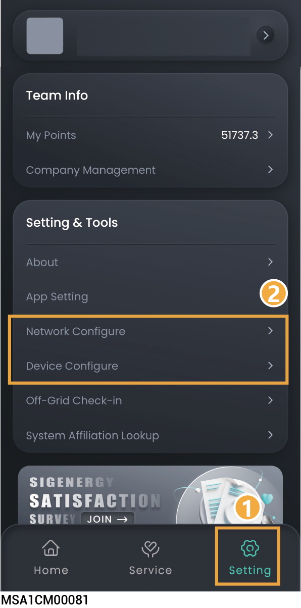

# FAQs

## **户主未收到账号激活邮件怎么办？**

* 可从邮箱的“垃圾邮件”中查看，是否收到“sigencloud” 账号的邮件。
* 若“垃圾邮件”没有，请确认户主邮箱信息填写是否正确。若不正确，请重置，并重新推送。

<figure><figcaption></figcaption></figure>

## **户主账户激活超时，无法操作，怎么办？**

请重新推送账户激活信息，并知会户主24h内激活。

<figure><figcaption></figcaption></figure>

## **若开局等操作过程中遇到问题，怎么办？**

点击“Service”→“Support”获取各区域联系方式。

请进入本公司官网（[https://www.sigenergy.com](https://www.sigenergy.com/)）的“Contact Us” →“Local Contacts”获取联系方式。

## **系统发送的邮件（验证码、日志等）未收到，怎么办？**

* 可从邮箱的“垃圾邮件”中查看，是否收到“sigencloud” 账号的邮件。
* 重新发送。

## **设备通信方式从WLAN转为FE后，希望断开WLAN连接，怎么办？**

1. 将用于连接网络的网线插入设备。
2. 在“Home”界面，点击要设置的电站名称。
3. 点击电站名称后的，点击“System Settings”→“Connectivity”。
4. 待“Ethernet”显示已连接后，点击“WLAN”，选择任意WLAN输入错误密码即可。

## **若逆变器RS485\_2异常，如何接入功率传感器？**

您可将功率传感器连接至逆变器的RS485\_1端口。正确接线后，需要手动添加功率传感器。



<mark style="color:blue;">当RS485\_1端口接入功率传感器时，不可同时接入其他设备，避免影响功率控制。</mark>

<figure><figcaption></figcaption></figure>

## **并机场景下，如何能快速识别到SigenStor安装在何处？**

您可通过App，点亮SigenStor的LED进行查找。

<figure><figcaption></figcaption></figure>

## **若设备网络连接断开，如何重新连接网络？**

您可通过“Setting”→“Network Configure”或“Device Configure”，通过设备热点，重新配置网络。



<mark style="color:blue;">如果一直无法连接设备热点，请将设备交流断路器和直流开关断开，等待设备指示灯能熄灭后重新合上交流断路器和直流开关，等待30s后按照上述操作重新扫描设备二维码，配置网络。</mark>

<figure><figcaption></figcaption></figure>

## **如何查询设备是否与其他设备存在并机关系？**

您可通过“Setting”→“System Affiliation Lookup”查看。

## **Sigen CommMod流量用完了，如何购买流量？**

### **方式一**

点击“Service”→“Mall”→“Data plan”购买。

### **方式二**

* 在“Home”界面，点击要设置的电站名称。
* 点击电站名称后的，在通用中点击“Connectivity”→“Cellular”→“4G Data Recharge”。

## **如何购买License？**



* <mark style="color:blue;">Sigen Hybrid SP、Sigen Hybrid SP AU、Sigen Hybrid TP、Sigen Hybrid TP AU、Sigen Hybrid TPLV系列逆变器，应用于光储系统时，需购买并激活License。</mark>
* <mark style="color:$primary;">Sigen EV DC Charging Module 升级（例如12.5kW升级为25kW）时，需</mark><mark style="color:blue;">购买并激活License</mark>
* <mark style="color:$primary;">购买时，商品信息需与设备信息保持一致。</mark>

点击“Service”→“Mall”→“选择对应产品“许可证”→点击购买。

## **如何激活License？**

### **方式一**

点击“Service”→“Mall”→ →选择要激活的订单→点击“立即激活”→复制“许可证密钥”→选择电站→输入“许可证密钥”

### **方式二**

1. 在“Home”界面，点击要设置的电站名称。
2. 点击电站名称后的，在通用中点击“许可证激活”→输入“许可证密钥”

## **如何购买延长保修服务？**



<mark style="color:$primary;">购买时，商品信息需与设备信息保持一致。</mark>

点击“Service”→“Mall”→“延长保修”购买。

## **如何激活延长保修服务？**

点击“Service”→“Mall”→ →选择要激活的订单→点击“立即激活”→复制“延长保修密钥”→选择电站→输入“延长保修密钥”

## **如何关闭思格查看账号电站信息授权？**

点击点击“Service ”→“Community”→右上角“账号头像”→“Setting”→“Authorize station info”→“Revoke”→右上角“Unbind”。

## **Sigen EV AC Charger纯充电站是否支持第三方厂家逆变器PV余电充电？**

支持。Sigen EV AC Charger纯充电站必须配置Sigen power sensor。

## 如何将完成的工单退回重新提交？



<mark style="color:$primary;">7日内完成的工单可退回重新提交。</mark>

点击“Service”→“Support”→“History”→选择工单→点击“Problem unsolved? Restart ticket”。

## Sigen AI Mode下，如何查看电站的收益和收入日历？

点击电站名称后的→点击“Operational Mode”→点击“Current Mode”→选择“Sigen AI mode”即可查看Sigen AI mode的收益和收入日历。

## Vpp Scheduling mode下， 如何查看Vpp调度记录？

点击电站，下滑找到Power Metrics Chart，点击“Grid Service”。

## <mark style="color:$warning;">并机场景下，如何查看SigenStor的组串功率</mark>

<mark style="color:$warning;">点击“Device”→选择“PV Panel”→点击右上角“</mark><mark style="color:$warning;">”→选择对应SigenStor的SN编码查看。</mark>
