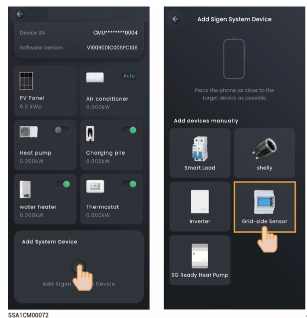

# How do I connect a power sensor if the RS485\_2 port of the inverter is faulty?

You can connect a power sensor to the RS485\_1 port of the inverter. You must manually add a power sensor after the cable is properly connected.



<mark style="color:blue;">When the RS485\_1 port is connected to a power sensor, do not connect other devices simultaneously. Otherwise, the power control may be affected.</mark>

<figure><figcaption></figcaption></figure>
