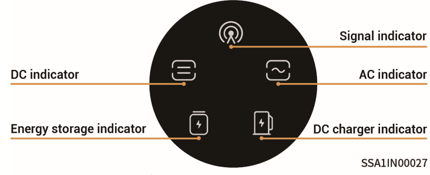
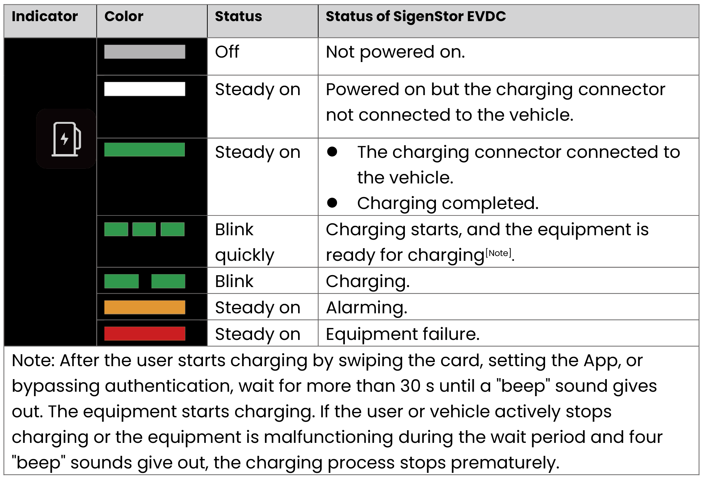

# LED Indicator Status

The status of SigenStor EVDC is indicated by the DC charger indicator on the front of the inverter.

<figure><figcaption></figcaption></figure>

<figure><figcaption></figcaption></figure>
