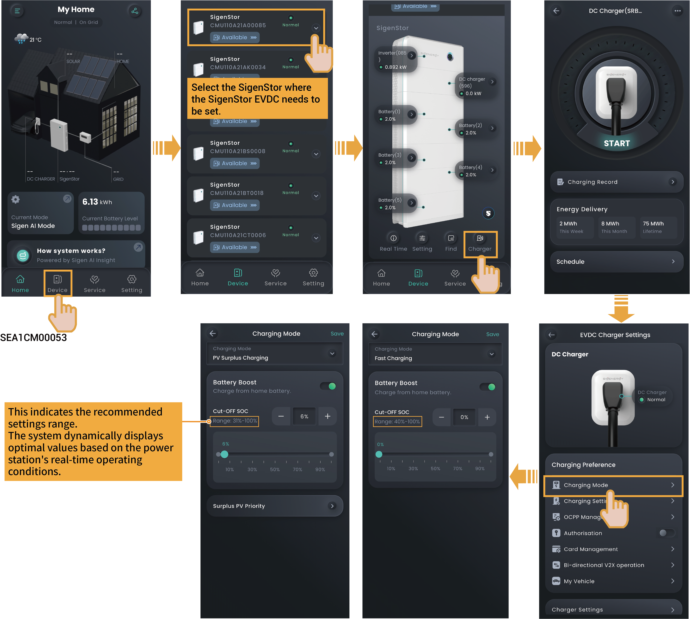

# Charging Mode Settings

### **Fast Charging**

* SigenStor EVDC charges the vehicle quickly to the "Vehicle Charging Cut-off SOC" value (see [Charging Settings](charging-power-allowed-for-evdc-settings.md)) at the maximum charging power (the value set for "Charging Power allowed for EVDC"), which is the fastest charging speed.
* In this mode, the default priority of the charging power source of SigenStor EVDC is: PV power → discharging power of battery pack → grid input power. You can set whether the battery pack is to be discharged through "Battery Boost". When set to , the battery is allowed to discharge power to SigenStor EVDC to charge the vehicle, and the discharge cutoff SOC can be set. When set to  or the battery is discharged to the set cut-off SOC, SigenStor EVDC is not allowed to draw charging power from the battery pack.

**For example:** Set the "Working Mode" of SigenStor to "Maximum Self-consumption". SigenStor contains 2 battery packs, each with a rated discharging power of 4 kW, while SigenStor EVDC has a rated charging power of 25 kW. You can set "Battery Boost" to  andthe discharge cut-off SOC to 0%. Power distribution under different lighting conditions:

| PV power | Battery pack power | Consumed power of load | Compensating power of grid | DC charging power |
| -------- | ------------------ | ---------------------- | -------------------------- | ----------------- |
| 0 kW     | Discharge: 8 kW    | 6 kW                   | 23 kW                      | 25 kW             |
| 23 kW    | Discharge: 8 kW    | 6 kW                   | 0 kW                       | 25 kW             |
| 31 kW    | 0 kW               | 6 kW                   | 0 kW                       | 25 kW             |
| 35 kW    | Charge: 4 kW       | 6 kW                   | 0 kW                       | 25 kW             |

### **PV Surplus Charging**



<mark style="color:blue;">**SigenStor EVDC cannot start charging in this mode at nighttime, please use this mode during the daytime.**</mark>

* When the generated PV power meets the power demand of loads, the surplus PV power is used to charge the device. You can set the priority of using the surplus PV power by dragging the device under the "Surplus PV Priority" menu (the priority is from top to bottom).
* When a device that uses the surplus PV power is set to SigenStor EVDC taking priority over the battery pack, and "Battery Boost" is set to , the battery pack is allowed to discharge, and the surplus PV power and discharging power of battery pack are both supplied to the SigenStor EVDC to charge the vehicle. When the battery pack is discharged to the set cut-off SOC, the battery pack stops discharging.

**For example:** Set the "Working Mode" of SigenStor to "Maximum Self-consumption". SigenStor contains 2 battery packs, each with a rated discharging power of 4 kW, while SigenStor EVDC has a rated charging power of 25 kW. "Battery Boost" is set to .Power distribution under different lighting conditions:

| PV power | Battery pack power | Consumed power of load | Compensating power of grid | DC charging power |
| -------- | ------------------ | ---------------------- | -------------------------- | ----------------- |
| 0 kW     | Discharge: 6 kW    | 6 kW                   | 0 kW                       | 0 kW              |
| 6 kW     | 0 kW               | 6 kW                   | 0 kW                       | 0 kW              |
| 16 kW    | 0 kW               | 6 kW                   | 0 kW                       | 10 kW             |
| 31 kW    | 0 kW               | 6 kW                   | 0 kW                       | 25 kW             |
| 35 kW    | Charge: 4 kW       | 6 kW                   | 0 kW                       | 25 kW             |



<mark style="color:blue;">**"Battery Boost" is only used to set whether the battery pack discharges power to the SigenStor EVDC.**</mark>
