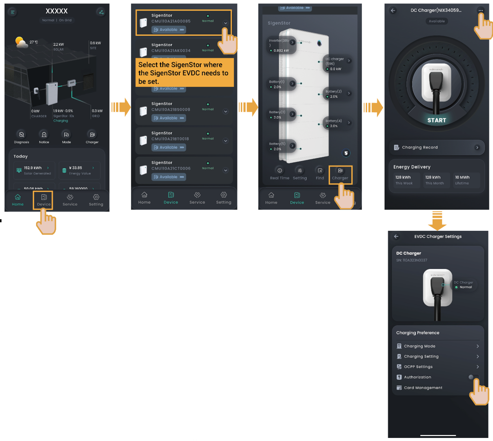

# Unauthenticated Charging Mode

1. Turn "Authentication" off, that is, .

<figure><figcaption></figcaption></figure>

2. Install the charging connector in place.



* <mark style="color:blue;">**It should be noted that when the unauthenticated charging mode is enabled, other vehicles can use this equipment for charging.**</mark>
* <mark style="color:blue;">**When you use the App or RFID card to start charging the equipment, it will perform a quick self-test, establish communication with the vehicle, and begin charging after about 30s to 40s. Please be patient and do not operate on the equipment, such as operating on the App, repeatedly swiping the card, or re-plugging the charging connector during this period.**</mark>
* <mark style="color:blue;">**If the vehicle cannot be charged, try to re-plug the charging connector, ensure the charging connector is properly connected to the vehicle, and then restart the charging.**</mark>
