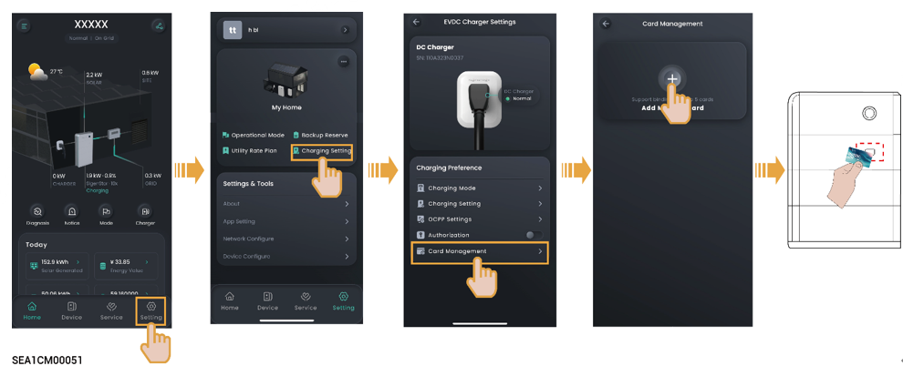

# Binding Sigen RFID Card

<figure><figcaption></figcaption></figure>



<mark style="color:blue;">If an error occurs when you bind the Sigen RFID Card, you can click</mark>  <mark style="color:blue;">and delete the Sigen RFID Card on the "Card Management" page.</mark>
