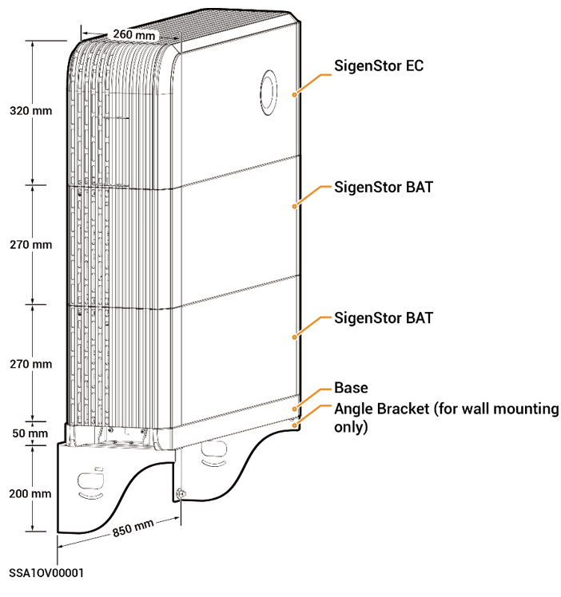
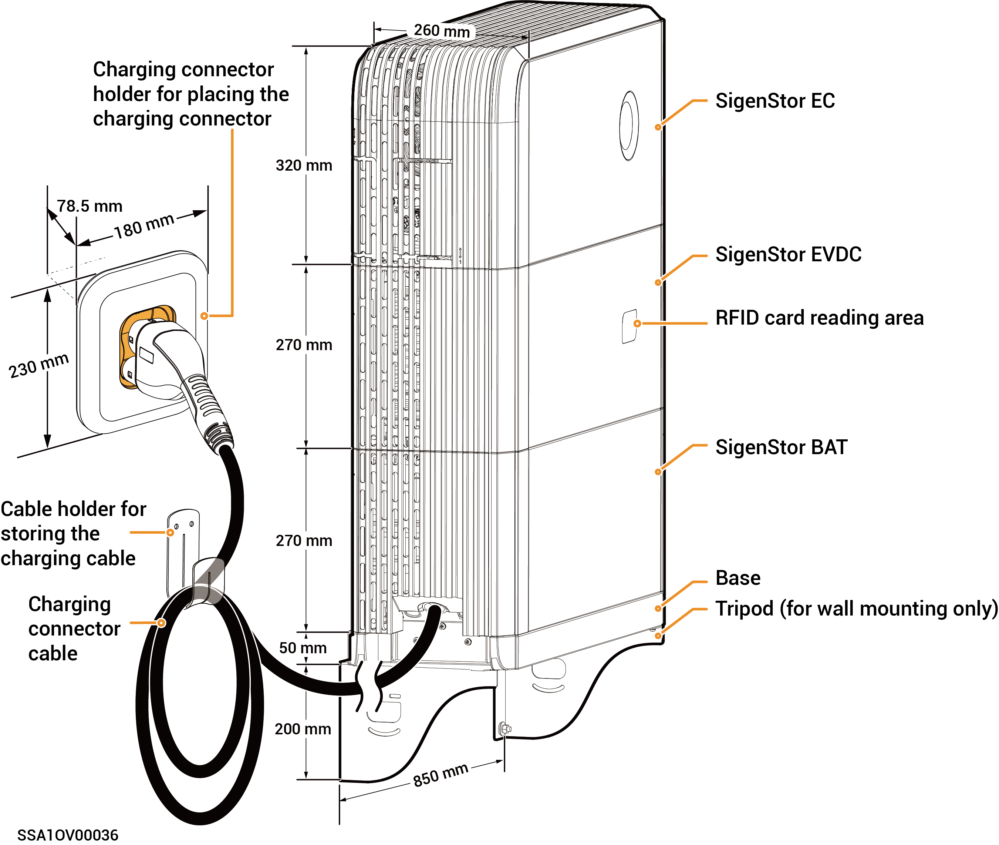

# Appearance and Dimensions

### **Without SigenStor EVDC Series**



<mark style="color:blue;">**The preceding figure takes two SigenStor BATs as an example to show the appearance.**</mark>

<figure><figcaption></figcaption></figure>

### **With SigenStor EVDC Series**



The preceding figure takes one SigenStor BAT as an example to show the appearance.

<figure><figcaption></figcaption></figure>
