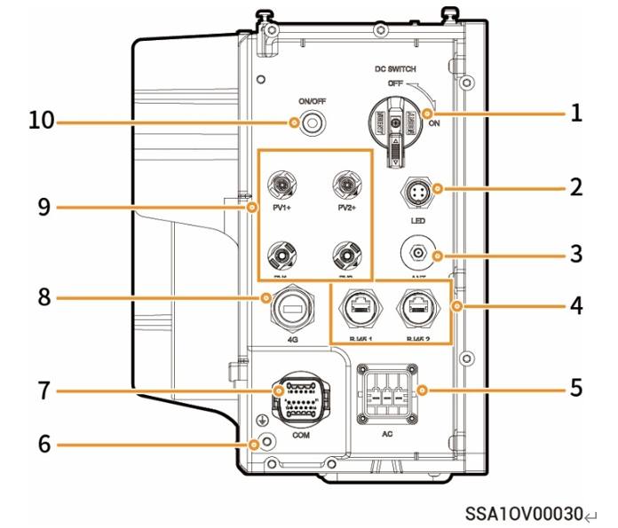
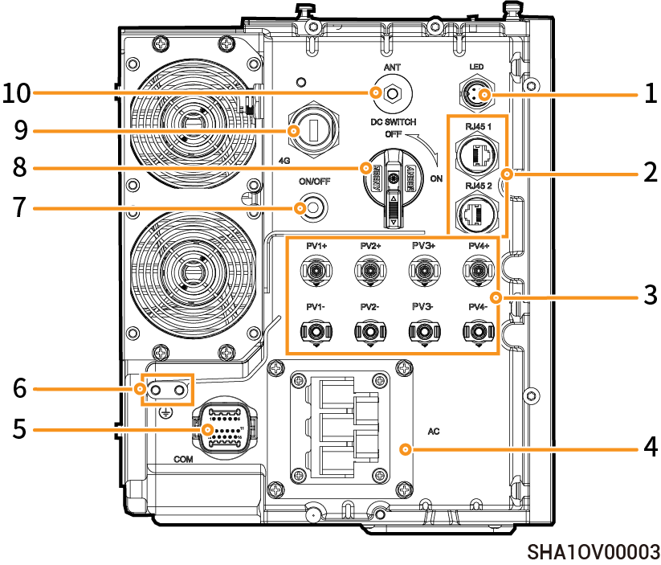
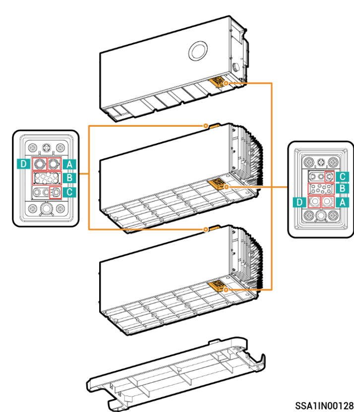

# Port Introduction

### **SigenStor EC (5.0, 6.0)** SP

<figure><figcaption></figcaption></figure>

|   S/N  | Name                                   | Marking              |
| :----: | -------------------------------------- | -------------------- |
|  **1** | Dc switch                              | DC SWITCH            |
|  **2** | Decorative cover light strip connector | LED                  |
|  **3** | Antenna interface                      | ANT                  |
|  **4** | Cable interface                        | RJ45 1/ RJ45 2       |
|  **5** | AC output interface                    | AC                   |
|  **6** | Ground screw                           | -                    |
|  **7** | Communication interface                | COM                  |
|  **8** | Sigen CommMod interface                | 4G                   |
|  **9** | DC input interface                     | PV1+/PV2+/ PV1-/PV2- |
| **10** | Switch button                          | ON/OFF               |

### **SigenStor EC (5.0**–**30.0)** TP AU

<figure><figcaption></figcaption></figure>

| S/N | Name                                   | Marking                                    |
| --- | -------------------------------------- | ------------------------------------------ |
| 1   | Decorative cover strip light connector | LED                                        |
| 2   | Network interface                      | RJ45 1/ RJ45 2                             |
| 3   | DC input interface                     | PV1+/PV2+/ PV3+/PV4+/ PV1-/PV2- /PV3-/PV4- |
| 4   | AC output interface                    | AC                                         |
| 5   | Communication interface                | COM                                        |
| 6   | Ground screw                           | -                                          |
| 7   | Switch button                          | ON/OFF                                     |
| 8   | DC switch                              | DC SWITCH                                  |
| 9   | Sigen CommMod interface                | 4G                                         |
| 10  | Antenna interface                      | ANT                                        |

### **SigenStor EC-(8.0–12.0) SP AU**

<figure><figcaption></figcaption></figure>

| S/N | Name                                   | Marking                                    |
| --- | -------------------------------------- | ------------------------------------------ |
| 1   | Decorative cover strip light connector | LED                                        |
| 2   | Network interface                      | RJ45 1/ RJ45 2                             |
| 3   | DC input interface                     | PV1+/PV2+/ PV3+/PV4+/ PV1-/PV2- /PV3-/PV4- |
| 4   | AC output interface                    | AC                                         |
| 5   | Communication interface                | COM                                        |
| 6   | Ground screw                           | -                                          |
| 7   | Switch button                          | ON/OFF                                     |
| 8   | DC switch                              | DC SWITCH                                  |
| 9   | Sigen CommMod interface                | 4G                                         |
| 10  | Antenna interface                      | ANT                                        |

### **Modular Floating Stacked Connector**

<figure><figcaption></figcaption></figure>

| No. | Meaning                 |
| --- | ----------------------- |
| A   | BAT-                    |
| B   | Communication interface |
| C   | PE                      |
| D   | BAT+                    |
