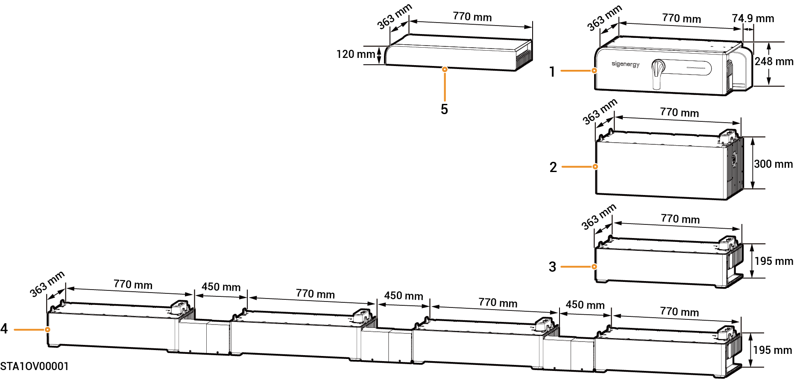
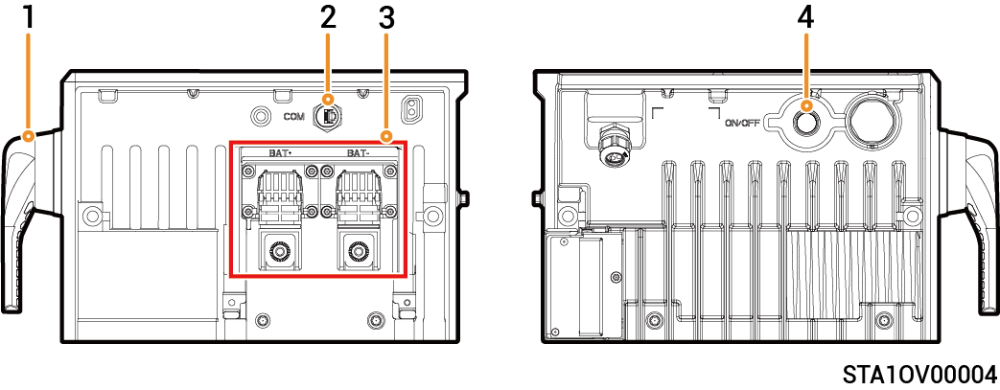

# Sigen Battery

### 寸法

<figure><figcaption></figcaption></figure>

### ポート説明

<figure><figcaption></figcaption></figure>

<table><thead><tr><th width="60.5555419921875" valign="top">S/N</th><th valign="top">名称</th><th valign="top">マーキング</th></tr></thead><tbody><tr><td valign="top">1</td><td valign="top">遮断スイッチ</td><td valign="top">-</td></tr><tr><td valign="top">2</td><td valign="top">通信ポート</td><td valign="top">COM</td></tr><tr><td valign="top">3</td><td valign="top">電源ポート</td><td valign="top">BAT+/BAT-</td></tr><tr><td valign="top">4</td><td valign="top">電源ボタン</td><td valign="top">ON/OFF</td></tr></tbody></table>
