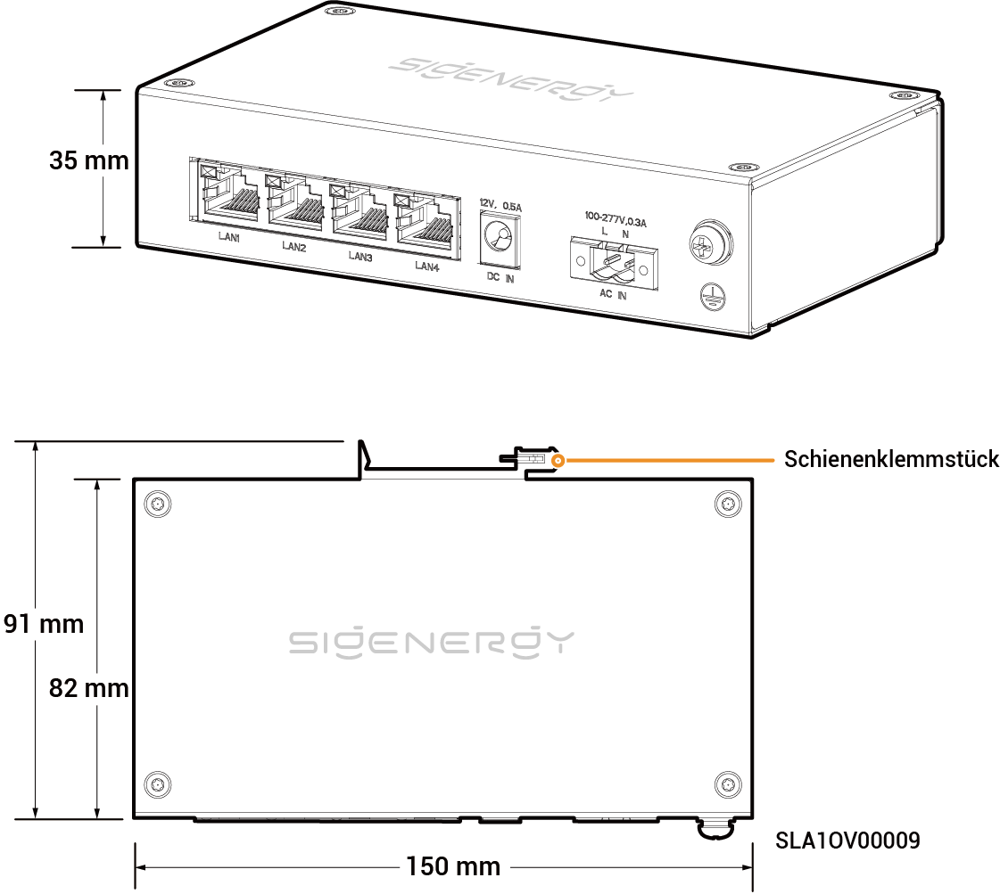

# Sigen-Kommunikationsbrücke

## Abmessungen

<figure><figcaption></figcaption></figure>

## Beschreibung der Anschlussbuchsen

<figure><figcaption></figcaption></figure>

<table><thead><tr><th width="61.66668701171875" align="center" valign="middle">Serien-Nr.</th><th valign="top">Bezeichnung</th><th valign="top">Kennzeichnung</th></tr></thead><tbody><tr><td align="center" valign="middle">1</td><td valign="top">LAN-Schnittstelle</td><td valign="top">LAN 1/LAN 2/LAN 3/LAN 4</td></tr><tr><td align="center" valign="middle">2</td><td valign="top">Anschlussbuchse für 12 VDC-Stromeingang</td><td valign="top">Eingang 12 V, 0,5 A</td></tr><tr><td align="center" valign="middle">3</td><td valign="top">Anschlussbuchse für 220 V AC-Stromeingang</td><td valign="top">Eingang 100-277 V AC, 0,3 A</td></tr><tr><td align="center" valign="middle">4</td><td valign="top">Schutzerdungspunkt</td><td valign="top">-</td></tr></tbody></table>
