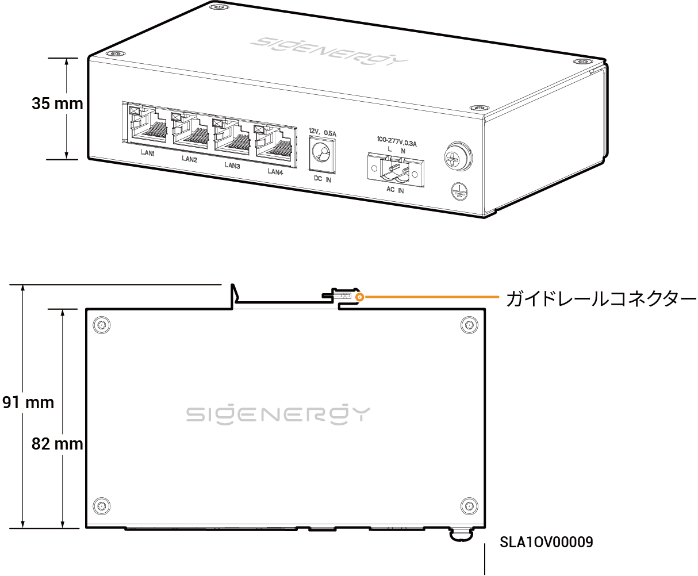

# Sigen Communication Bridge

### 寸法

<figure><figcaption></figcaption></figure>

### ポート説明

<figure><figcaption></figcaption></figure>

<table><thead><tr><th width="61.66668701171875" align="center" valign="middle">S/N</th><th valign="top">名称</th><th valign="top">マーキング</th></tr></thead><tbody><tr><td align="center" valign="middle">1</td><td valign="top">LANインターフェイス</td><td valign="top">LAN1/LAN2/LAN3/LAN4</td></tr><tr><td align="center" valign="middle">2</td><td valign="top">12V DC電源入力ポート</td><td valign="top">DC入力12V、0.5A</td></tr><tr><td align="center" valign="middle">3</td><td valign="top">220V AC電源入力ポート</td><td valign="top">AC入力100～277V、0.3A</td></tr><tr><td align="center" valign="middle">4</td><td valign="top">保護接地ポイント</td><td valign="top">-</td></tr></tbody></table>
