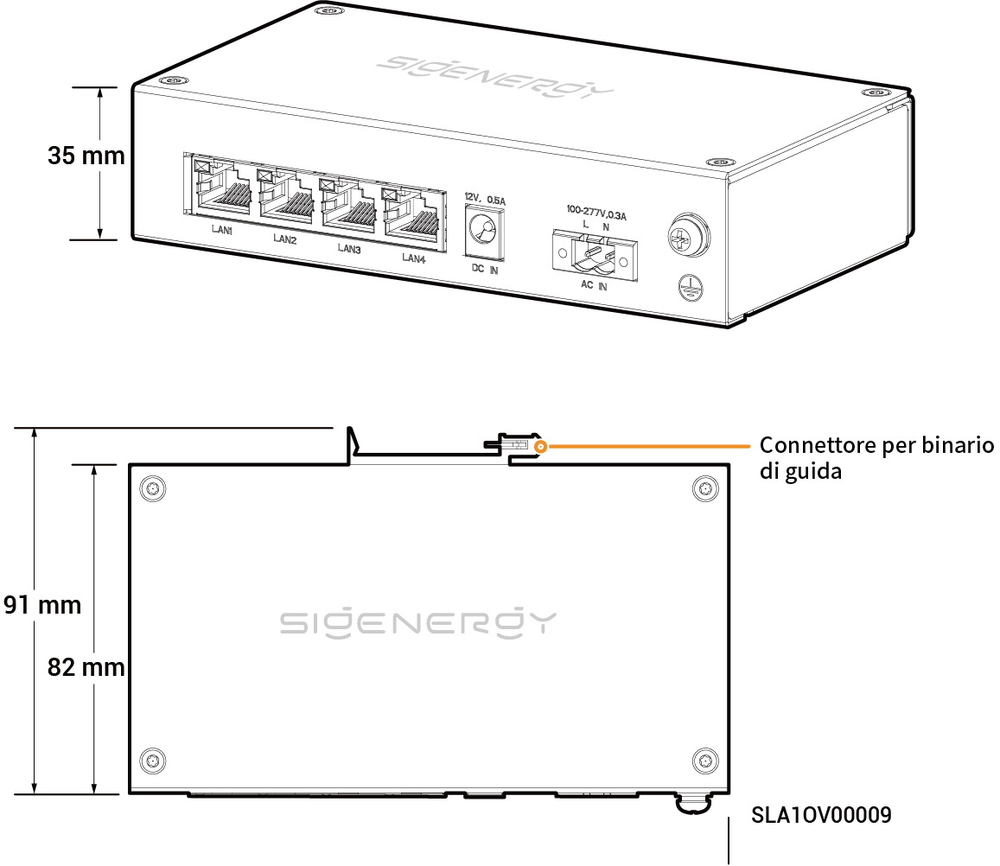

# Ponte di comunicazione Sigen

## Dimensioni

<figure><figcaption></figcaption></figure>

## Descrizioni delle porte

<figure><figcaption></figcaption></figure>

<table><thead><tr><th width="61.66668701171875" align="center" valign="middle">N.</th><th valign="top">Nome</th><th valign="top">Indicazione</th></tr></thead><tbody><tr><td align="center" valign="middle">1</td><td valign="top">Interfaccia LAN</td><td valign="top">LAN1/LAN2/LAN3/LAN4</td></tr><tr><td align="center" valign="middle">2</td><td valign="top">Porta di ingresso di alimentazione CC 12 V</td><td valign="top">DC IN 12 V，0,5 A</td></tr><tr><td align="center" valign="middle">3</td><td valign="top">Porta di ingresso di alimentazione CA 220 V</td><td valign="top">AC IN 100-277 V，0,3 A</td></tr><tr><td align="center" valign="middle">4</td><td valign="top">Punto di messa a terra di protezione</td><td valign="top">-</td></tr></tbody></table>
