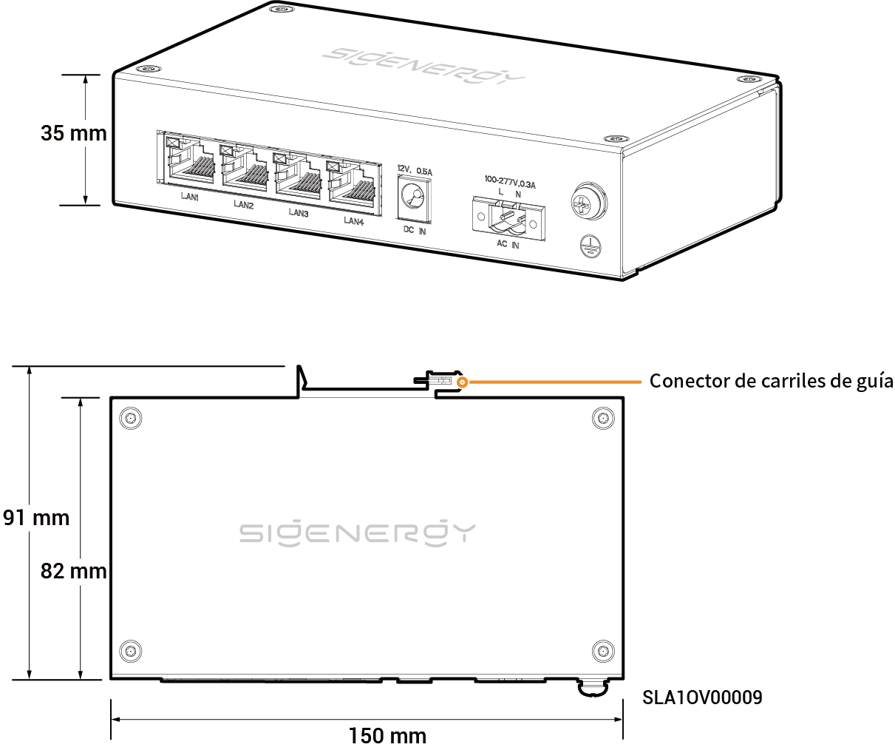

# Puente de comunicaciones Sigen

## Dimensiones

<figure><figcaption></figcaption></figure>

## Descripciones de los puertos

<figure><figcaption></figcaption></figure>

<table><thead><tr><th width="61.66668701171875" align="center" valign="middle">N.º S.</th><th valign="top">Denominación</th><th valign="top">Marcado</th></tr></thead><tbody><tr><td align="center" valign="middle">1</td><td valign="top">Interfaz de LAN</td><td valign="top">LAN1/LAN2/LAN3/LAN4</td></tr><tr><td align="center" valign="middle">2</td><td valign="top">Puerto de entrada de corriente de 12 Vcc</td><td valign="top">DC IN 12 V, 0,5 A</td></tr><tr><td align="center" valign="middle">3</td><td valign="top">Puerto de entrada de corriente de 220 Vca</td><td valign="top">AC IN 100-277 V, 0,3 A</td></tr><tr><td align="center" valign="middle">4</td><td valign="top">Punto de conexión a tierra de protección</td><td valign="top">-</td></tr></tbody></table>
