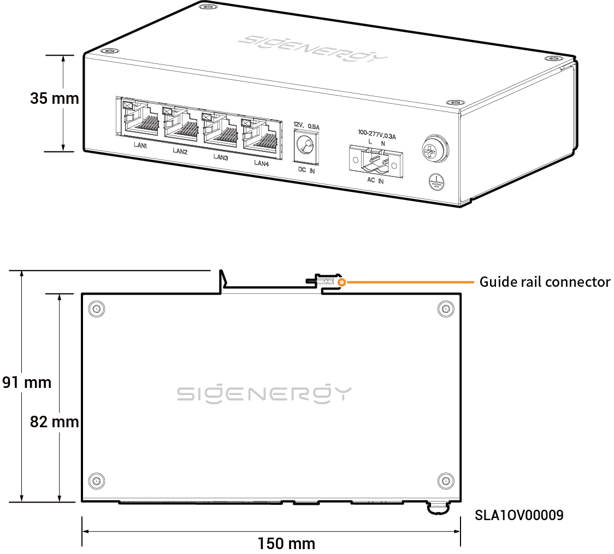

# Sigen Communication Bridge

## Dimensions

<figure><figcaption></figcaption></figure>

## Port Descriptions

<figure><figcaption></figcaption></figure>

<table><thead><tr><th width="61.66668701171875" align="center" valign="middle">S/N</th><th valign="top">Name</th><th valign="top">Marking</th></tr></thead><tbody><tr><td align="center" valign="middle">1</td><td valign="top">LAN interface</td><td valign="top">LAN1/LAN2/LAN3/LAN4</td></tr><tr><td align="center" valign="middle">2</td><td valign="top">12V DC power input port</td><td valign="top">DC IN 12V，0.5A</td></tr><tr><td align="center" valign="middle">3</td><td valign="top">220V AC power input port</td><td valign="top">AC IN 100-277V，0.3A</td></tr><tr><td align="center" valign="middle">4</td><td valign="top">Protective grounding point</td><td valign="top">-</td></tr></tbody></table>
