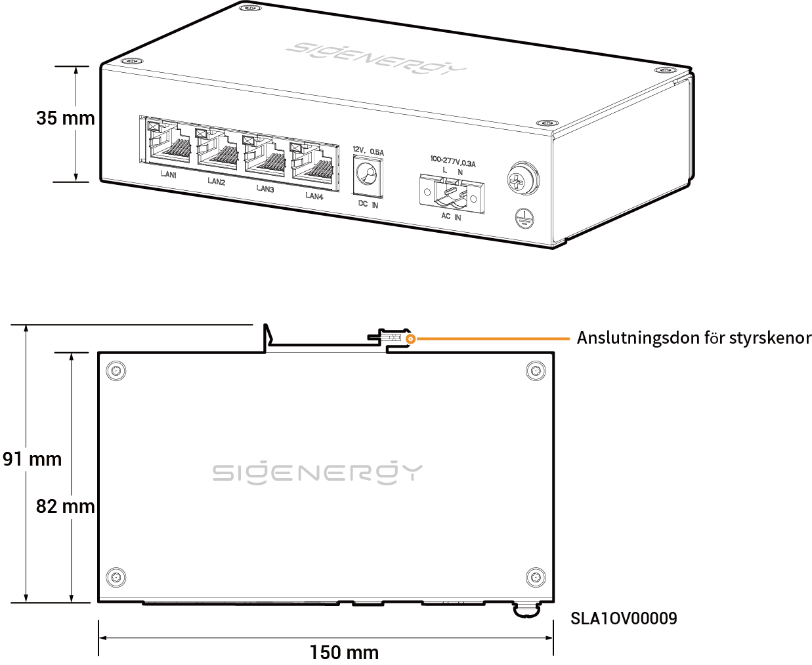

# Sigen Kommuinikationsbrygga

## Mått

<figure><figcaption></figcaption></figure>

## Portbeskrivningar

<figure><figcaption></figcaption></figure>

<table><thead><tr><th width="61.66668701171875" align="center" valign="middle">Siffra</th><th valign="top">Namn</th><th valign="top">Märkning</th></tr></thead><tbody><tr><td align="center" valign="middle">1</td><td valign="top">LAN-gränssnitt</td><td valign="top">LAN1/LAN2/LAN3/LAN4</td></tr><tr><td align="center" valign="middle">2</td><td valign="top">12 V ingångsport för likström</td><td valign="top">Likström IN 12 V，0,5 A</td></tr><tr><td align="center" valign="middle">3</td><td valign="top">220 V ingångsport för växelström</td><td valign="top">AC IN 100-277 V，0,3 A</td></tr><tr><td align="center" valign="middle">4</td><td valign="top">Skyddande jordningspunkt</td><td valign="top">-</td></tr></tbody></table>
