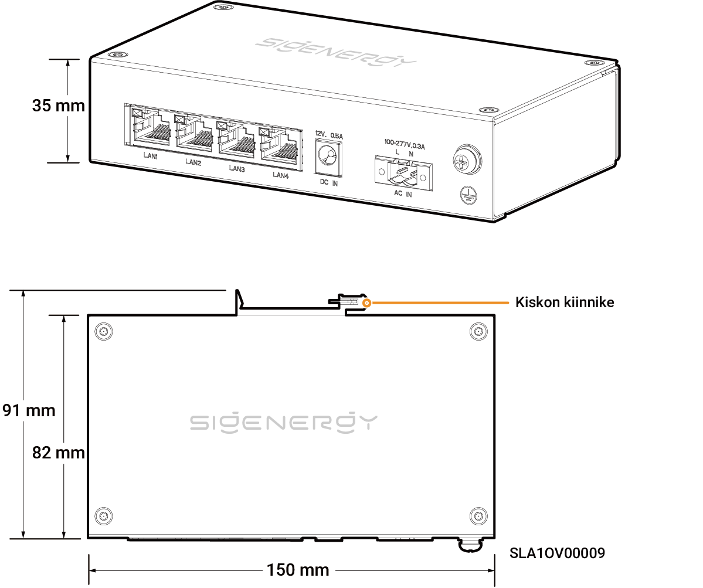

# Sigen Communication Bridge

## Mitat

<figure><figcaption></figcaption></figure>

## Porttien kuvaukset

<figure><figcaption></figcaption></figure>

<table><thead><tr><th width="61.66668701171875" align="center" valign="middle">S/N</th><th valign="top">Nimi</th><th valign="top">Merkintä</th></tr></thead><tbody><tr><td align="center" valign="middle">1</td><td valign="top">LAN-liitäntä</td><td valign="top">LAN1/LAN2/LAN3/LAN4</td></tr><tr><td align="center" valign="middle">2</td><td valign="top">12 V:n DC-virran tuloportti</td><td valign="top">DC IN 12 V, 0,5 A</td></tr><tr><td align="center" valign="middle">3</td><td valign="top">220 V:n AC-virran tuloportti</td><td valign="top">AC IN 100–277 V, 0,3 A</td></tr><tr><td align="center" valign="middle">4</td><td valign="top">Suojamaadoituspiste</td><td valign="top">-</td></tr></tbody></table>
