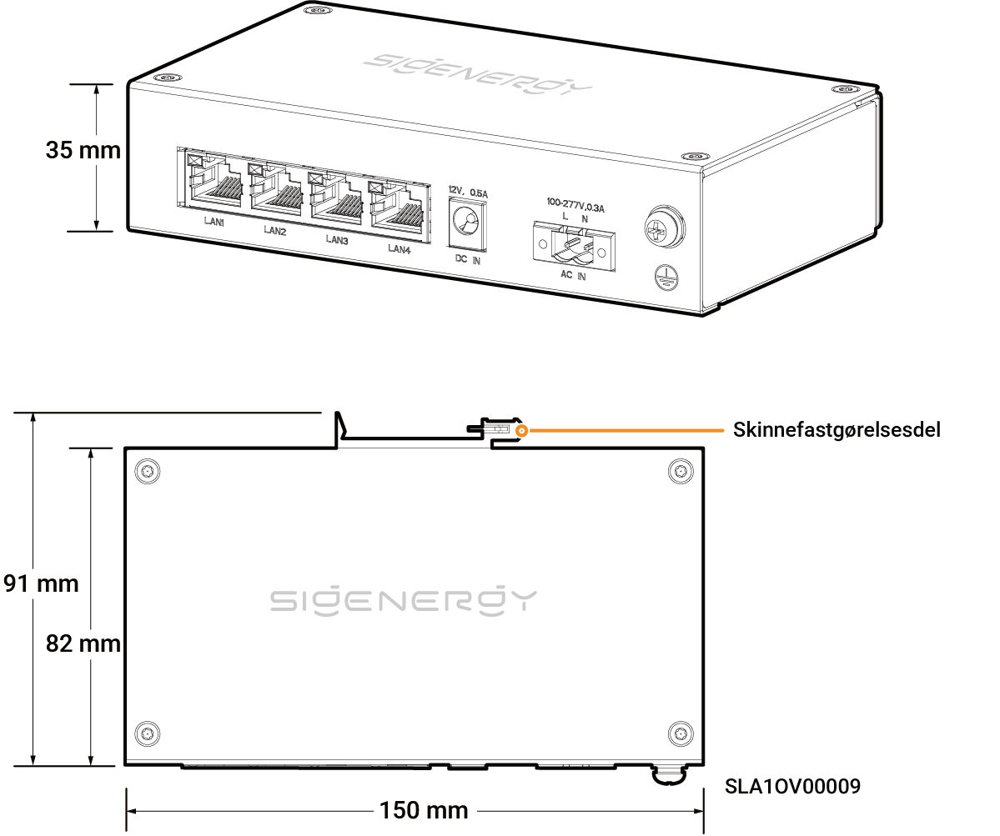

# Sigen Communication Bridge

## Dimensioner

<figure><figcaption></figcaption></figure>

## Portbeskrivelser

<figure><figcaption></figcaption></figure>

<table><thead><tr><th width="155.66668701171875" align="center" valign="middle">Serienummer</th><th valign="top">Navn</th><th valign="top">Markering</th></tr></thead><tbody><tr><td align="center" valign="middle">1</td><td valign="top">LAN-stik</td><td valign="top">LAN1/LAN2/LAN3/LAN4</td></tr><tr><td align="center" valign="middle">2</td><td valign="top">12 V DC strømindgangsport</td><td valign="top">DC IN 12 V, 0,5 A</td></tr><tr><td align="center" valign="middle">3</td><td valign="top">220 V AC strømindgangsport</td><td valign="top">AC IN 100–277 V, 0,3 A</td></tr><tr><td align="center" valign="middle">4</td><td valign="top">Beskyttende jordingspunkt</td><td valign="top">-</td></tr></tbody></table>
