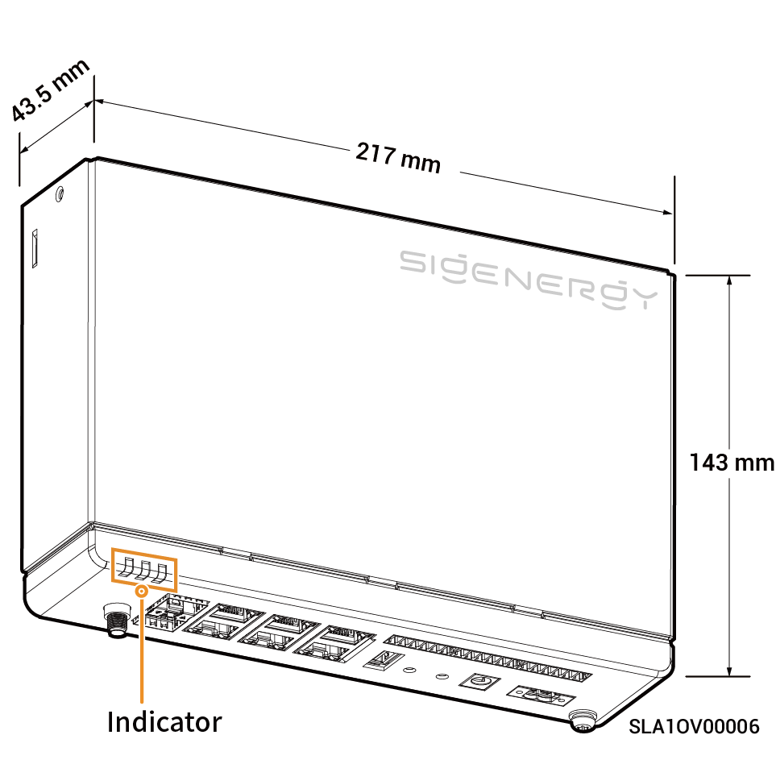

# Sigen Data Logger

## Dimensions

<figure><figcaption></figcaption></figure>

## Port Descriptions

<figure><figcaption></figcaption></figure>

<table><thead><tr><th width="59.44439697265625" align="center" valign="middle">S/N</th><th valign="middle">Name</th><th valign="middle">Marking</th></tr></thead><tbody><tr><td align="center" valign="middle">1</td><td valign="middle">LED indicator</td><td valign="middle">RUN、NET、ALM</td></tr><tr><td align="center" valign="middle">2</td><td valign="middle">SFP fiber optic interface</td><td valign="middle">SFP1/SFP2</td></tr><tr><td align="center" valign="middle">3</td><td valign="middle">WAN network cable interface</td><td valign="middle">WAN1/WAN2</td></tr><tr><td align="center" valign="middle">4</td><td valign="middle">LAN interface</td><td valign="middle">LAN1/LAN2/LAN3/LAN4</td></tr><tr><td align="center" valign="middle">5</td><td valign="middle">Digital input port</td><td valign="middle">OV/1/2/3/4/5/6/7/8/9/10/OV</td></tr><tr><td align="center" valign="middle">6</td><td valign="middle">RS-485 interface</td><td valign="middle">A1/B1/A2/B2/A3/B3</td></tr><tr><td align="center" valign="middle">7</td><td valign="middle">Protective grounding point</td><td valign="middle">-</td></tr><tr><td align="center" valign="middle">8</td><td valign="middle">220V AC power input port</td><td valign="middle">AC IN 100-277V，0.5A</td></tr><tr><td align="center" valign="middle">9</td><td valign="middle">12V DC power input port</td><td valign="middle">DC IN 12V，2A</td></tr><tr><td align="center" valign="middle">10</td><td valign="middle">USER button (short press to open AP hotspot)</td><td valign="middle">USER</td></tr><tr><td align="center" valign="middle">11</td><td valign="middle">RST button (short press to reset the equipment)</td><td valign="middle">RST</td></tr><tr><td align="center" valign="middle">12</td><td valign="middle">(Reserved) USB port</td><td valign="middle">USB</td></tr><tr><td align="center" valign="middle">13</td><td valign="middle">Antenna interface</td><td valign="middle">ANT</td></tr></tbody></table>
