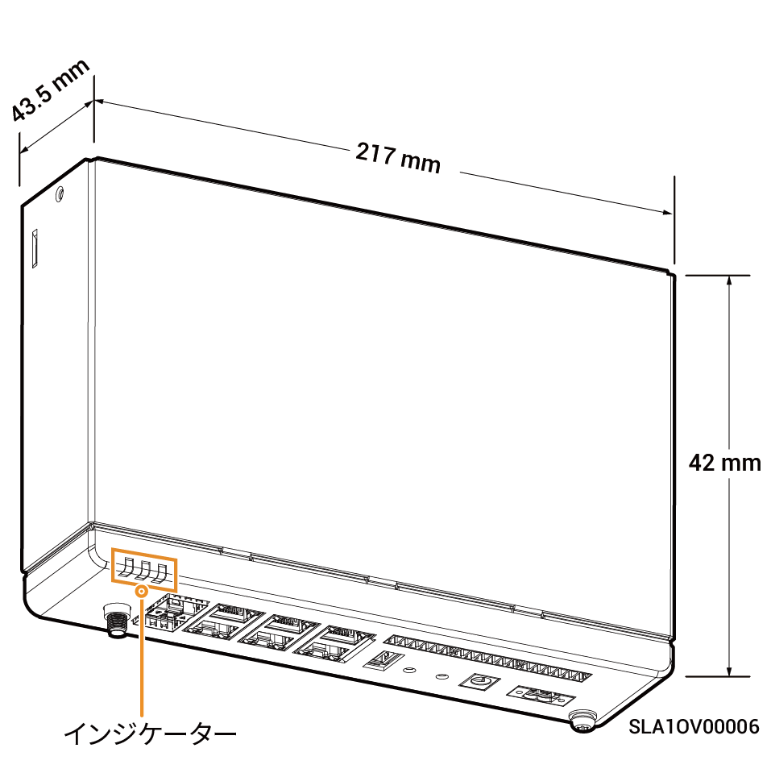

# Sigen Data Logger

### 寸法

<figure><figcaption></figcaption></figure>

### ポート説明

<figure><figcaption></figcaption></figure>

<table><thead><tr><th width="59.44439697265625" align="center" valign="middle">S/N</th><th valign="middle">名称</th><th valign="middle">マーキング</th></tr></thead><tbody><tr><td align="center" valign="middle">1</td><td valign="middle">LEDインジケーター</td><td valign="middle">RUN、NET、ALM</td></tr><tr><td align="center" valign="middle">2</td><td valign="middle">SFP光ファイバーインターフェイス</td><td valign="middle">SFP1/SFP2</td></tr><tr><td align="center" valign="middle">3</td><td valign="middle">WANネットワークケーブルインターフェイス</td><td valign="middle">WAN1/WAN2</td></tr><tr><td align="center" valign="middle">4</td><td valign="middle">LANインターフェイス</td><td valign="middle">LAN1/LAN2/LAN3/LAN4</td></tr><tr><td align="center" valign="middle">5</td><td valign="middle">デジタル入力ポート</td><td valign="middle">0V/1/2/3/4/5/6/7/8/9/10/0V</td></tr><tr><td align="center" valign="middle">6</td><td valign="middle">RS-485インターフェイス</td><td valign="middle">A1/B1/A2/B2/A3/B3</td></tr><tr><td align="center" valign="middle">7</td><td valign="middle">保護接地ポイント</td><td valign="middle">-</td></tr><tr><td align="center" valign="middle">8</td><td valign="middle">220V AC電源入力ポート</td><td valign="middle">AC IN 100-277V，0.5A</td></tr><tr><td align="center" valign="middle">9</td><td valign="middle">12V DC電源入力ポート</td><td valign="middle">DC IN 12V，2A</td></tr><tr><td align="center" valign="middle">10</td><td valign="middle">USERボタン（短押しでAPホットスポットが開く）</td><td valign="middle">USER</td></tr><tr><td align="center" valign="middle">11</td><td valign="middle">RSTボタン（短押しで機器をリセット）</td><td valign="middle">RST</td></tr><tr><td align="center" valign="middle">12</td><td valign="middle">（予備）USBポート</td><td valign="middle">USB</td></tr><tr><td align="center" valign="middle">13</td><td valign="middle">アンテナインターフェース</td><td valign="middle">ANT</td></tr></tbody></table>
