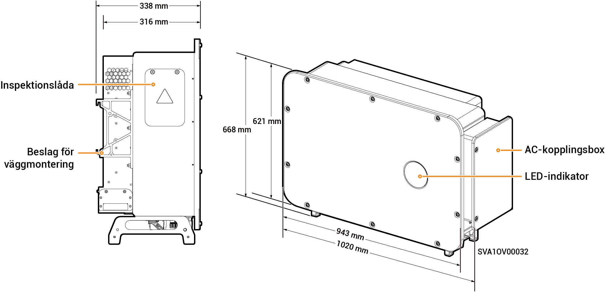

# Sigen PV 100M1-HYB-JP Inverter

## Mått

<figure><figcaption></figcaption></figure>

## Portbeskrivningar

<figure><figcaption></figcaption></figure>

<table><thead><tr><th width="81.22222900390625" valign="top">Siffra</th><th width="355.2222900390625" valign="top">Namn</th><th valign="top">Märkning</th></tr></thead><tbody><tr><td valign="top">1</td><td valign="top">Testbox</td><td valign="top">-</td></tr><tr><td valign="top">2</td><td valign="top">SigenStack nätverksgränssnitt</td><td valign="top">RJ45 3</td></tr><tr><td valign="top">3</td><td valign="top">SigenStack DC-kabelgränssnitt</td><td valign="top">BAT+/BAT-</td></tr><tr><td valign="top">4</td><td valign="top">DC-brytare 1</td><td valign="top">DC SWITCH 1</td></tr><tr><td valign="top">5</td><td valign="top">Likströmsingångsterminal grupp 1</td><td valign="top">PV1 till PV8</td></tr><tr><td valign="top">6</td><td valign="top">Likströmsingångsterminal grupp 2</td><td valign="top">PV9 till PV16</td></tr><tr><td valign="top">7</td><td valign="top">DC-brytare 2</td><td valign="top">DC SWITCH 2</td></tr><tr><td valign="top">8</td><td valign="top">Nätverksgränssnitt</td><td valign="top">RJ45 2</td></tr><tr><td valign="top">9</td><td valign="top">Antennuttag</td><td valign="top">ANT</td></tr><tr><td valign="top">10</td><td valign="top">Nätverksgränssnitt</td><td valign="top">RJ45 1</td></tr><tr><td valign="top">11</td><td valign="top">Dragningshål för flerledarkabel</td><td valign="top">-</td></tr><tr><td valign="top">12</td><td valign="top">Dragningshål för enledarkabel</td><td valign="top">-</td></tr><tr><td valign="top">13</td><td valign="top">Sigen CommMod-uttag</td><td valign="top">4G</td></tr><tr><td valign="top">14</td><td valign="top">Kommunikationsuttag</td><td valign="top">COM</td></tr><tr><td valign="top">15</td><td valign="top">Fläkt för kylning</td><td valign="top">-</td></tr></tbody></table>
