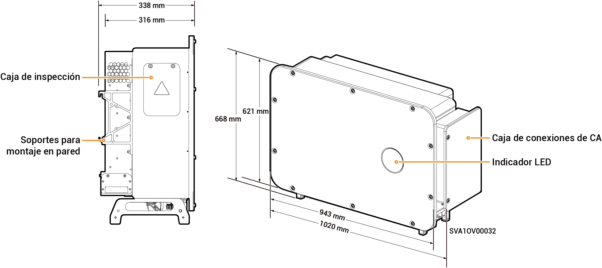

# Sigen PV 100M1-HYB-JP Inverter

## Dimensiones

<figure><figcaption></figcaption></figure>

## Descripciones de los puertos

<figure><figcaption></figcaption></figure>

<table><thead><tr><th width="81.22222900390625" valign="top">N.º S.</th><th width="352.4949951171875" valign="top">Denominación</th><th valign="top">Marcado</th></tr></thead><tbody><tr><td valign="top">1</td><td valign="top">Caja de prueba</td><td valign="top">-</td></tr><tr><td valign="top">2</td><td valign="top">Interfaz de red SigenStack</td><td valign="top">RJ45 3</td></tr><tr><td valign="top">3</td><td valign="top">Interfaz de cable CC de SigenStack</td><td valign="top">BAT+/BAT-</td></tr><tr><td valign="top">4</td><td valign="top">Interruptor 1 de CC</td><td valign="top">DC SWITCH 1</td></tr><tr><td valign="top">5</td><td valign="top">Grupo 1 de terminales de entrada de CC</td><td valign="top">PV1 a PV8</td></tr><tr><td valign="top">6</td><td valign="top">Grupo 2 de terminales de entrada de CC</td><td valign="top">PV9 a PV16</td></tr><tr><td valign="top">7</td><td valign="top">Interruptor 2 de CC</td><td valign="top">DC SWITCH 2</td></tr><tr><td valign="top">8</td><td valign="top">Interfaz de red</td><td valign="top">RJ45 2</td></tr><tr><td valign="top">9</td><td valign="top">Interfaz de antena</td><td valign="top">ANT</td></tr><tr><td valign="top">10</td><td valign="top">Interfaz de red</td><td valign="top">RJ45 1</td></tr><tr><td valign="top">11</td><td valign="top">Agujero de entrada para el cable multinúcleo</td><td valign="top">-</td></tr><tr><td valign="top">12</td><td valign="top">Agujero de entrada para el cable de un solo núcleo</td><td valign="top">-</td></tr><tr><td valign="top">13</td><td valign="top">Interfaz Sigen CommMod</td><td valign="top">4G</td></tr><tr><td valign="top">14</td><td valign="top">Interfaz de comunicación</td><td valign="top">COM</td></tr><tr><td valign="top">15</td><td valign="top">Ventilador de refrigeración</td><td valign="top">-</td></tr></tbody></table>
