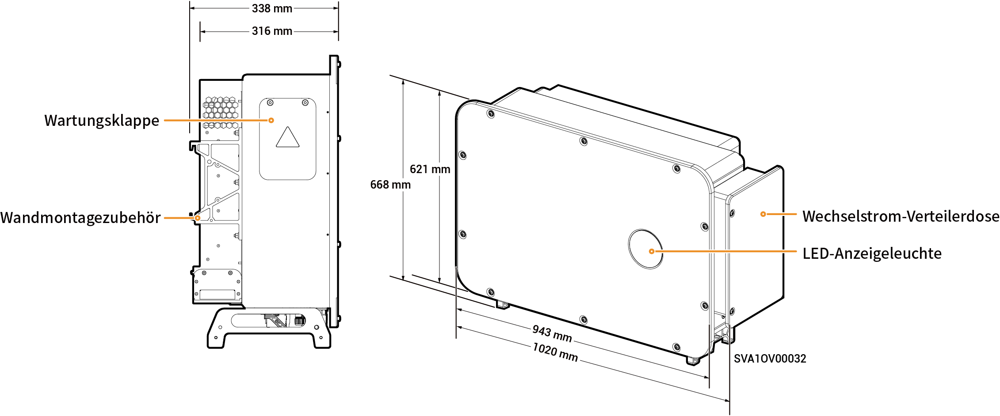

# Sigen PV 100M1-HYB-JP Inverter

## Abmessungen

<figure><figcaption></figcaption></figure>

## Beschreibung der Anschlussbuchsen

<figure><figcaption></figcaption></figure>

<table><thead><tr><th width="81.22222900390625" valign="top">Serien-Nr.</th><th width="355.2222900390625" valign="top">Bezeichnung</th><th valign="top">Kennzeichnung</th></tr></thead><tbody><tr><td valign="top">1</td><td valign="top">Testkasten</td><td valign="top">-</td></tr><tr><td valign="top">2</td><td valign="top">SigenStack Netzwerkschnittstelle</td><td valign="top">RJ45 3</td></tr><tr><td valign="top">3</td><td valign="top">SigenStack DC-Kabelschnittstelle</td><td valign="top">BAT+/BAT-</td></tr><tr><td valign="top">4</td><td valign="top">Antennenanschluss</td><td valign="top">ANT</td></tr><tr><td valign="top">5</td><td valign="top">DC-Schalter 1</td><td valign="top">DC-SCHALTER 1</td></tr><tr><td valign="top">6</td><td valign="top">DC-Eingangsklemme Gruppe 1</td><td valign="top">PV1 bis PV8</td></tr><tr><td valign="top">7</td><td valign="top">DC-Eingangsklemme Gruppe 2</td><td valign="top">PV9 bis PV16</td></tr><tr><td valign="top">8</td><td valign="top">DC-Schalter 2</td><td valign="top">DC-SCHALTER 2</td></tr><tr><td valign="top">9</td><td valign="top">Netzwerkschnittstelle</td><td valign="top">RJ45 1</td></tr><tr><td valign="top">10</td><td valign="top">Netzwerkschnittstelle</td><td valign="top">RJ45 2</td></tr><tr><td valign="top">11</td><td valign="top">Durchgangsöffnung für mehradriges Kabel</td><td valign="top">-</td></tr><tr><td valign="top">12</td><td valign="top">Durchgangsöffnung für einadriges Kabel</td><td valign="top">-</td></tr><tr><td valign="top">13</td><td valign="top">Sigen CommMod-Anschluss</td><td valign="top">4G</td></tr><tr><td valign="top">14</td><td valign="top">Kommunikationsanschluss</td><td valign="top">COM</td></tr><tr><td valign="top">15</td><td valign="top">Kühlgebläse</td><td valign="top">-</td></tr></tbody></table>
