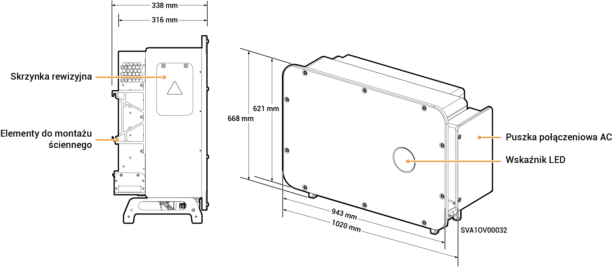

# Sigen PV 100M1-HYB-JP

## Wymiary

<figure><figcaption></figcaption></figure>

## Opisy portów

<figure><figcaption></figcaption></figure>

<table><thead><tr><th width="81.22222900390625" valign="top">S/N</th><th width="355.2222900390625" valign="top">Nazwa</th><th valign="top">Oznakowanie</th></tr></thead><tbody><tr><td valign="top">1</td><td valign="top">Pole testu</td><td valign="top">-</td></tr><tr><td valign="top">2</td><td valign="top">Interfejs sieciowy SigenStack</td><td valign="top">RJ45 3</td></tr><tr><td valign="top">3</td><td valign="top">Interfejs przewodu SigenStack DC</td><td valign="top">BAT+/BAT-</td></tr><tr><td valign="top">4</td><td valign="top">Interfejs anteny</td><td valign="top">ANT</td></tr><tr><td valign="top">5</td><td valign="top">Przełącznik DC 1</td><td valign="top">DC SWITCH 1</td></tr><tr><td valign="top">6</td><td valign="top">Grupa złączy wejściowych DC 1</td><td valign="top">PV1 do PV8</td></tr><tr><td valign="top">7</td><td valign="top">Grupa złączy wejściowych DC 2</td><td valign="top">PV9 do PV16</td></tr><tr><td valign="top">8</td><td valign="top">Przełącznik DC 2</td><td valign="top">DC SWITCH 2</td></tr><tr><td valign="top">9</td><td valign="top">Interfejs sieciowy</td><td valign="top">RJ45 1</td></tr><tr><td valign="top">10</td><td valign="top">Interfejs sieciowy</td><td valign="top">RJ45 2</td></tr><tr><td valign="top">11</td><td valign="top">Port wejściowy obciążeń domowych z zasilaniem zapasowym</td><td valign="top">-</td></tr><tr><td valign="top">12</td><td valign="top">Port wejściowy sieci energetycznej</td><td valign="top">-</td></tr><tr><td valign="top">13</td><td valign="top">Interfejs Sigen CommMod</td><td valign="top">4G</td></tr><tr><td valign="top">14</td><td valign="top">Interfejs komunikacyjny</td><td valign="top">COM</td></tr><tr><td valign="top">15</td><td valign="top">Wentylator chłodzący</td><td valign="top">-</td></tr></tbody></table>
