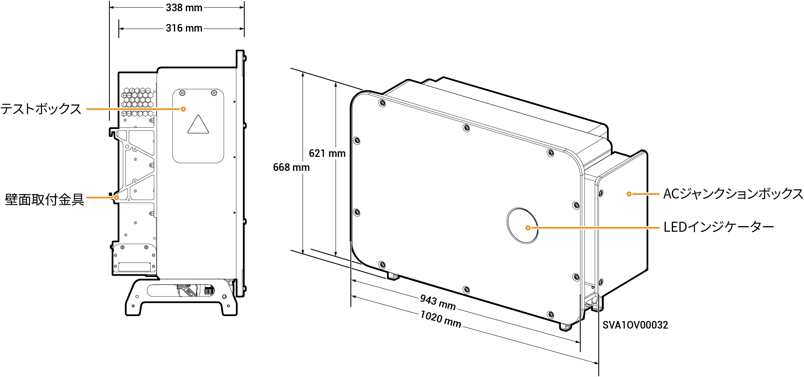

# Sigen PV 100M1-HYB-JP Inverter

### 寸法

<figure><figcaption></figcaption></figure>

### ポート説明

<figure><figcaption></figcaption></figure>

<table><thead><tr><th width="81.22222900390625" valign="top">S/N</th><th width="365.2222900390625" valign="top">名称</th><th valign="top">マーキング</th></tr></thead><tbody><tr><td valign="top">1</td><td valign="top">テストボックス</td><td valign="top">-</td></tr><tr><td valign="top">2</td><td valign="top">SigenStackネットワーク・インターフェース</td><td valign="top">RJ45 3</td></tr><tr><td valign="top">3</td><td valign="top">SigenStack DCケーブルインターフェース</td><td valign="top">BAT+/BAT-</td></tr><tr><td valign="top">4</td><td valign="top">アンテナインターフェース</td><td valign="top">ANT</td></tr><tr><td valign="top">5</td><td valign="top">DCスイッチ1</td><td valign="top">DC SWITCH 1</td></tr><tr><td valign="top">6</td><td valign="top">DC入力端子グループ1（DCスイッチ1で制御）</td><td valign="top">PV1～PV8</td></tr><tr><td valign="top">7</td><td valign="top">DC入力端子グループ2（DCスイッチ2で制御）</td><td valign="top">PV9～PV16</td></tr><tr><td valign="top">8</td><td valign="top">DCスイッチ2</td><td valign="top">DC SWITCH 2</td></tr><tr><td valign="top">9</td><td valign="top">ネットワークインターフェース</td><td valign="top">RJ45 1</td></tr><tr><td valign="top">10</td><td valign="top">ネットワークインターフェース</td><td valign="top">RJ45 2</td></tr><tr><td valign="top">11</td><td valign="top">多芯ケーブル用配線穴</td><td valign="top">-</td></tr><tr><td valign="top">12</td><td valign="top">単芯ケーブル用配線穴</td><td valign="top">-</td></tr><tr><td valign="top">13</td><td valign="top">Sigen CommModインターフェース</td><td valign="top">4G</td></tr><tr><td valign="top">14</td><td valign="top">通信インターフェース</td><td valign="top">COM</td></tr><tr><td valign="top">15</td><td valign="top">冷却ファン</td><td valign="top">-</td></tr></tbody></table>
