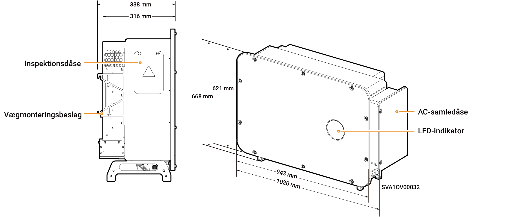

# Sigen PV 100M1-HYB-JP

## Dimensioner

<figure><figcaption></figcaption></figure>

## Portbeskrivelser

<figure><figcaption></figcaption></figure>

<table><thead><tr><th width="144" align="center" valign="middle">Serienummer</th><th valign="top">Navn</th><th valign="middle">Markering</th></tr></thead><tbody><tr><td align="center" valign="middle">1</td><td valign="top">Inspektionsdåse</td><td valign="middle">-</td></tr><tr><td align="center" valign="middle">2</td><td valign="top">SigenStack netværksinterface</td><td valign="middle">RJ45 3</td></tr><tr><td align="center" valign="middle">3</td><td valign="top">SigenStack DC-kabelinterface</td><td valign="middle">BAT+/BAT-</td></tr><tr><td align="center" valign="middle">4</td><td valign="top">Antenneinterface</td><td valign="middle">ANT</td></tr><tr><td align="center" valign="middle">5</td><td valign="top">DC-afbryder 1</td><td valign="middle">DC SWITCH 1</td></tr><tr><td align="center" valign="middle">6</td><td valign="top">DC-indgangsterminalgruppe 1 (styret af DC SWITCH 1)</td><td valign="middle">PV1 til PV8</td></tr><tr><td align="center" valign="middle">7</td><td valign="top">DC-indgangsterminalgruppe 2 (styret af DC SWITCH 2)</td><td valign="middle">PV9 til PV16</td></tr><tr><td align="center" valign="middle">8</td><td valign="top">DC-afbryder 2</td><td valign="middle">DC SWITCH 2</td></tr><tr><td align="center" valign="middle">9</td><td valign="top">Netværksinterface</td><td valign="middle">RJ45 1</td></tr><tr><td align="center" valign="middle">10</td><td valign="top">Netværksinterface</td><td valign="middle">RJ45 2</td></tr><tr><td align="center" valign="middle">11</td><td valign="top">Indgangsport for backupbelastninger</td><td valign="middle">-</td></tr><tr><td align="center" valign="middle">12</td><td valign="top">Indgang til ledning for nettilslutning</td><td valign="middle">-</td></tr><tr><td align="center" valign="middle">13</td><td valign="top">Sigen CommMod-interface</td><td valign="middle">4G</td></tr><tr><td align="center" valign="middle">14</td><td valign="top">Kommunikationsinterface</td><td valign="middle">COM</td></tr><tr><td align="center" valign="middle">15</td><td valign="top">Køleventilator</td><td valign="middle">-</td></tr></tbody></table>
