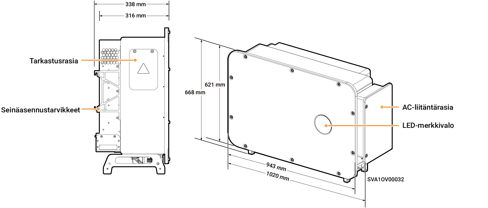
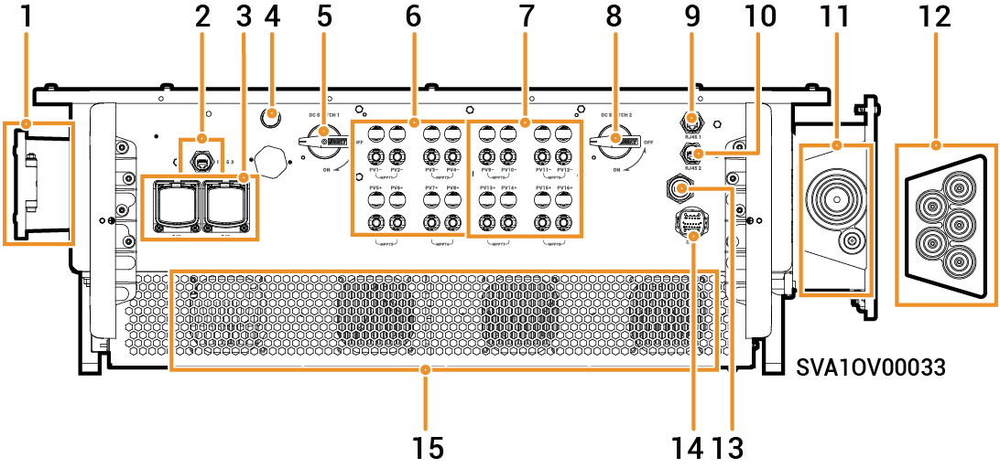

# Sigen PV 100M1-HYB-JP

## Mitat

<figure><figcaption></figcaption></figure>

## Porttien kuvaukset

<figure><figcaption></figcaption></figure>

<table><thead><tr><th width="75.11114501953125" align="center" valign="middle">S/N</th><th valign="top">Nimi</th><th valign="middle">Merkintä</th></tr></thead><tbody><tr><td align="center" valign="middle">1</td><td valign="top">Tarkastusrasia</td><td valign="middle">-</td></tr><tr><td align="center" valign="middle">2</td><td valign="top">SigenStack-verkkoliitäntä</td><td valign="middle">RJ45 3</td></tr><tr><td align="center" valign="middle">3</td><td valign="top">SigenStackin DC-kaapeliliitäntä</td><td valign="middle">BAT+/BAT-</td></tr><tr><td align="center" valign="middle">4</td><td valign="top">Antenniliitäntä</td><td valign="middle">ANT</td></tr><tr><td align="center" valign="middle">5</td><td valign="top">DC-kytkin 1</td><td valign="middle">DC SWITCH 1</td></tr><tr><td align="center" valign="middle">6</td><td valign="top">DC-tuloliitäntäryhmä 1 (Ohjattu DC SWITCH 1:n toimesta)</td><td valign="middle">PV1–PV8</td></tr><tr><td align="center" valign="middle">7</td><td valign="top">DC-tuloliitäntäryhmä 2 (ohjaus DC SWITCH 2)</td><td valign="middle">PV9–PV16</td></tr><tr><td align="center" valign="middle">8</td><td valign="top">DC-kytkin 2</td><td valign="middle">DC SWITCH 2</td></tr><tr><td align="center" valign="middle">9</td><td valign="top">Verkkoliitäntä</td><td valign="middle">RJ45 1</td></tr><tr><td align="center" valign="middle">10</td><td valign="top">Verkkoliitäntä</td><td valign="middle">RJ45 2</td></tr><tr><td align="center" valign="middle">11</td><td valign="top">Varakuormien tuloliitäntä</td><td valign="middle">-</td></tr><tr><td align="center" valign="middle">12</td><td valign="top">Sähköverkon tuloliitäntä</td><td valign="middle">-</td></tr><tr><td align="center" valign="middle">13</td><td valign="top">Sigen CommMod -liitäntä</td><td valign="middle">4G</td></tr><tr><td align="center" valign="middle">14</td><td valign="top">Tiedonsiirtoliitäntä</td><td valign="middle">COM</td></tr><tr><td align="center" valign="middle">15</td><td valign="top">Jäähdytyspuhallin</td><td valign="middle">-</td></tr></tbody></table>
