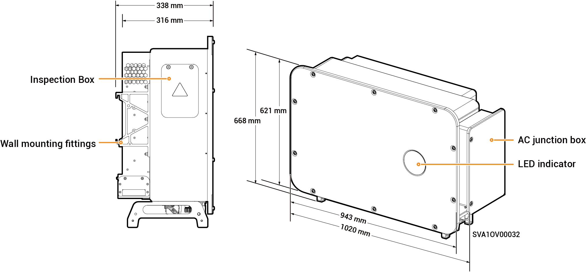

# Sigen PV 100M1-HYB-JP

## Dimensions

<figure><figcaption></figcaption></figure>

## Port Descriptions

<figure><figcaption></figcaption></figure>

<table><thead><tr><th width="75.11114501953125" align="center" valign="middle">S/N</th><th valign="top">Name</th><th valign="middle">Marking</th></tr></thead><tbody><tr><td align="center" valign="middle">1</td><td valign="top">Inspection Box</td><td valign="middle">-</td></tr><tr><td align="center" valign="middle">2</td><td valign="top">SigenStack network interface</td><td valign="middle">RJ45 3</td></tr><tr><td align="center" valign="middle">3</td><td valign="top">SigenStack DC cable interface</td><td valign="middle">BAT+/BAT-</td></tr><tr><td align="center" valign="middle">4</td><td valign="top">Antenna interface</td><td valign="middle">ANT</td></tr><tr><td align="center" valign="middle">5</td><td valign="top">DC switch 1</td><td valign="middle">DC SWITCH 1</td></tr><tr><td align="center" valign="middle">6</td><td valign="top">DC input terminal group 1 (Controlled by DC SWITCH 1)</td><td valign="middle">PV1 to PV8</td></tr><tr><td align="center" valign="middle">7</td><td valign="top">DC input terminal group 2 (Controlled by DC SWITCH 2)</td><td valign="middle">PV9 to PV16</td></tr><tr><td align="center" valign="middle">8</td><td valign="top">DC switch 2</td><td valign="middle">DC SWITCH 2</td></tr><tr><td align="center" valign="middle">9</td><td valign="top">Network interface</td><td valign="middle">RJ45 1</td></tr><tr><td align="center" valign="middle">10</td><td valign="top">Network interface</td><td valign="middle">RJ45 2</td></tr><tr><td align="center" valign="middle">11</td><td valign="top">Wire-in port of backup loads</td><td valign="middle">-</td></tr><tr><td align="center" valign="middle">12</td><td valign="top">Wire-in port of power grid</td><td valign="middle">-</td></tr><tr><td align="center" valign="middle">13</td><td valign="top">Sigen CommMod interface</td><td valign="middle">4G</td></tr><tr><td align="center" valign="middle">14</td><td valign="top">Communication interface</td><td valign="middle">COM</td></tr><tr><td align="center" valign="middle">15</td><td valign="top">Cooling fan</td><td valign="middle">-</td></tr></tbody></table>
